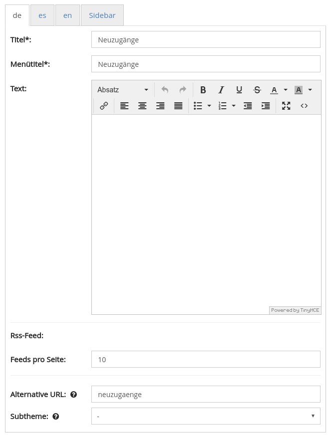
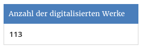

# October

In October we are happy about the release of the new theme of the HLB-Fulda: 

* [http://fuldig.hs-fulda.de](http://fuldig.hs-fulda.de)
* [https://www.hs-fulda.de/hlb/ueber-die-hlb/aktuelles/meldungsdetails/news/neuer-fuldig-viewer-geht-online/](https://www.hs-fulda.de/hlb/ueber-die-hlb/aktuelles/meldungsdetails/news/neuer-fuldig-viewer-geht-online/) 

The new Grimm portal, which was developed under the leadership of the University of Kassel, also went online with great media coverage:

* [https://www.grimm-portal.de](https://www.grimm-portal.de) 
* [http://www.hessenschau.de/kultur/grimms-werke-und-briefe-auf-onlineportal-weltweit-verfuegbar,grimm-portal-kassel-100.html](http://www.hessenschau.de/kultur/grimms-werke-und-briefe-auf-onlineportal-weltweit-verfuegbar,grimm-portal-kassel-100.html) 
* [http://www.ardmediathek.de/radio/hr4-Nord-Osthessen/Fundgrube-für-Grimm-Freunde-In-Kassel-/hr4/Audio-Podcast?bcastId=10886542&documentId=47172112](http://www.ardmediathek.de/radio/hr4-Nord-Osthessen/Fundgrube-für-Grimm-Freunde-In-Kassel-/hr4/Audio-Podcast?bcastId=10886542&documentId=47172112) 
* [http://www.sueddeutsche.de/news/kultur/kultur---kassel-werke-der-brueder-grimm-bekommen-digitale-plattform-dpa.urn-newsml-dpa-com-20090101-171024-99-583675](http://www.sueddeutsche.de/news/kultur/kultur---kassel-werke-der-brueder-grimm-bekommen-digitale-plattform-dpa.urn-newsml-dpa-com-20090101-171024-99-583675)

## Developments

### CMS

There are several new features in the CMS area. First there are two new templates. One for displaying the latest additions on a separate page \(similar to the RSS feed\), and one for displaying collections as an accordion.

To make the functionality available, the first parts of the implementation of the IIIF Presentation API flowed back into the master Branch. Furthermore, a new widget has been developed that displays the total number of available digital representations in the sidebar.

With the Grimm portal, a Goobi viewer has gone online that shares the entire database with another instance \(ORKA\). It's just a different view of it. For this several smaller tasks in the CMS area and the search were necessary to complete the separation cleanly and efficiently.

### Memory usage

In order to optimize memory consumption, various changes were made to the Goobi viewer indexer and the Goobi viewer core. The indexer has been converting various formats to ALTO for a long time. What's new is that these are no longer stored exclusively in the Solr search index, but also in the file system. The texts for the search are indexed in the search index. ALTO files are now read from the file system for display. This reduced the size of the search index while maintaining the same functionality. In addition, the ALTO files can now also be used by other components, such as the ContentServer, for PDF generation to store full texts.

### PDF generation

In the context of PDF generation there were two minor improvements. Firstly, the watermarkID configured in the viewer is now consistently transferred during PDF generation to ensure that the images contained in the PDF contain the desired image mirrors. On the other hand, the size of the PDF document to be generated can now be better displayed in the download modal.

### Search

After last month's curving brackets in the faceting caused errors, this month's normal search fixed a bug with square brackets. Furthermore, truncation on both sides has now been implemented in the advanced search as well. If there are structure types without titles in the aggregated search hit display, these are now also translated via the messages files.

