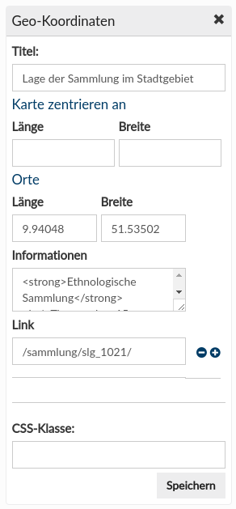
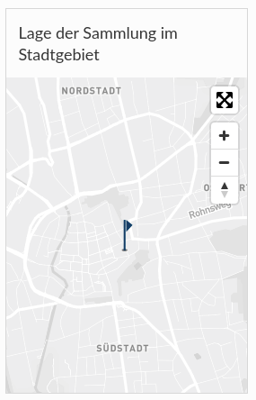

# November

In November, two Goobi viewer instances received an update to the current stable version: 

* [http://hauspublikationen.mak.at](http://hauspublikationen.mak.at) 
* [https://haab-digital.klassik-stiftung.de](https://haab-digital.klassik-stiftung.de) 

Based on the Masonry template and many different media files, the Upper Austrian Digital Regional Library has created a varied new homepage: 

* [http://digi.landesbibliothek.at](http://digi.landesbibliothek.at)

## Developments

### CMS

There is a new CMS widget for displaying geocordinates.





A new CMS widget allows other CMS pages to be listed in the sidebar. 

All CMS widgets can now bring their own individual titles. Therefore there is a new, optional title field in every widget. 

The templates of CMS pages have been further adapted to have even more integration possibilities. For example, the page on which the objects of a Solr query are displayed at the end can now also be combined with the overview page. In addition, images with a higher resolution are retrieved to avoid blurring. 

The feedback page has been separated into a component and prepared for integration into the CMS. 

For images displayed on a Masonry template based CMS page there is now an extended randomization of the content. When uploading media files, you can specify the order in which the tiles are to be displayed. If one or more tiles have the same order, the delivery is random. This allows you to create beautiful effects with constantly changing images, for example on the start page.

### Search

In context search hit display there were two new features. The first was that authority data are now also displayed if they are relevant for the search hit. If a work is found because a hit was found in the indexed, alternative spellings of the author, this alternative spelling is also displayed. Since this information is stored differently for technical reasons, this was previously not possible. 

The second new feature is that a further search in the database can now be triggered from standard data hits. Thus the browsing possibilities and the networkability in the dataset are strongly extended.

### API

The REST interface has received new endpoints for ALTO and FULLTEXT. This makes it possible to access the full texts available in the Goobi viewer, taking into account all known and configured access restrictions. Access is via the following URLs:

```text
  viewer/rest/content/alto/PI/PAGENO/
  viewer/rest/content/text/PI/PAGENO/
```

### Translations

The work of translating the Goobi viewer into French has begun. The first message keys have been translated and can be found in the repository: 

* [https://github.com/intranda/goobi-viewer-core/blob/master/goobi-viewer-core/src/de/intranda/digiverso/presentation/messages/messages\_fr.properties](https://github.com/intranda/goobi-viewer-core/blob/master/goobi-viewer-core/src/de/intranda/digiverso/presentation/messages/messages_fr.properties)

