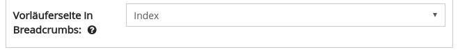

# December

Even though the month of December and the year 2017 are not yet over, the development work for this month has been completed. There are several new features to report.&#x20;

First of all, we are proud that the collection portal of the University of Göttingen was officially opened at the beginning of the month. The portal is based on the Goobi viewer and can be reached at the following URL:

* [http://sammlungen.uni-goettingen.de](http://sammlungen.uni-goettingen.de)

## Developments

### CMS

Finally it is possible to define the breadcrumbs in CMS pages. For each page you can choose which other page is the potential parent page. By default all pages are children of the home page. On this page you can also define breadcrumbs like for example "Home > Collections > Collection name".



### PDF download

The Goobi viewer can delegate the generation of PDF documents to the TaskManager. Its queue makes it easier to delegate load balancing on the system. This feature already exists for more than one year.&#x20;

We have now recorded the user feedback and improved, corrected and refactored various points. Especially the adapted user interface in the TaskManager backend is visible. Further information is now displayed there. During EPUB generation, the expected size of the EPUB document is also determined and presented to the user in advance.&#x20;

The adjustments in the code have made the entire process much more robust and clearer.

### Full text hints

If full texts exist for a record, a corresponding full text link is displayed in the navigation bar. The text for the record can be viewed above this.&#x20;

Often, however, it is precisely when transcribing manuscripts and other full texts captured via crowdsourcing that the problem arises that data is only available for a few pages, but the full text link is displayed globally for the work. It was not possible to recognize for which pages the texts are available.&#x20;

This problem has now been solved by the possibility to show further hints. The display is activated based on a configurable value. The value defines a percentage of full texts in the total work. If this percentage is not reached, the notes are displayed. These notes are displayed as follows:

1. The existing full text is indicated in the picture display with an additional icon above the picture: \
   [http://digi.landesbibliothek.at/viewer/image/177/158/](http://digi.landesbibliothek.at/viewer/image/177/158/)&#x20;
2. The page preview indicates existing full texts with an additional icon: \
   [http://digi.landesbibliothek.at/viewer/thumbs/177/6/](http://digi.landesbibliothek.at/viewer/thumbs/177/6/)&#x20;
3. on the full text page, only the pages with full text are now displayed in the drop-down menu: [http://digi.landesbibliothek.at/viewer/fulltext/177/162/](http://digi.landesbibliothek.at/viewer/fulltext/177/162/)

### URLs

Under the hood there were a lot of changes concerning the handling of URLs and redirects. From a technical point of view, this takes place in different places and has been growing ever since. On the one hand, URLs are predefined by the application, for example&#x20;

```
/viewer/image/IDENTIFIER/page/
```

&#x20;can also be set in the CMS itself, for example:&#x20;

```
/viewer/news/unknown-works-discovered/ 
```

In the first example, the /image/ in the URL can now be changed via a configuration switch so that it is called /object/, for example. The second example can also be called as a CMS page under the URL /viewer/cms/CMSID/. Also on the search page much like the search string, the selected facets etc. is displayed via the URL.&#x20;

Due to the relocation of functions to the CMS, it was now necessary to clean up at this point, to re-implement it and to document the code further. These changes form the basis for further developments, such as the integration of the search into the CMS.

### Language versions for a document

The Goobi viewer can now manage multiple language versions of a work. This makes it possible, for example, to display different translations for a work. This was developed to allow TEI documents to be displayed in the Goobi viewer. More about this will follow in a later digest

### Goobi viewer Indexer

The Goobi viewer Indexer has received several new features. With an update to the current master, it is also necessary to update the indexer and the Solr schema and to adapt the configuration file.&#x20;

First, the location where the indexer searches for images in the LIDO files during indexing became configurable. There is a list of XPATH expressions that can be specified in the top init section as follows:

```markup
<lido>
    <imageXPath>lido:resourceID</imageXPath>
    <imageXPath>lido:resourceRepresentation[@lido:type='image_master']/lido:linkResource</imageXPath>
    <imageXPath>lido:resourceRepresentation[@lido:type='http://terminology.lido-schema.org/resourceRepresentation_type/provided_representation']/lido:linkResource</imageXPath>
    <imageXPath>lido:resourceRepresentation[@lido:type='http://terminology.lido-schema.org/lido00464']/lido:linkResource</imageXPath>
    <imageXPath>lido:resourceRepresentation[@lido:type='image_overview']/lido:linkResource</imageXPath>
</lido>
```

Furthermore, the indexer can now be instructed to download externally linked images from the LIDO files during indexing. Therefore the images have to be referenced in the LIDO file and can be found under one of the configured XPATH expressions. The download is initiated if the LIDO file and a folder with VORGANGSTITEL\_downloadimages are located in the hotfolder.&#x20;

Last but not least, the indexer now knows different strategies to distribute the indexed objects to memory areas. Now different system architectures can be served. The strategies are as follows:

* **SingleRepositoryStrategy**: The works are all moved to the familiar flat file system infrastructure as before.&#x20;
* **MaxRecordNumberStrategy**: The works are moved to different "data repositories". A configurable number of works is moved per repository. This ensures that there are no more than 5000 subfolders in a directory, for example.&#x20;
* **RemainingSpaceStrategy**: The works are also divided into different "data repositories". It looks how big the work is with all associated files and selects the next repository that still has the necessary free space. Thus the data records can be divided for example into handy 5TB snippets.

Data repositories in the indexer context are a list of folders in the file system. Different mountpoints can then be attached to these folders, for example for the RemainingSpaceStragety. The configuration is also carried out in the top init section as follows:

```markup
<dataRepositories>
    <strategy>SingleRepositoryStrategy</strategy>
    <maxRecords>10000</maxRecords>
    <dataRepository>/opt/digiverso/viewer/data/1</dataRepository>
    <dataRepository>/opt/digiverso/viewer/data/2</dataRepository>    
    <dataRepository>/opt/digiverso/viewer/data/3</dataRepository>
</dataRepositories>
```
