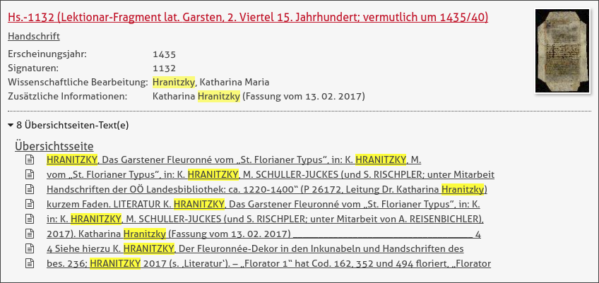
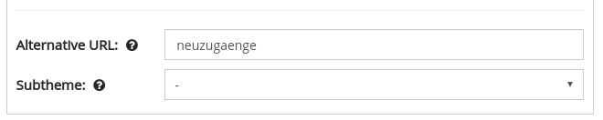

# September

## Developments

In September, the Goobi viewer was used for various development projects, which are summarized here once again in a nutshell.

### Search

In the search there were improvements and bugfixes. For example, one line per search hit is displayed on the overview page.



In addition, titles are no longer displayed as additional child elements in the aggregated search hit display to avoid duplication.   
Metadata hits can now also be translated. This is important for hits such as digital collections or structural elements. If certain metadata is not to be displayed, it can be maintained in an ignoreList. An error has occurred if values after which faceting should be performed contained a curved bracket. This error has been corrected.

### Work display

When viewing a work in the work display, the table of contents can be displayed in the sidebar. Here it is possible to configure the title of the main element individually, for example to show the year of publication for newspaper volumes. The title, which is displayed at the top of the work display, is now synchronized with the value configured for the table of contents.

### Translations

In the past, it was necessary to restart the Goobi viewer when entering new translations until the changes were adopted. This circumstance is now a thing of the past and the new values are read in immediately.

### CMS

There were three main changes in the CMS. First of all, CMS pages can now get their own meaningful names for the URL. Now URLs like "/viewer/sammlungen/spezial" can be realized.   
Secondly, the sub-themes known from the factory view can now also be used for CMS pages.



The third adaptation was in the sidebar widget for configurable faceting. The desired sorting can now be defined within the widget itself.

### API

The REST interface has received a new endpoint for RSS feeds:

```text
/viewer/rest/rss/LANG/PARTNERID/HITCOUNT/
```

### Download via queue

The Goobi viewer offers the possibility to delegate the generation of PDF documents to the intranda TaskManager. The tried-and-tested queue allows a significantly better load distribution to be achieved. In addition, an upstream modal prevents a click on a PDF button directly activating the generation that potentially generates a lot of load on the system.

With this integration the usability was worked on once again. The upstream modal was optically revised in order to separate the individual contents more clearly from each other. In the upper area, a guideline value for the expected size of the PDF file is now also displayed. The page which shows the position of the own document in the queue has been extended so that it reloads itself. Once the document is generated, it will be automatically redirected to the Accept License Agreement and Download page.

### Publications

In October we released the Theme-Boilerplate for the Goobi viewer. This framework offers a clean and clearly structured way to create your own themes for the Goobi viewer. The repository can be found as usual at Github: [https://github.com/intranda/goobi-viewer-theme-boilerplate](https://github.com/intranda/goobi-viewer-theme-boilerplate)

### Other

At the end of September there were the Goobi Days where various lectures were dedicated to the Goobi viewer context. These will be published and linked in the media corner of the intranda GmbH website. We will point this out at this point.

