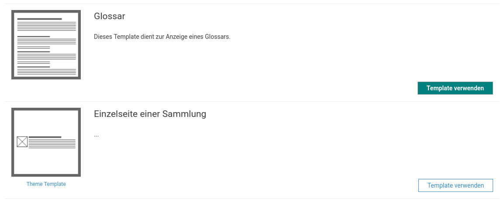

# January

January's work in the Goobi viewer team was characterised above all by the development and implementation of individual customer wishes. The crowdsourcing module at HLB Fulda went online. Welcome to the crowdsourcing community!&#x20;

Furthermore, the digital collections of the University Library of the Humboldt-Universität zu Berlin shine in new splendour. The updated website can be found at the following URL:&#x20;

* [http://www.digi-hub.de/](http://www.digi-hub.de/)

## Developments

### CMS

The biggest changes in the CMS area are not visible as they affect the code quality "under the hood". Smaller parts were cleaned up or newly implemented to achieve better stability in the backend.&#x20;

As features the migration of the simple and the extended search into the CMS backend was added.&#x20;

There was also a change in the CMS templates in which the pages are defined. Here we went through a learning process as a team. In the beginning each theme had its own templates. However, we quickly found out that the application purposes overlap and that we only do a lot of work by maintaining the templates in the themes. We then migrated the templates ourselves to the Goobi viewer core. It quickly became clear, however, that there were always customer requests that were individual and that the theme in the core was not really in the right place for everyone. Therefore, it was still possible to store templates in the theme. However, only the CMS templates from the theme were loaded. This led to the fact that we always had to copy the certain core template into the theme so that the customer had it available. So we were back at the beginning: We had to wait for core templates in the individual customer themes.&#x20;

Therefore, the loading mechanism was rebuilt and now allows to load a list of CMS templates from the core and one from the theme. Both lists are displayed on the page of available templates. Templates developed individually for the customer are visually highlighted.



### Multilingual metadata

If metadata for a work is available in different languages, these could previously be displayed in the object display. The language of the metadata could be changed via a separate language switch. New is the possibility to set the displayed language depending on the whole interface. If, for example, the title of a work was recorded in several languages, it is now possible to display the title in each visitor's language. The new configuration parameter for this is:

```markup
<useViewerLocaleAsRecordLanguage>true</useViewerLocaleAsRecordLanguage>
```

By the way: To store a metadata, for example a title in several languages, the suffix LANG\_XX must be appended to the index field, where XX is the bilingual language code. Example:

```
MD_TITLE_LANG_DE = "Selbstbildnis"
MD_TITLE_LANG_EN = "Self-Portrait"
MD_TITLE_LANG_FR = "Autoportrait"
```

### API

The REST interface has received new endpoints for TEI and CMDI files.

### Internal

Internally, there was a changeover to version 2.3 of the Templating Framework JSF 2.3 used. This was accompanied by so-called refactoring work, whereby the communication between individual parts of the application was switched to an alternative mechanism.

### Display of metadata

At this point there were two exciting innovations. The first is a way to display metadata differently with one condition. A typical application scenario is the display of licenses. The title of the license should always be displayed (e.g. "CC BY-SA 4.0", "Public domain", ...). However, if there is another metadata with a URL, the title should be displayed, but clickable, and the link opens. The display of the metadata is therefore always "pretty" and sometimes - if available - with a link deposited.&#x20;

In order to reach this goal the possibility was created in the metadata configuration to overwrite the global VALUE conditionally under the condition that a parameter exists with an alternative VALUE. Here is an example:


```markup
<metadata label="LABEL_LICENSE" value="">
    <param type="field" key="MD_LICENCETITEL"/>
    <param type="field" key="MD_LICENCEURL" value="VAL_LICENCEURL"/>
</metadata>
```



```
LABEL_LICENSE=Lizenz
VAL_LICENCEURL=<a href="{1}" target="_blank">{0}</a>
```


By default, a metadata "License" is displayed with the contents of the Solr field MD\_LICENCETITEL. However, if the field MD\_LICENCEURL also exists for the work, both fields are passed to the value VAL\_LICENCEURL from the messages file, which inserts the values into a string using the known placeholders.

The second new feature for displaying metadata is the display of values from structured trees. The Goobi viewer can structure works into different, individual trees. These are, for example, collections or fields of knowledge. Previously, only the last sub-collection was displayed on the bibliographic data page. New is the possibility to display the complete path, including a link of the individual sections to the respective section. The new field type for the parameter is "hierarchicalfield".
