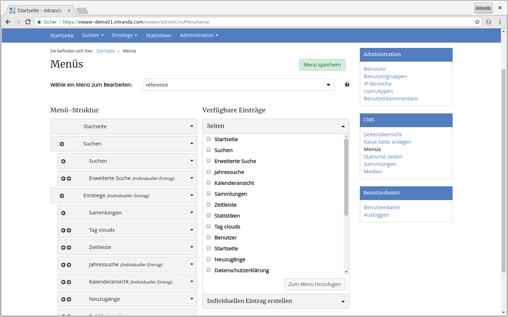
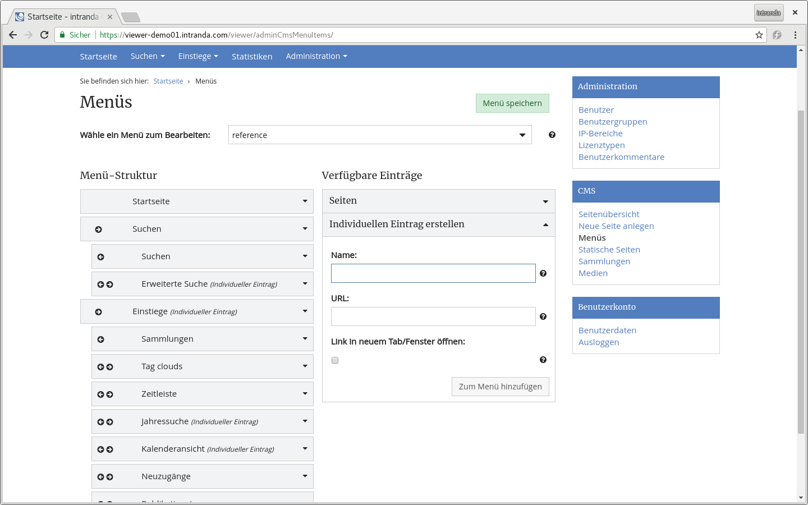

# October

In October we are pleased to announce the publication of the digitalized estates of Kurt W. Rothschild and Josef Steindl of WU Vienna at the following address:

* [https://viewer.wu.ac.at](https://viewer.wu.ac.at)



The Goobi viewer of the Bauhaus University Weimar has also been updated:

* [https://digitalesammlungen.uni-weimar.de](https://digitalesammlungen.uni-weimar.de)

Last month the Scipta Paedagogica Online of the Library for Educational History Research and the Digital Collections of HAAB Weimar was updated:

* [http://goobiweb.bbf.dipf.de](http://goobiweb.bbf.dipf.de)
* [https://haab-digital.klassik-stiftung.de](https://haab-digital.klassik-stiftung.de)

All institutions automatically make their entire freely available database available via the IIIF Image API and as IIIF Presentation Manifestos for the Digital Humanities.

## Developments

### CMS

The area for editing the main menu in the CMS backend has been revised. Menus for subthemes can now also be created there. At the same time the usability has been improved:



New is the option to open links directly in a new tab / window.



Until now, the menu title was a mandatory field in CMS pages. This has been changed. If a page does not contain a menu title, it will no longer be listed in the list of pages available for the main menu. This makes the area much clearer.&#x20;

### SEO

The sitemap now lists pages from GROUP documents such as convolutes as a table of contents.&#x20;

### Search

In the context search there have been two changes. One is a bugfix concerning the advanced search. If a value was selected in a dropdown menu and a new line was added, the value from the dropdown menu was reset. This bug has been fixed.&#x20;

Also the list of structure elements Whitelist was replaced. In this list, the structural elements that should be displayed in the digital collections were listed. However, it has always caused confusion that the document types themselves had to be explicitly defined again. From now on, the list is generated automatically and the configuration is no longer necessary.&#x20;

### XHTML Pages

All buttons in the interface were analyzed and standardized to a few different definitions (like btn--default, btn--success, btn--danger, btn--clean...). Since there are a good 230 places in the source code of the Goobi viewer core where buttons are defined, this was quite a lot of work. As a result, the button design is now uniform, consistent and centrally controlled.&#x20;

### Documentation

Two things have been added to the documentation this month. First, the FAQ section answered the question: "[How can I re-index my entire database in the Goobi viewer?](https://docs.intranda.com/goobi-viewer-de/7#wie-kann-ich-meinen-gesamten-datenbestand-im-goobi-viewer-neu-indexieren)" On the other hand, [chapter 6.13](https://docs.intranda.com/goobi-viewer-de/6/6.11) of the Application Scenarios has been added to describe the process and configuration chain for configuring Goobi workflow, indexing and displaying subcollections in the Goobi viewer.&#x20;

### Indexer

In the Goobi viewer indexer there were several bugfixes and minor developments. It is now possible to define a boolean field in order to be able to facet according to works with images and without images. The configuration is as follows:


```markup
<BOOL_CONTAINSIMAGE>
    <list>
        <item>
            <xpath>string(boolean(mets:fileSec/mets:fileGrp[@USE="PRESENTATION"]))</xpath>
            <addToDefault>false</addToDefault>
            <addSortField>true</addSortField>
        </item>
    </list>
</BOOL_CONTAINSIMAGE>
```

