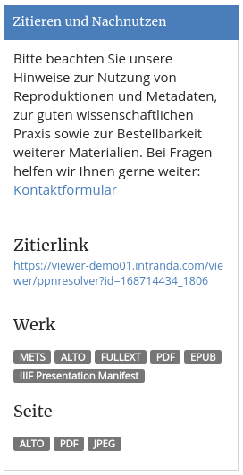
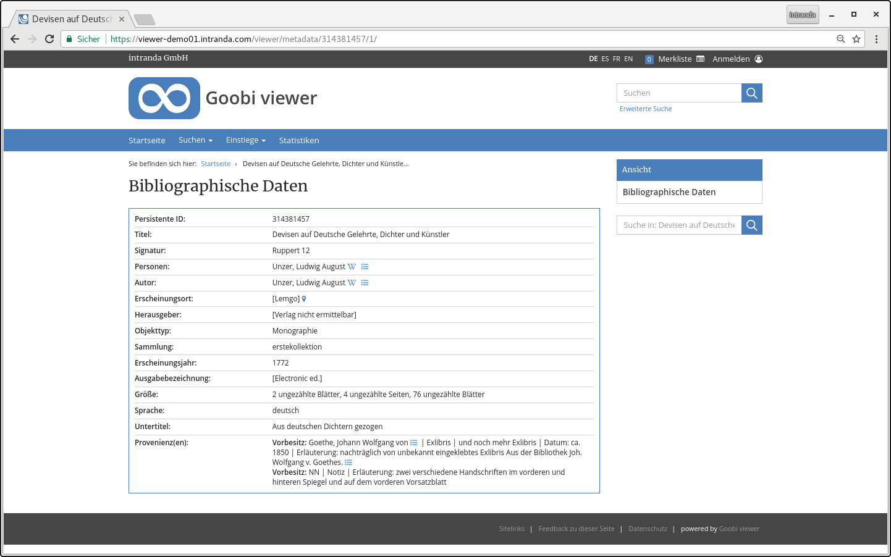

# November

In November the Goobi viewer of the Wiener Library in London went online. Based on METS/MODS and TEI documents, the portal presents eyewitness accounts and reports from the 1938 pogrom night. The instance can be found at the following address: 

* [https://www.pogromnovember1938.co.uk/viewer/](https://www.pogromnovember1938.co.uk/viewer/)

 In the Upper Austrian State Library there was an event on the lists of casualities presented in the Goobi viewer there. It was always great how the analogue and digital worlds come together on such occasions and enrich each other: 

* [https://www.landesbibliothek.at/veranstaltungen/detail/news/detail/News/froehliche-wissenschaft-geschichte](https://www.landesbibliothek.at/veranstaltungen/detail/news/detail/News/froehliche-wissenschaft-geschichte) 

## Developments

### Widget with license and usage instructions 

There are several new features in the factory display. A feature that has been desired for a long time has finally found its way into the Goobi viewer: a widget to display license information and possibilities for subsequent use in a concentrated manner:

If available, the widget also displays links to full texts and ALTO files. All ALTO or full text files can be downloaded as ZIP files.

### DropDown for direct page navigation

In the factory display, a drop-down menu is available above the picture to jump directly to a page in the factory. The structure has always been "Picture number: Pagination label", for example "`8: IV`". 

The display in this DropDown menu is now configurable. Placeholders can now also be used to create displays such as only "`8`" or "`8 of 17`". The functionality is described in chapter [2.11.1](https://docs.intranda.com/goobi-viewer-de/2/2.11/2.11.1). 

### Authority data / Provenances 

The new option to configure the display of authority data is now also available in the factory display context. This development was implemented for the display of provenance data within the Goobi viewer. Whereas the display used to be rigid, the fields can now be configured individually and defined in sequence. The functionality is described in chapter [2.19.5](https://docs.intranda.com/goobi-viewer-de/2/2.19/2.19.5). The field type for the NORM\_URI entries in config\_viewer.xml has changed. These are now of the new type `normdatauri`. Please also note the instructions for core changes for administrators.

### Watermark IDs 

It has always been possible to display a footer under a picture. This can be different depending on a value of a field in the Solr search index. New is the possibility to define the value `<watermarkIdField>` multiple times. Then the value from the first field, which is not empty, is used for the image footer ID. See also chapter [2.11.9](https://docs.intranda.com/goobi-viewer-de/2/2.11/2.11.9). 

### Overwriting licenses

If a work has multiple access conditions \(license types\), it is now sufficient for the user to have access rights to one of these license types. Previously, an access authorization had to be available for each license type. 

For this purpose, there is now a new multiselect menu in the mask for creating license types that allows the overwriting license types to be selected. 

### Paginator for works with few images

The Paginator for pages with few images has been further adapted. For example, the DropDown menu for direct page selection as well as the possibility to jump to the first or last page is only displayed if more than two images are available. 

### Sorting and LIDO Events 

The Goobi viewer indexer has been enhanced with a new configuration that allows you to write metadata fields from LIDO events into the main element. This allows sorting by metadata fields from the event. See chapter [3.7.2](https://docs.intranda.com/goobi-viewer-de/3/3.7#3-7-2-parameter-addsortfieldtotopstruct).

