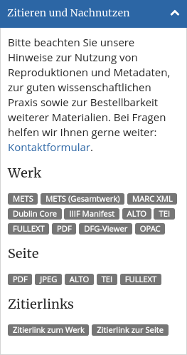
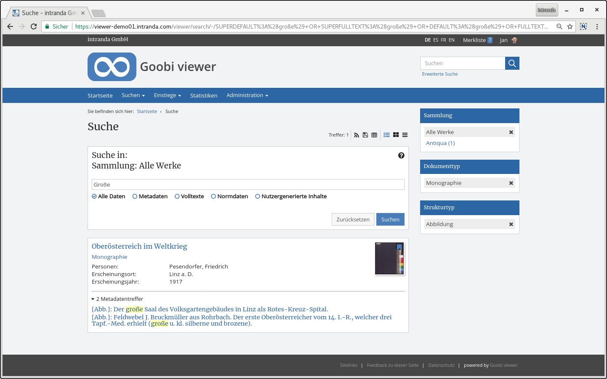

# December

The year is drawing to a close and we look back with pride on the past 12 months of Goobi viewer development. We would also like to take this opportunity to thank all users who have again contributed so constructively to the development this year!&#x20;

We are happy to announce two new Goobi viewer instances in December. The Landesmuseum für Vorgeschichte Halle (Saale) presented your instance to the public at the end of the project:



The Goobi viewer can be found at [https://digital-heritage.landesmuseum-vorgeschichte.de](https://digital-heritage.landesmuseum-vorgeschichte.de) .&#x20;

We are also delighted about the opening of the Chester Beatty Goobi viewer by the Irish Minister of Culture Josepha Madigan:



The instance is located at the URL [https://viewer.cbl.ie](https://viewer.cbl.ie)&#x20;

The [digital regional library of Upper Austria](https://digi.landesbibliothek.at) has received an update.&#x20;

Representing the Goobi community, we are also making a stronger public appearance in context IIIF. The Goobi viewer with its supported APIs is mentioned in the last IIIF newsletter: #

* [https://iiif.io/news/2018/12/19/newsletter/#goobi-viewer-implements-the-iiif-image-and-presentation-apis](https://iiif.io/news/2018/12/19/newsletter/#goobi-viewer-implements-the-iiif-image-and-presentation-apis)&#x20;

Before we start with the description of the developments, one last point: We were asked to point out changes that change existing functionalities. These changes will be warned in the Digest and will be mentioned in the Community Forum.&#x20;

The decisive factor was the omission of the docStructWhiteList which can have an effect on the listed works within a collection, if for example not only journals, but also the contained journal volumes are to be displayed. This is no longer possible since the change. On the one hand, we are working on simplifying this for many users, but on the other hand we are not losing any flexibility.


Thus in the future an existing functionality will be pointed out which has changed.


## Developments

### SEO

Search engine optimization continued to progress in December. This month two things have been implemented. Search and tag cloud pages are now output with a "noindex" meta tag. This directive was already set by robots.txt before, but becomes more binding by the meta tag in HTML.&#x20;

Secondly, canonical links are now marked as canonical via the URN or PI (PPN, EPN, ...) resolver. This allows search engines to better understand the same pages that are available via alternative URLs and avoid duplicates.&#x20;

### Crowdsourcing&#x20;

There is now a new TEI export that allows to export transcriptions from crowdsourcing as TEI. As a small addon ALTO results are also converted to TEI. The download is available either for the whole work or for the displayed page and can be found in the new widget "Cite and reuse".&#x20;

### Widget with license and usage hints&#x20;

The new widget "Cite and reuse", which was presented in November, has been significantly expanded once again. New is the possibility to copy a citation link for the work or the page. Furthermore, the different possibilities of linking and downloading have been compiled from the interface and concentrated in the new widget. This includes, for example, the download options below the "Bibliographic Data" page, the link to the catalogue or to the DFG Viewer from the sidebar, or the download options above the title and in the expanded heading. The widget is displayed in the sidebar by default.


Attention: The download options on the page "Bibliographic Data" or above the work have been removed and moved to the new widget "Quoting and Nachnutzen".


### CMS&#x20;

There is a new CMS-Template to display the simple and the extended search page about the CMS. It is possible to select in the page which search type should be displayed and whether all works or no works should be displayed automatically in an empty search. The template is available in the core.&#x20;

### Facetting by structure elements

It is now possible not only to faceted according to document types (monograph, map, nudes, music, ...), but also according to the structural elements contained in the found works (chapter, illustration, table, curriculum vitae, ...). To do this, not only the Goobi viewer core itself, but also the Solr schema and the Goobi viewer Indexer must be updated and the database re-indexed. Then there are the new fields `DOCSTRCT_TOP` and `DOCSTRCT_SUB` which can be configured for faceting as well as for the extended search mask.

See also the [notes for administrators in the Core changes on 2018-12-17](https://docs.intranda.com/goobi-viewer-de/9/9.1#2018-12-17) and the updated chapter [2.17.2](https://docs.intranda.com/goobi-viewer-de/2/2.17/2.17.2) in the documentation.&#x20;

### Authentication against Aleph X Services&#x20;

A new feature is the possibility to run user authentication against an Aleph X service. A new authentication provider for bor\_auth has been implemented. See also chapter [2.5.1](https://docs.intranda.com/goobi-viewer-de/2/2.5/2.5.1).&#x20;

### Optional automatic phrase search&#x20;

When searching in certain fields, for example the signature, you automatically want to have a phrase search and no matches contained. For this, there is now the attribute `untokenizeForPhraseSearch="true"` in the advanced search, see also chapter [2.17.3.](https://docs.intranda.com/goobi-viewer-de/2/2.17/2.17.3)&#x20;

### automatic opening of a work with only one work in a collection

If there is only one work in a digital collection, it was opened by default. The behavior is now configurable and when displayed a search hit list with a work is displayed, see also chapter [2.18.6](https://docs.intranda.com/goobi-viewer-de/2/2.18/2.18.6).&#x20;

### Performance improvement for tables of contents

The Goobi viewer has the option of providing certain structural elements with access restrictions for PDF downloads. The rights check led to performance losses for works with many structural elements (in the case reported it was 1700). The code was optimized and the rights are no longer queried individually for each structural element, but once concentrated for all. This more than halved the generation time for the table of contents.
