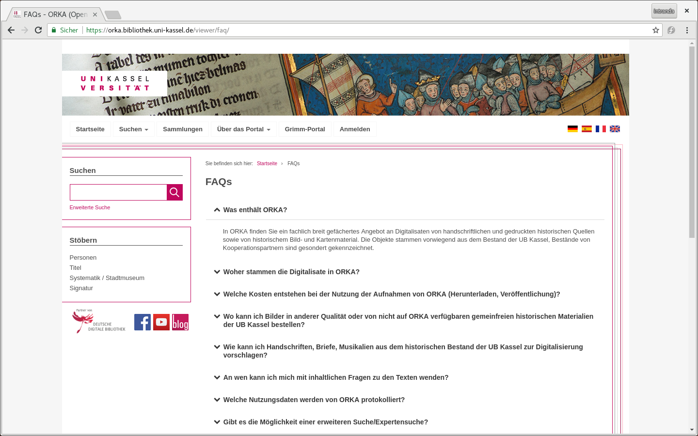
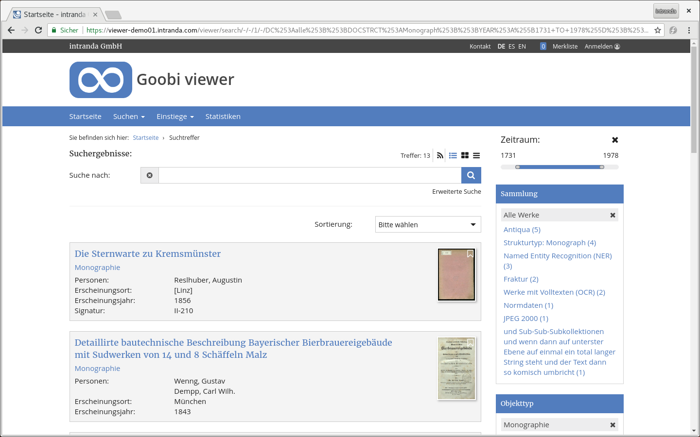
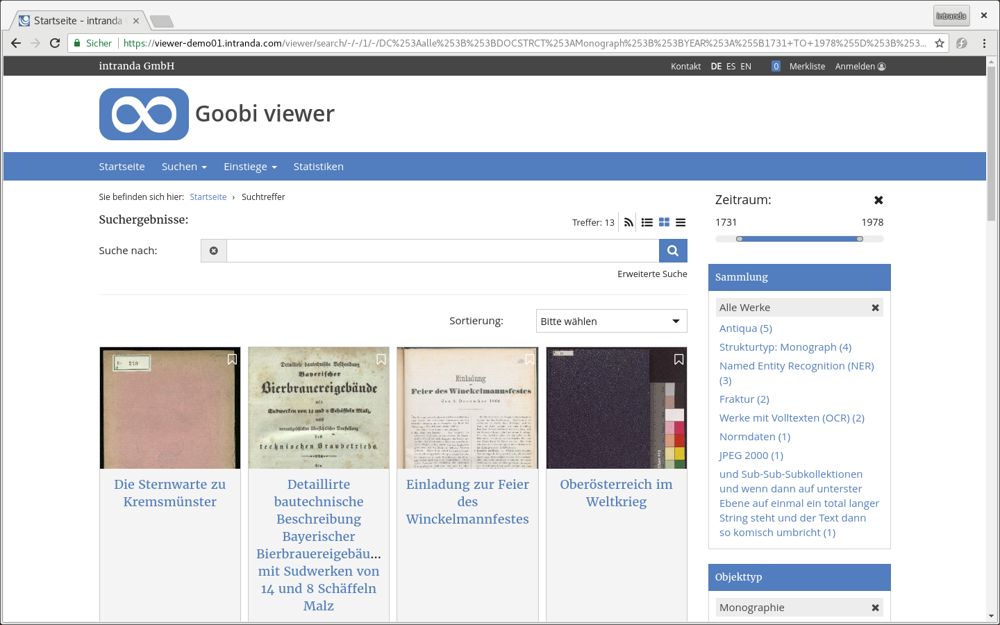
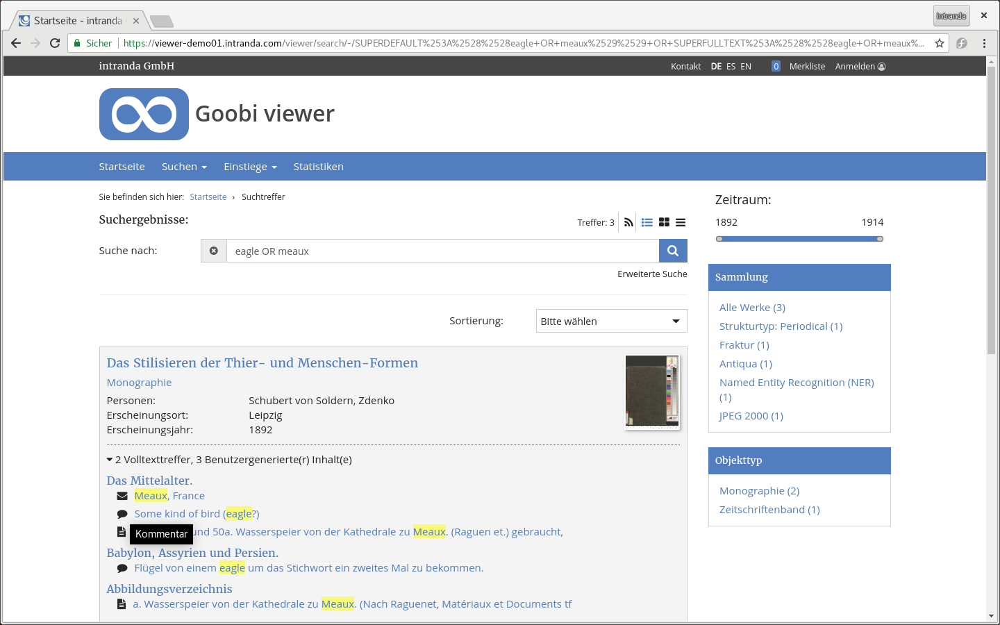

# June

In June, the University Library of Kassel held an event on crowdsourcing. ORKA and the Grimm-Portal were presented together with the crowdsourcing module and its possibilities. We are pleased about the event in the Grimm world with more than 50 participants.

* [https://www.hna.de/kassel/hobby-historiker-fuers-uni-bibliothek-in-kassel-gesucht-9943601.html](https://www.hna.de/kassel/hobby-historiker-fuers-uni-bibliothek-in-kassel-gesucht-9943601.html)
* [https://www.uni-kassel.de/uni/en/aktuelles/meldung/post/detail/News/die-universitaets-bibliothek-bietet-plattformen-fuer-citizen-science/](https://www.uni-kassel.de/uni/en/aktuelles/meldung/post/detail/News/die-universitaets-bibliothek-bietet-plattformen-fuer-citizen-science/)

## Developments

### CMS

In the CMS backend there is a new template in the core that allows you to create a FAQ page. Individual questions and answers are recorded and classified as a CMS page. The FAQ page shows all single pages combined.



### Search

In the search hit display it is now possible to display the search hits not only in the previous form, but also as tiles or simple list. The switch is possible on the search hit page via three new icons above the search field. The previously known detail display is still the default value.






User-generated content that was captured in crowdsourcing is now also displayed in the search hit display as subhits to the corresponding structural elements. The prefixed icon indicates the type of content entered.



Also new is the ability to display sub hits from TEI documents. Since these hits are usually not assigned to any structural element, they are listed as a separate category:


Otherwise there were minor bugfixes and improvements. The phrase search, which is indicated by the setting of quotation marks around the desired search terms, is now also available for a search in the factory. Furthermore, the Solr stopwords are now also evaluated when highlighting the search terms for sub hits. For example, if you search for the phrase "The Heilsbronn Monastery", hits that are only "Heilsbronn Monastery" will also be found and displayed. The article "The" as stopword will not only be ignored during the search, but also during the highlighting. The latter was not the case so far, which led to confusion in the display.

### Browsing

It is now also possible to browse only certain collections. This functionality can not be configured yet, but can be accessed by a direct call of the URL. The URL must be structured as follows:

```text
https://viewer.example.org/viewer/term/STOEBERNFELDNAME/DC:kollektionsname/-/1/
```

### Timeline

The number of hits in the timeline is now configurable. The following new button is available in the configuration file.



```markup
<timeline>
    <hits>108</hits>
</timeline>
```



### Structure Element Whitelist 

The entire structural element whitelist can now be disabled when a single element with an asterisk is added. This can be useful, for example, in the realization of portals where only objects consisting of single images are imported, but the number of object types is very large.



```markup
<metadata>
    <docStructWhiteList>
        <docStruct>*</docStruct>
    </docStructWhiteList>
</metadata>
```



### Documentation 

The documentation for the Goobi viewer that was previously available as a PDF document has been transferred to a web-based documentation system. In the course of this work, it was updated and partially restructured. The documentation is now available at the following address: 

* [https://docs.intranda.com/goobi-viewer-de](https://docs.intranda.com/goobi-viewer-de) 

Also in June, the previous digests were published, to be found at: 

* [https://docs.intranda.com/goobi-viewer-de/digests](https://docs.intranda.com/goobi-viewer-de/digests)

