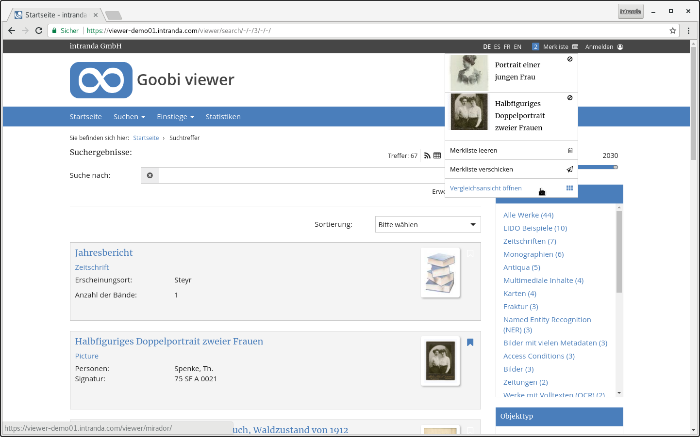
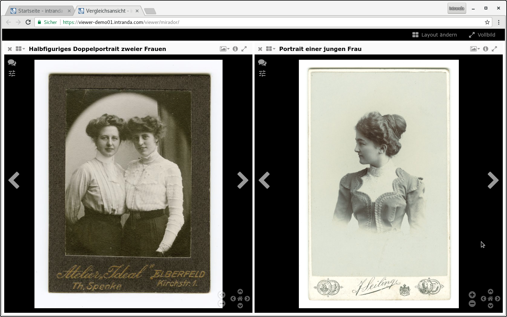

# July

Due to the summer holidays, the development speed of the Goobi viewer slowed down in July. Work has been done more "under the hood", but there are also new features to be seen on the surface. 

In addition, the project received the [first pull request on GitHub,](https://github.com/intranda/goobi-viewer-core/pull/1) which was then incorporated into the core. Due to the way of working it could not be taken over directly but was entered manually. However, we are already working on a conversion of the working method, so that in future it will be easier to take over pull requests directly. 

## Developments 

### CMS 

For new CMS pages, the standard sidebar is no longer activated when creating, but the individual selection of the widgets to be displayed. This corresponds more to the way of working in daily use. In addition, a lot of time went into the analysis of the database connection to fix a bug that prevented the delivery of CMS pages under certain constellations. 

### Mirador 

The [Mirador](http://projectmirador.org/) was integrated into the Goobi viewer. It is now possible to open a comparison view in the Mirador via the watch lists. The functionality is always available when there is more than one object on the watch list. In the same turn the watch lists were refactorized from the source code. This allows you to better integrate yourself optically into the rest of the Goobi viewer.

### Automatic tests 

For some time now, automatic unit tests have been running on [Travis](https://travis-ci.org/intranda/goobi-viewer-core/) in the Goobi viewer core repository for each commit. This checks that the application continues to compile and that the tested logic remains the same. Previously, only simple automatic tests were tested. In July, all unit tests that require a database were included. In addition, tests for source code written in Javascript are tested with Jasmine in the Firefox and Chrome browsers. 

The output of the tests can be found at the following URLs: 

* [JUnit](https://intranda.github.io/goobi-viewer-core/goobi-viewer-core/test-reports-html/) 
* [Jasmine](https://intranda.github.io/goobi-viewer-core/goobi-viewer-core/test-reports-karma/) 

### Code Cleanup 

During work on the documentation, various switches in the configuration were noticed that were no longer in use. These have been removed from the source code. For developers, a new ViewerConfigurationException has been introduced that shows when important entries in the configuration file are missing. 

Due to the introduction of the French translation, errors occurred when using quotation marks `"` and half quotation marks `'` . The source code has been thoroughly checked so that the use of single quotation marks in the French language does not cause problems with page display.

