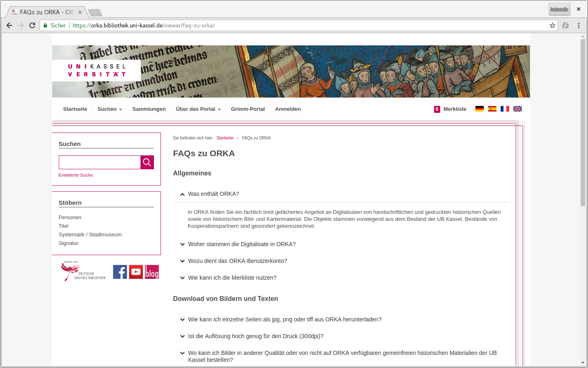
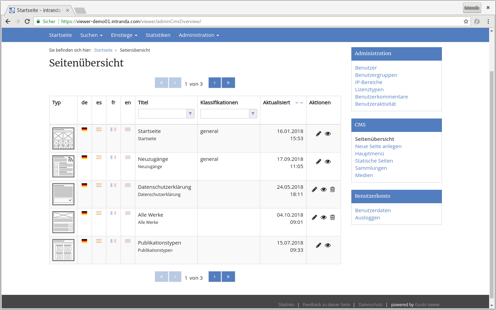

# September

The month of September was dominated by the Goobi user meeting. All slides of the presentations can be found in the media corner on intranda.com:



The [Goobi Community Forum](https://community.goobi.io/) was also presented at the user meeting. Concerns in the context of digitization and/or Goobi can be discussed there. Everything about the Goobi viewer can be found in the [viewer category](https://community.goobi.io/c/viewer). 

We were delighted about the great response to the topic of crowdsourcing. In the near future we will certainly see exciting news here! 

Apart from the user meeting, two new Goobi viewer instances officially went online in September. On the one hand, the results of the WorldViews project were presented at the Historikertag in Münster.



The website was developed on the basis of the Goobi viewer. The functionalities have been incorporated into the core, more specific developments that were very customer-specific have been outsourced to a separate module. It is exciting that the content comes completely from TEI documents. The site can be found at [http://worldviews.gei.de](http://worldviews.gei.de) . 

On the other hand, the [artist database and estate archive of Lower Saxony](https://www.kuenstlerdatenbank.niedersachsen.de/) was officially opened. The portal is based on the Goobi viewer, the technical implementation was carried out here by the GBV.

## Developments

### CMS

The possibility to realize a FAQ about the CMS module was once again significantly extended. For FAQ single articles a sequence can now be defined to determine the position of the entry in the complete list. The previous sorting was based on the order of the individual entries and could not be adjusted. FAQ single articles do not have to belong to a certain classification anymore. If several classifications are selected in the FAQ overview, the articles are grouped according to these classifications. The name of the classification optionally serves as a subheading. 

The result is visible, for example, in the [FAQs on ORKA of the Kassel University Library](https://orka.bibliothek.uni-kassel.de/viewer/faq-zu-orka/):

### Usability 

In the context of usabillity, there have been minor changes, but these mean a significant leap in comfort. These are: 

* Administration area 
  * The access licenses are no longer a free text field, but a dropdown menu. The indexed values can now be selected directly. There is no need to search for the name in the METS file. 
* CMS Backend 
  * If dynamic content based on a Solr field was also offered for sorting, the selection of the sort field was a free text field. Similar to the access licenses, this was also changed to a dropdown menu. 
  * If you want to insert an image into a template, you can now click directly on the desired image in the media modal that opens. The link previously offered for this purpose is omitted. 
  * The page overview of the existing CMS pages now shows the assigned title and the menu title. This makes it easier to identify a page linked in the menu with an independent title in the overview. 
  * Also in the page overview it is now possible to sort different columns and search in them.

In addition, the wish was expressed every now and then on pages with a Paginator, whether front- or backend, to display this not only at the bottom but also at the top of the page. The goal was a faster navigation through the pages / search hits without having to scroll each time. In complete contrast to this wish, however, is the requirement to display the relevant page content as far as possible at the top of the page to directly load as much as possible to see important. As a compromise we implemented a navigation with the arrow keys of the keyboard. Wherever a Paginator is offered to browse between pages or search hits, it can now be operated with the left and right arrow keys on the keyboard to navigate one page forward or one page backward. In addition, you can click the arrow keys twice in quick succession to jump to the first or last page. 

### Authentication 

The Goobi viewer offers the option of authenticating yourself via a local or OpenID account \(e.g. Google\). This area has been revised internally and there is now a new option to authenticate against an HTTP API from VuFind. The documentation has been updated and notes that have to be considered when updating the core have been added to the corresponding section of the documentation platform. 

### Indexer

The Goobi viewer Indexer now supports the indexing of videos from LIDO files. Previously, this was only the case for METS documents.

