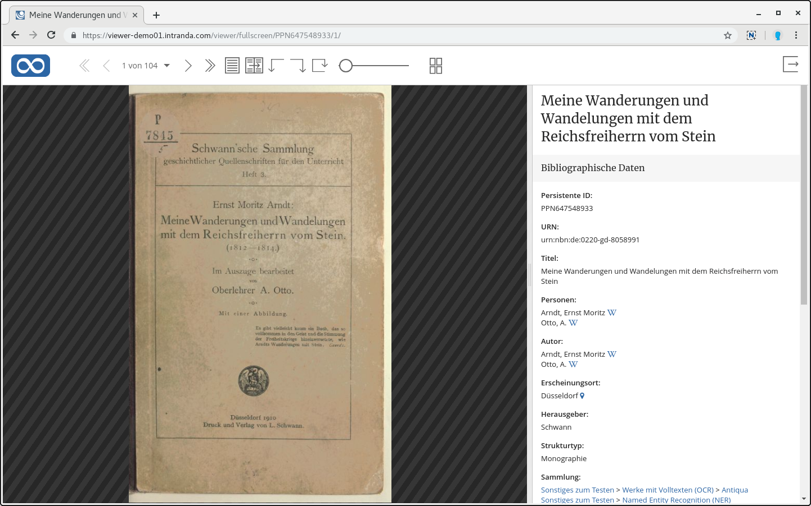
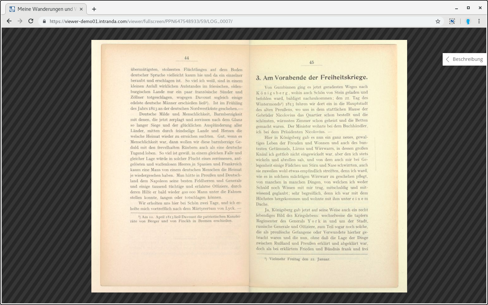
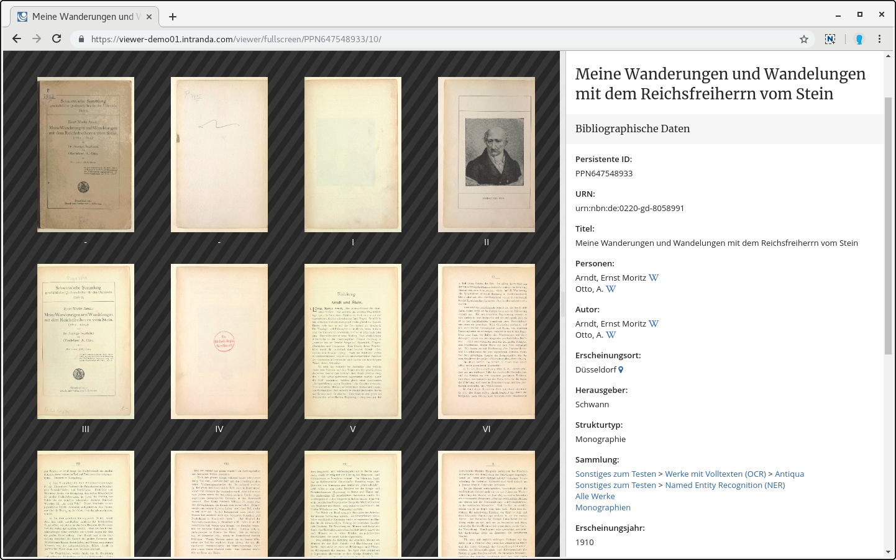
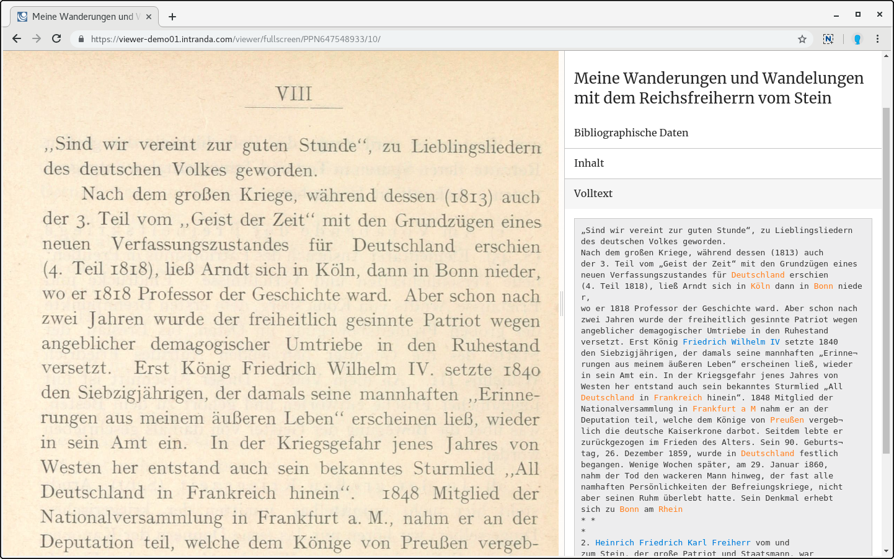
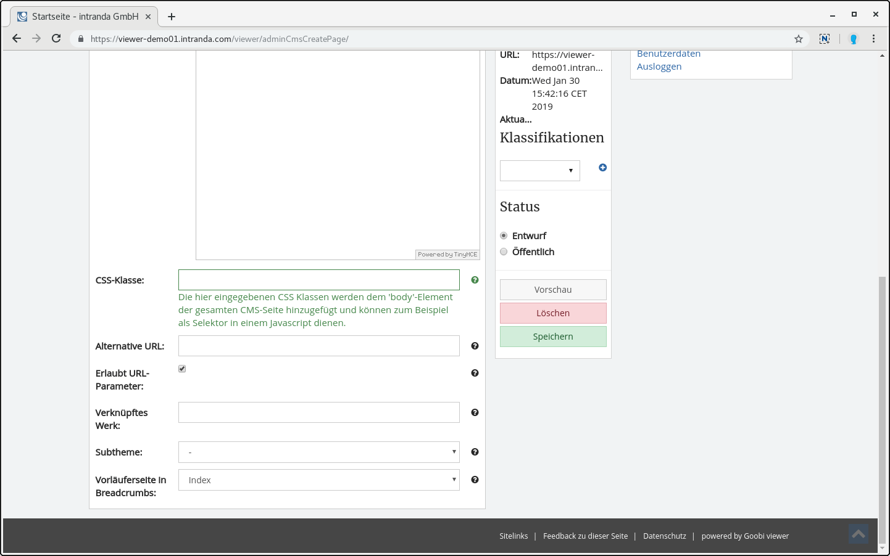

# January

The new year has started with fresh energy into the Goobi viewer development and there will be a lot of reports in January.&#x20;

First of all we would like to mention the great social media work on Twitter by the team behind the Digital State Library Berlin. Without further comment an unrestricted #followfriday #ff recommendation for the account of [@zlb\_digital](https://twitter.com/zlb\_digital)!&#x20;

In January there were two updates of Goobi viewer instances:&#x20;

* The Digital Collections of the Ibero-American Institute of Prussian Cultural Heritage\
  [https://digital.iai.spk-berlin.de/](https://digital.iai.spk-berlin.de)
* SULB digital! - the digitisation platform of the Saarland University and State Library [http://digital.sulb.uni-saarland.de/](http://digital.sulb.uni-saarland.de)&#x20;

## Developments

### IIIF Change Discovery API&#x20;

The Goobi viewer now implements the IIIF Change Discovery API as well as the IIIF Image API and the IIIF Presentation API. It is now possible to track changes to the manifests of the database. The API is available at the following URL:&#x20;

```
/viewer/rest/iiif/discovery/activities 
```

There are deviations from the official specification. This is because the specification is still in DRAFT status and version 3 of the IIIF Presentation API is already being considered. The Goobi viewer has so far implemented the stable version 2.1 of the Presentation API. Therefore, there are three minor adjustments in the individual pages of orderedItems.object:&#x20;

| Specification                                   | Implementation in Goobi viewer |
| ----------------------------------------------- | ------------------------------ |
| `orderedItems.object.id`                        | `orderedItems.object.@id`      |
| `orderedItems.object.type`                      | ` orderedItems.object.@type`   |
| `Manifest` (within `orderedItems.object.@type`) | `sc:Manifesto`                 |

As soon as the IIIF Presentation API 3.0 is released stable, we will ensure support in the Goobi viewer and also adapt the Change Discovery API.&#x20;

### IIIF Snippets&#x20;

* A presentation manifest can now also contain an optional description. A list of potential Solr fields can be defined. The description itself is then taken from the first filled field. See also chapter 2.33.2.&#x20;
* In the comparison view the annotation icons are hidden because this functionality is not available there.&#x20;
* LIDO objects are now correctly referenced to the LIDO source document.&#x20;

### New full screen display&#x20;

A reading mode for the Goobi viewer was developed some time ago. Over time, various variants of this solution developed and were used in various themes. However, isolated solutions always remained and were not incorporated into the stable core for everyone. We changed that in January. The read mode was completely redesigned and equipped with additional functions such as a new thumbnail display. In addition to the bibliographic data, the structure tree and the full text of the current page are also visible in the sidebar. This makes it possible for the first time to display an image and the corresponding full text synoptically. The upper navigation bar hides automatically after five seconds of inactivity with the mouse. To take over the development for all users, we have decided to integrate the new read mode as a new full screen display. Thus this feature is immediately available with an update.&#x20;

Here are some impressions:










Attention. This new display replaces the previous full screen display and reading mode. This must be considered when updating the theme.


### CMS

There have been the following changes in the CMS area:&#x20;

* With a FAQ overview page it is possible to refer directly to a contribution. An icon for a URL is displayed next to the title. If this is used, the browser scrolls directly to the article and unfolds it.&#x20;
* The Inline-Help which is available when creating or editing CMS pages for the functions in the lower part of the page has been revised.&#x20;
* A CSS class can now optionally be set for a CMS page in order to uniquely identify a CMS page in a Javascript.



### Browser caching&#x20;

The content server used in the Goobi viewer has received support for better browser caching of images. These are now delivered with an ETag. If a web browser asks for an image resource, it sends - if known - an ETag. If this is known to the ContentServer and the corresponding image has not changed, the ContentServer now responds with an HTTP 304 (Not Modified). Then the image does not have to be reloaded, but the browser takes it from its local cache. In practice, this leads to a faster page structure.&#x20;

### Language switching and translations

Previously, there were various factory language switching limitations, which have now been fixed. Metadata was not translated directly after language switching, but the page had to be loaded a second time. Structural elements without titles in the table of contents were not translated at all, but kept the language with which the work was opened. The case of a user constantly switching back and forth between different languages is also extremely rare, but usually only occurs during testing. Nevertheless, we are very happy about this bugfix, which significantly improves the support for multilingual structure and metadata.&#x20;

In addition, the translations for English and Spanish have been revised and completed.&#x20;

### Access licenses

&#x20;For access licenses, there was a more specific development in the definition of conditions. Previously, only Solr queries could be defined as conditions, for example to create a moving wall or to restrict the PDF download to certain file names. Recently a regular expression can also be defined as a condition with `FILENAME:{REGEX}` in order to control the download possibility of files in combination with the right "Download files" by means of the file name.&#x20;

If the source folder contains one or more files beginning with INTERNAL, they can be accessed via the condition `FILENAME:{INTERN.*}` and made available, for example, only from the internal network. See also chapter [6.9.1](https://docs.intranda.com/goobi-viewer-de/6/6.8/6.8.1).&#x20;

### Normalization of sort fields

The Goobi viewer indexer can now normalize numeric values in strings to prepare them for correct sorting. See also [chapter 3.7.17](https://docs.intranda.com/goobi-viewer-de/3/3.7#3-7-17-parameter-normalizevalue).
