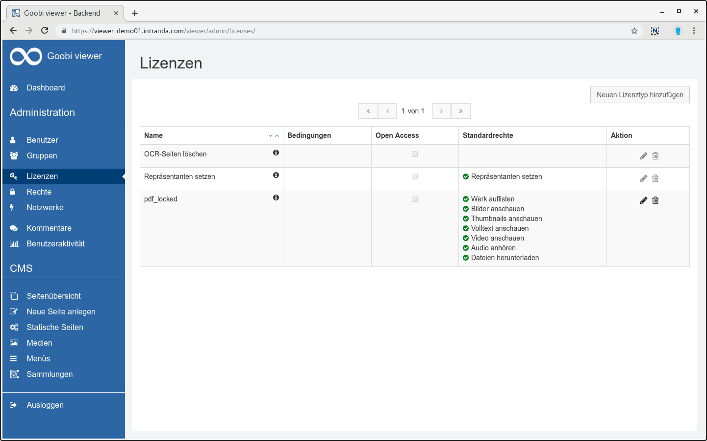
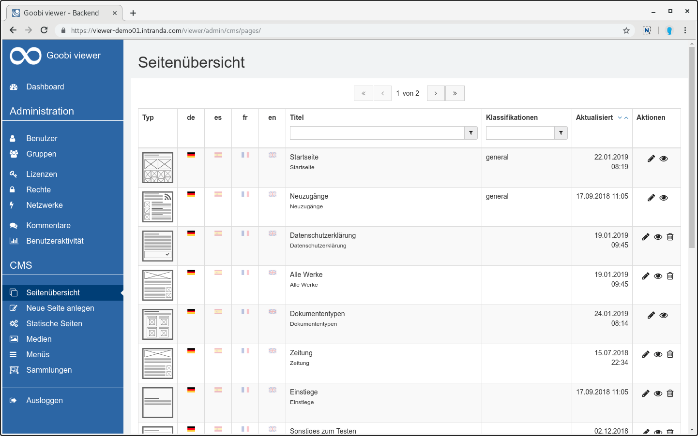
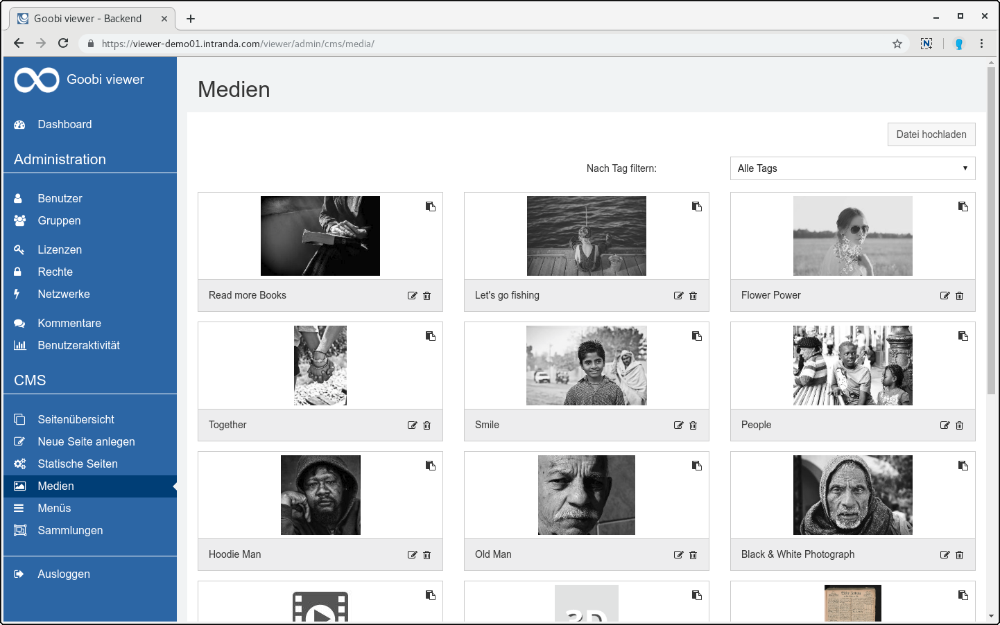
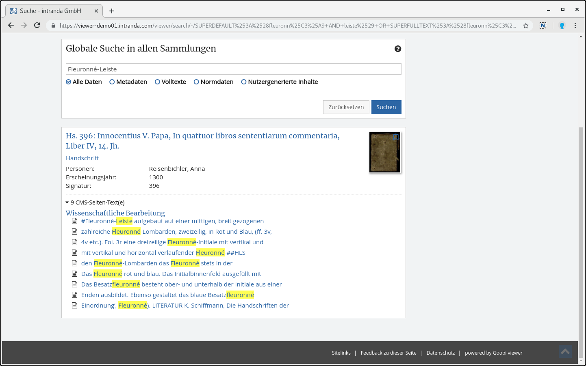
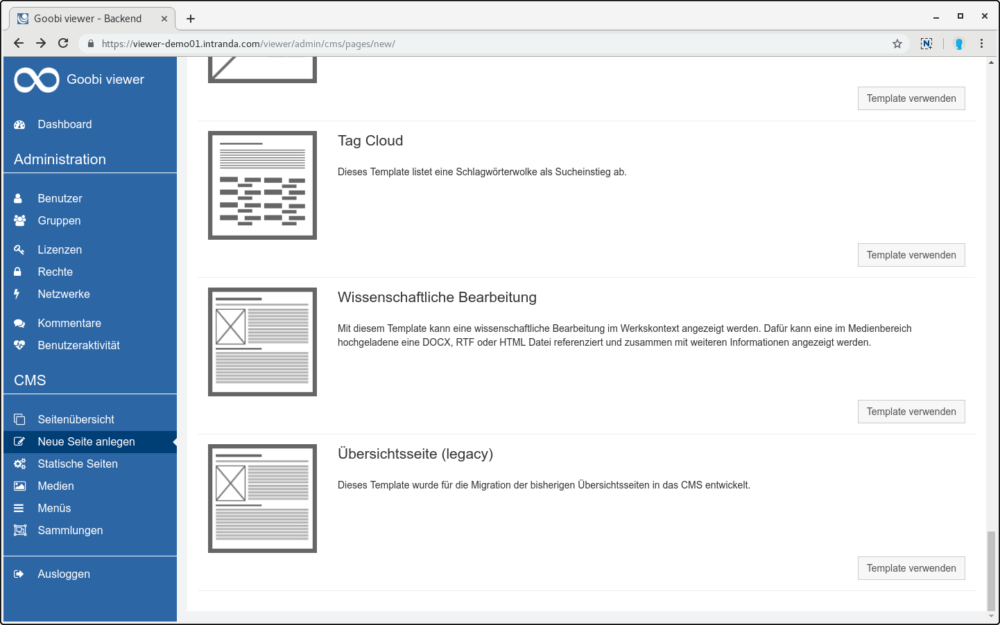
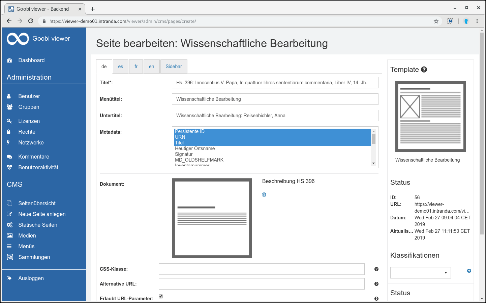
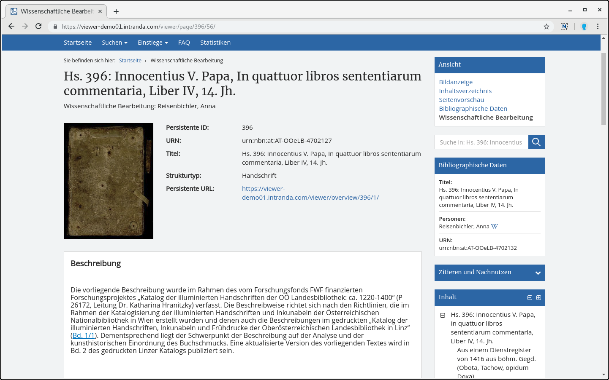

# February

In February the Goobi viewer instance of the Chamber of Labour in Vienna was updated. As part of this update, the sub-theme possibilities around the CMS were further refined in order to be able to edit and adapt as many things as possible directly from the user interface. The updated instance can be found at the following address: [https://emedien.arbeiterkammer.at](https://emedien.arbeiterkammer.at) 

In addition, the [Digital Culture and Knowledge Portal Thuringia](http://www.kuwi-thueringen.de/) has gone online. We are proud to deliver data there via the IIIF interfaces of the Goobi viewer.



Since there have been questions in the past about which web browsers are supported by the Goobi viewer, we have added an entry to the FAQ:

* [https://docs.intranda.com/goobi-viewer-de/faq\#welche-webbrowser-werden-vom-goobi-viewer-unterstuetzt](https://docs.intranda.com/goobi-viewer-de/faq#welche-webbrowser-werden-vom-goobi-viewer-unterstuetzt)

## Developments

### Admin backend

As announced last September at the Goobi User Meeting, we want to standardize the design in the admin backend. Our goal there is to be independent of the respective CI of the institution. With the new design we want to extend the inline help step by step and improve the usability. In the end, the complete backend including screenshots should also be described in the documentation. 

The prelude to this work was the gathering of feedback on the status quo. In the [Goobi Community Forum](https://community.goobi.io/) we invited to a meeting and further participation. On this date, the Goobi viewer team and two users collected ideas and constructively discussed and classified the feedback we received via the forum, email or telephone. This topic will continue to accompany us intensively in the coming months. 

The first step was taken in February and a first version of the independent design was added to the stable master. All functions have remained the same, but the design has changed. A direct effect in practice is that there is already much more space available. Here are some impressions:

### CMS overview pages

There has also been a big change in the overview pages. The functionality has been completely moved to the CMS area. This work has various positive effects. For example, there is only one place where content can be edited. This increases maintainability and removes redundancies in the source code. At the same time the initial support for the search in CMS pages was implemented. From each CMS page assigned to a work, the texts are indexed when saved and are available in the aggregated search hit display.

The possibility to upload not only images but also DOCX, RTF and HTML files in the media area has also been newly created. These files can be integrated into the new CMS template for scientific editing. DOCX and RTF files are automatically converted to HTML for display. The contents of the files are also indexed for the search. 

In order to be able to display all functions of the former overview page, a further component is now available for templates: Display metadata of the work. A selection can be made from a list of all potential metadata fields. Depending on the work to which the CMS page is assigned, the entries for which values also exist are then displayed from the list. 

In order for the pages to be displayed in the record context, the check mark for "This page uses the standard sidebar" must be activated in the "Sidebar" tab when editing the page. This is not set by default. 

CMS pages assigned to a work can be called up via the usual URLs `/viewer/cms/PAGEID/` or via the URL `/viewer/page/WERKSIDENTIFIER/PAGEID/`. Of course, an alternative URL with its own path can still be assigned.

### CMS Facetting widget 

For CMS pages where collections or search hits are displayed there is a widget to provide individual facets. This widget can now be used on any CMS page and automatically redirects to a search hit page. This means, for example, that a faceting by collections, time periods, locations or other fields can be offered on the start page as an introduction to the content. 

### IIIF

 When configuring the IIIF Presentation API, it is now possible to give a metadata a different label in the manifest than in the Goobi viewer interface. Metadata can also be retrieved from LIDO events. See also chapter [2.33.2](https://docs.intranda.com/goobi-viewer-de/2/2.33/2.33.2).

### Authentication against Littera webOPAC

 A new feature is the possibility of user authentication against a Littera webOPAC. Therefore another authentication provider was implemented. See also chapter [2.5.1](https://docs.intranda.com/goobi-viewer-de/2/2.5/2.5.1).

### Works in collection display configurable again

In October, we replaced the structural elements whitelist with an automatic list of document types. Our intention behind it was to make the many questions of the users obsolete, why after entering a new document type in Goobi workflow it does not appear in the Goobi viewer after the export. This step not only met with approval, as logic was also dropped, which was used and desired by various institutions. For this reason now again a configuration option is available in adapted form. Instead of a list of structural elements that are listed, a Solr query can be formulated with which the document types and structural elements can be defined. See also chapter [2.18.7](https://docs.intranda.com/goobi-viewer-de/2/2.18/2.18.7). 

### Browse

 Sometimes it takes a long time to browse through a large database. To improve performance, an optional Solr query can be passed, for example, to search for content only in structure elements. With this adjustment the time for generating the browsing page on a customer system could be reduced by three quarters. See also chapter [2.19.8](https://docs.intranda.com/goobi-viewer-de/2/2.19/2.19.8).

### Documentation

At the brainstorm meeting on the admin backend it came out that it was not known how the multilingualism of themes can be managed and controlled. After a short check we noticed that this was not documented at all. We made up for that directly, for all those who are interested, we refer to the documentation,[ chapter 6.12](https://docs.intranda.com/goobi-viewer-de/6/6.12).

