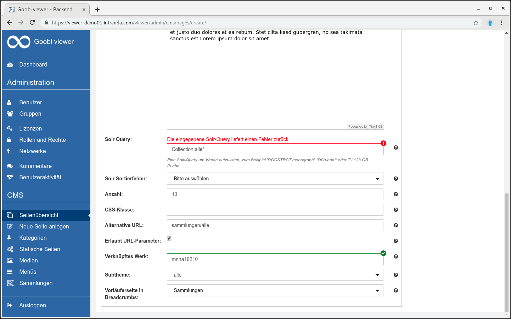
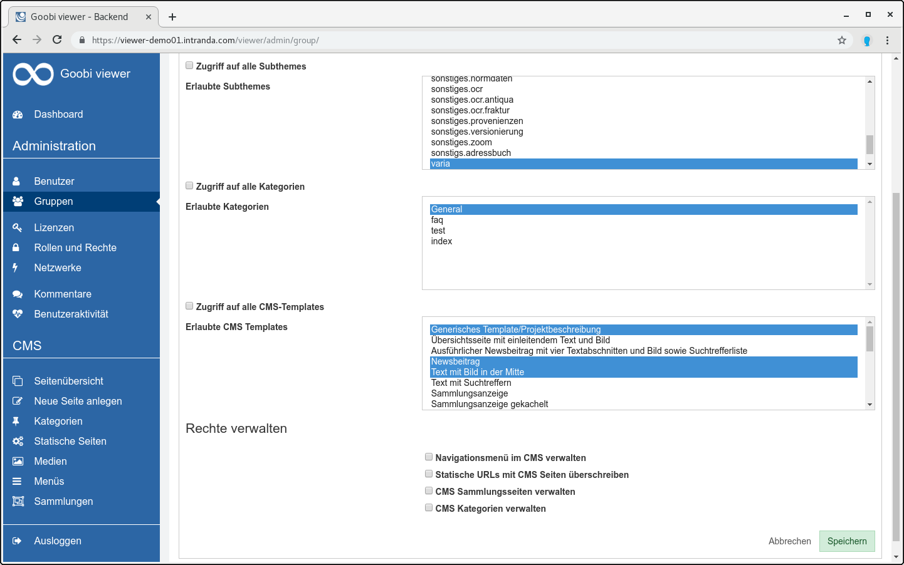
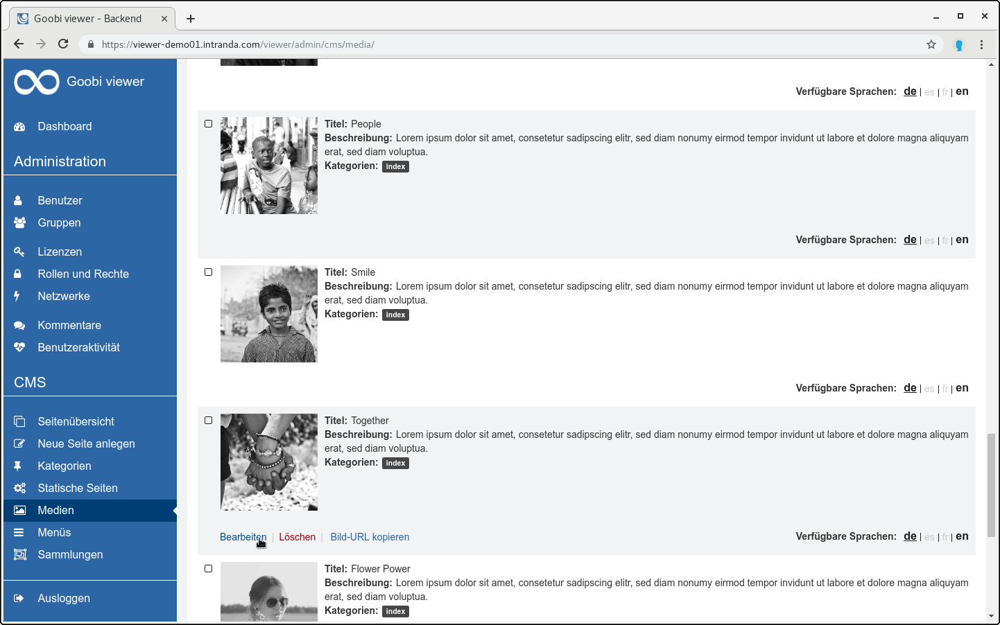
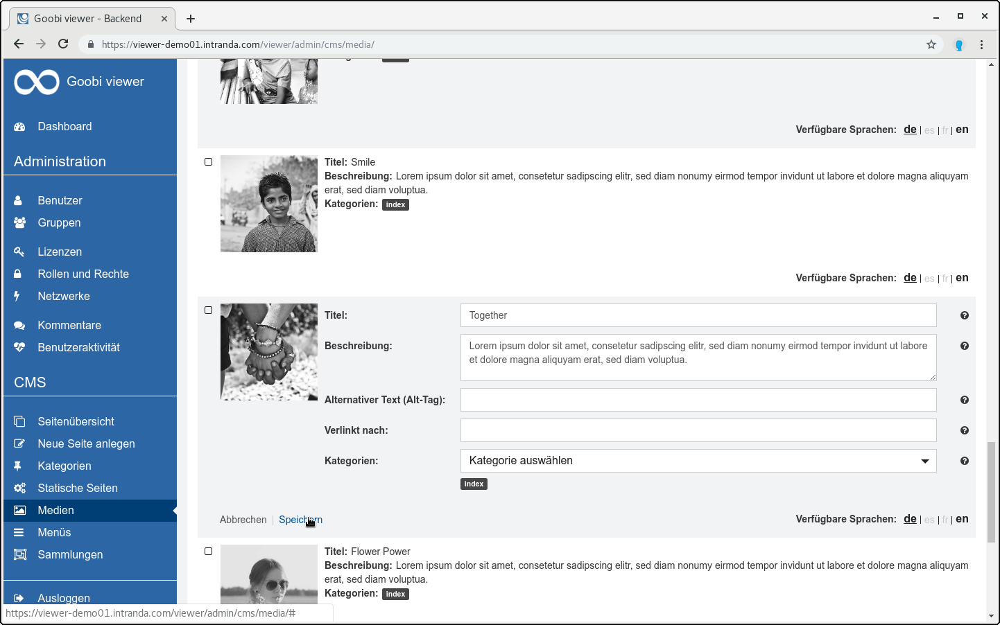
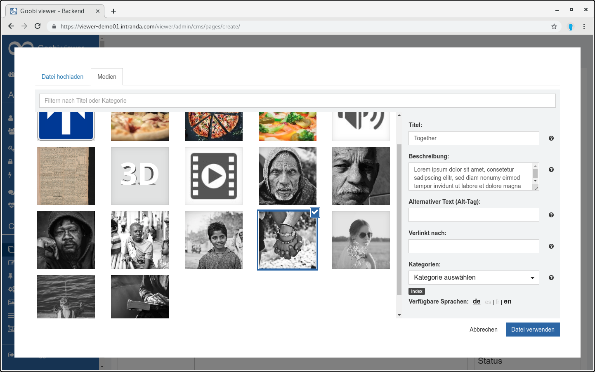
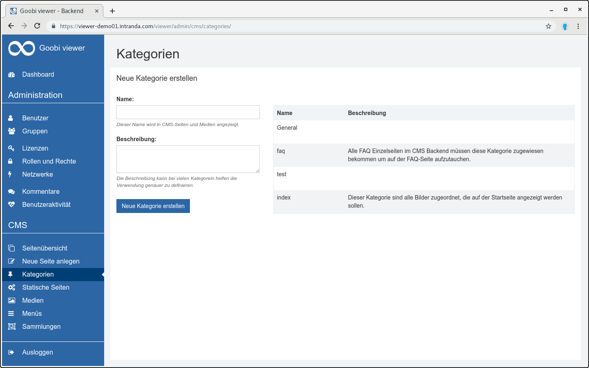
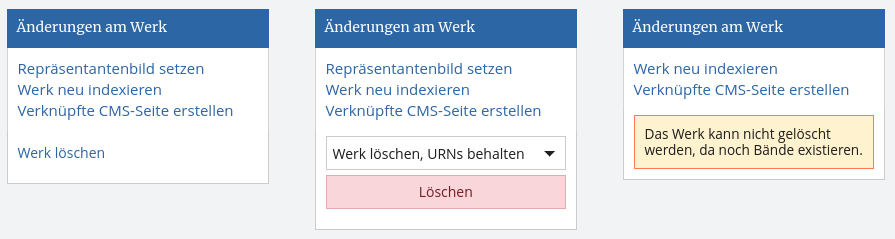

# March

As always, a lot has happened over the past month. For example, the Goobi viewer at Stuttgart University Library was updated and the installation of the Vorarlberg State Library in Bregenz was put into operation. The two instances can be found at the following URLs: 

* **Digibus** of the Stuttgart University Library: [https://digibus.ub.uni-stuttgart.de](https://digibus.ub.uni-stuttgart.de) 
* **volare texts** of the Vorarlberger Landesbibliothek: [https://texte.volare.vorarlberg.at/viewer/](https://texte.volare.vorarlberg.at/viewer/) 

Especially worth mentioning are also the developments that have taken place around the CMS. Classifications and tags were merged to categories and can be edited directly in the web interface. The media area has been redesigned and it is finally possible to upload files while editing a page. The role and rights concept was extended to the CMS area, so that the editing of CMS pages no longer has to be done exclusively by administrators. More about this in the following sections.

## Developments

### Authentication 

User accounts can now be automatically added to groups depending on the authentication method. 

For example, if the Goobi viewer is configured to authenticate against the library catalog's user database, all users who have an account in the catalog can automatically become members of a specific group in the Goobi viewer. In conjunction with the access restrictions, these users can then be granted certain rights to view works that are not used by library users. 

See also [Chapter 2.5](https://docs.intranda.com/goobi-viewer-de/2/2.5) and related subchapters. 

### OpenSearch

The Goobi viewer now supports the OpenSearch standard. This makes it easier to search in the databases of an instance. In the Omnibar of Google Chrome, a search is automatically offered when the tab behind the domain name is pressed. In Firefox, the small green plus on the magnifying glass in the search engine field indicates availability. For the configuration see also chapter [2.34. ](https://docs.intranda.com/goobi-viewer-de/2/2.34)

### Inline help and validation in the CMS

 The community indicated that a validation of the entries and a revised inline help in the admin backend would make the work easier. That's why we started this month with the implementation and added an automatic validation of the entries in two places. Also first help texts were revised. From now on it will be checked whether an entered Solr query is valid and returns hits or whether a linked work also exists.



### Licenses vs. Roles and Rights 

The previous area of licenses was split into two points: 

1. **Licenses**: Configuration of Access Restrictions for Individual Works 
2. **Roles and rights**: Configuration of rights that release functions in the user interface. 

This division is the first step to further change into the area. We have plans to continue working there in the coming months in terms of structure, usability and optics and usability. 

### CMS controllable via rights 

Until now, the editing of CMS content was reserved for administrators only. This restriction is lifted with the extension of the rights management to the CMS area. Users and user groups can now be provided with rights for the CMS. There is the possibility to release the whole area or only parts in restricted form. 

You can configure: 

* Restricting to certain subthemes 
* Restrict to certain categories 
* Restrict to certain CMS templates 
* Managing the Navigation Menu 
* Managing static URLs 
* Managing Collections 
* Manage Categories



### Media 

The media area has been completely revised. The goal was to improve usability, reduce clicks and develop painfully missing functions in the context. Therefore, it is now possible to upload or delete several image files at once. In addition, new images can finally be uploaded directly when editing a CMS page. 

Here are some impressions:








### Classification + Tags = Categories 

Previously, tags were available for media files. After these tags could be filtered or all media files with certain tags could be displayed on a CMS page. The names of the tags were freely selectable.   
On CMS pages a comparable functionality was available under the name Classification. However, classifications were not freely assigned, but a list of possible values was stored in the Goobi viewer configuration file. 

The category area is now completely new. It replaces the previous classifications and tags. Old entries are automatically migrated to categories and converted. 

A page is available in the backend on which the categories are managed.



### Delete item from viewer 

Items can now be deleted directly from the Goobi viewer interface. A new option is available in the "Changes to record" widget for this purpose. If URNs exist, you can select whether the work should be removed and URNs retained, or whether the item should be completely deleted. This functionality is only available to administrators.



The functionality can also be used via REST at the following endpoint:

```text
https://viewer.example.org/viewer/rest/index/deleterecord/?token=test
```

The following information must be sent to this endpoint via POST:

```javascript
{
    "pi":"IDENTIFIER",
    "createTraceDocument":false
}
```

### Indexer: Buffer for Data Repositories

In addition to various bug fixes, the Goobi viewer Indexer has received new functionality for data repositories. With the `RemainingSpaceStrategy`, the optional buffer attribute can now be used to define a memory `buffer` that should remain unused in the memory area. See also [chapter 3.2.6](https://docs.intranda.com/goobi-viewer-de/3/3.2#3-2-6-parameter-datarepositories-datarepository).

