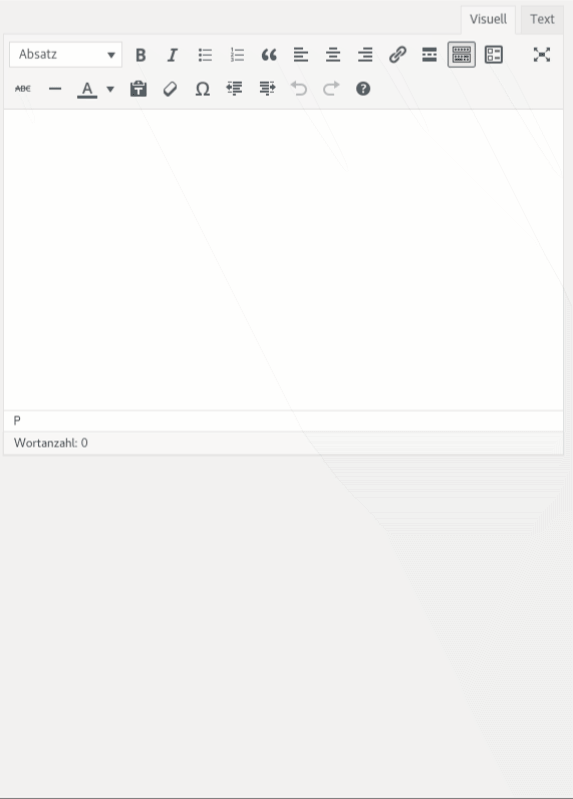
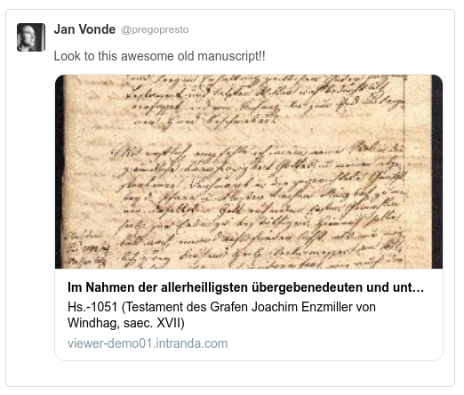
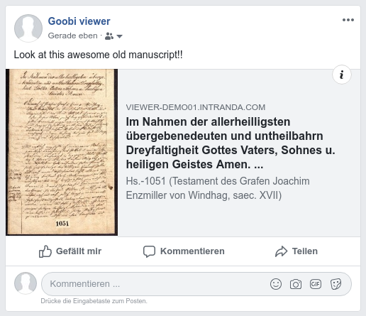
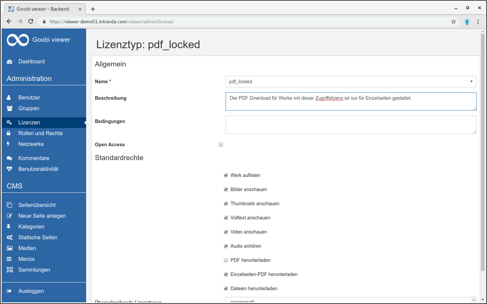
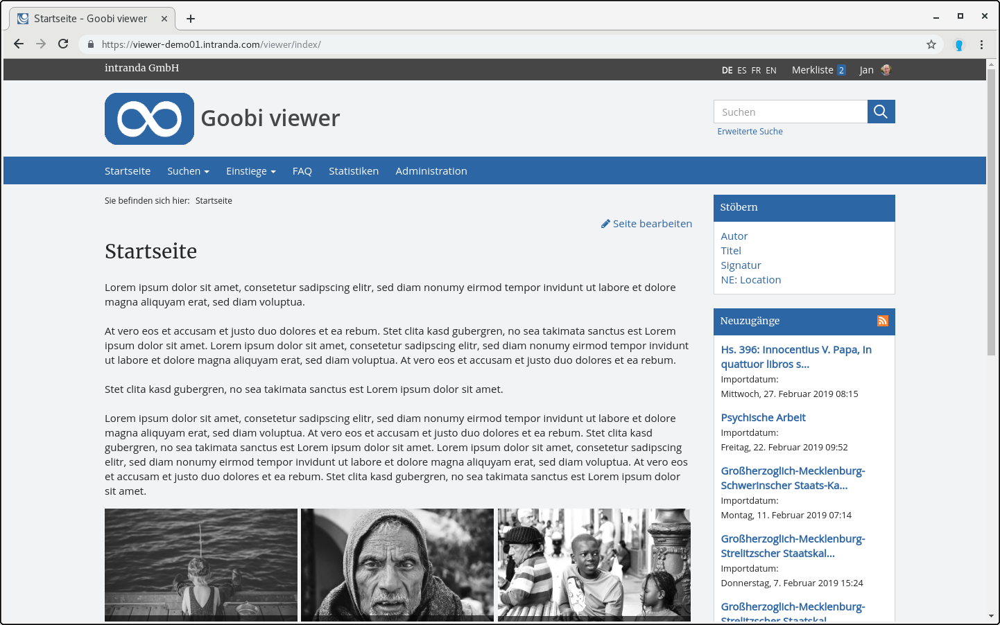
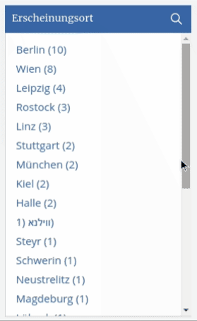

# April

April has once again brought exciting topics to the fore. There were developments in the context of social media, different things to improve the usability in the CMS or restructuring within the documentation. 

The Goobi viewer was also mentioned in the IIIF Community Newsletter with the implementation of the Change Discovery API:



## Developments

### Social media 

The Goobi viewer now supports three methods to better display links to works in social networks: 

* oEmbed
* Twitter Cards
* OpenGraph

The oEmbed standard is supported by content management systems such as Wordpress. A URL to a work is then resolved there directly as an image. Here is an example from the Wordpress editor while writing a contribution:

Twitter Cards allow not only the link to a page, but also pictures or videos including metadata to be displayed directly in the timeline. OpenGraph is the equivalent in Facebook.

### Access restriction 

When configuring access restrictions it is now possible to limit the download to single page PDF. Previously, PDF downloads for a work could only be disabled completely or limited to one structural element type. With the new option, works containing several thousand images with just a few structural elements can now also be offered for download in the Goobi viewer. The restriction to single page PDF helps to reduce the load on the servers.

### CMS 

There were two minor adjustments in the CMS. On the one hand, a new linked CMS page can be created from the factory view. In the widget "Changes at work" in the sidebar a new link "Create linked CMS page" is available. A click here in the CMS area creates a new page based on the template "Scientific editing". The linked work is preselected. 

The new link "Edit page" is immediately visible for all authenticated users with the appropriate rights level. This link is displayed in the frontend and enables the user to switch from there directly to the backend in the edit mode of the CMS page in question.

### Usability 

There were several improvements in the usability of the system. The well-known key combinations for scrolling with the arrow keys now also work in the full screen display. There, the width of the sidebar and its scroll position is now remembered when scrolling. This simplifies, for example, the parallel display of image and full text while scrolling in the factory.

There are also two optimizations to report from the context search. If one scrolls down in a search hit list, clicks on a search hit and goes from there back to the search hit list, the scroll position is remembered and one lands on the known page at the same place where one left it. Previously the page was displayed at the top and you had to scroll down again.

Another new feature is the possibility to filter in the faceting options. If the list of the offered possibilities is very large, an input box can be displayed with a click on the title or the adjacent magnifying glass, which allows a direct filtering in the possibilities.

### Breadcrumbs

The collection tree is now automatically listed in the breadcrumbs for a work URL if the work only belongs to one collection. This makes it easier to understand the context of the work. CMS pages are also correctly linked and listed. 

### Documentation

New additions to the documentation are [chapters 3.13](https://docs.intranda.com/goobi-viewer-de/3/3.13) and [3.14](https://docs.intranda.com/goobi-viewer-de/3/3.14), which describe the Solr scheme itself and special fields used in the Goobi viewer. This is particularly interesting for professional users who maintain their own schema or configure the data mapping themselves. 

As already announced in the Community Forum, the link structure of the documentation has been adapted to that of Goobi workflow. The URLs are less meaningful, but will in future allow for easier switching between different language versions.   
The digests were also moved from the documentation itself to a new location to make the separation between the contents clearer. 

### Internal

Not everything that is developed is directly visible in the surface. So a lot of time was invested in April to use the internal urlBuilder at all places in the source code. This generates URLs from the Goobi viewer itself to other pages within the Goobi viewer. During development it is sometimes easier to "just build the link by hand". This was cleaned up once. 

The same applies to the support of the DataRepositories. The PDF download from these repositories was not yet fully supported. This was also implemented. 

### Goobi viewer Connector

In the OAI interface there were smaller updates for more stability. An update is only necessary if there are problems. 

### Goobi viewer Indexer

 The Goobi viewer Indexer now supports words in ALTO full texts that are separated by a line break and are located in ComposedBlocks. Indexing has been implemented and the correct display in the search hits has been verified.   
When LIDO files use automatic image download, images can now be downloaded from a IIIF Image API compatible interface.

An update is also only necessary if there are current problems with one of the two points mentioned.

