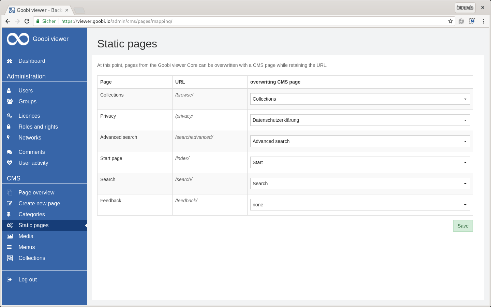
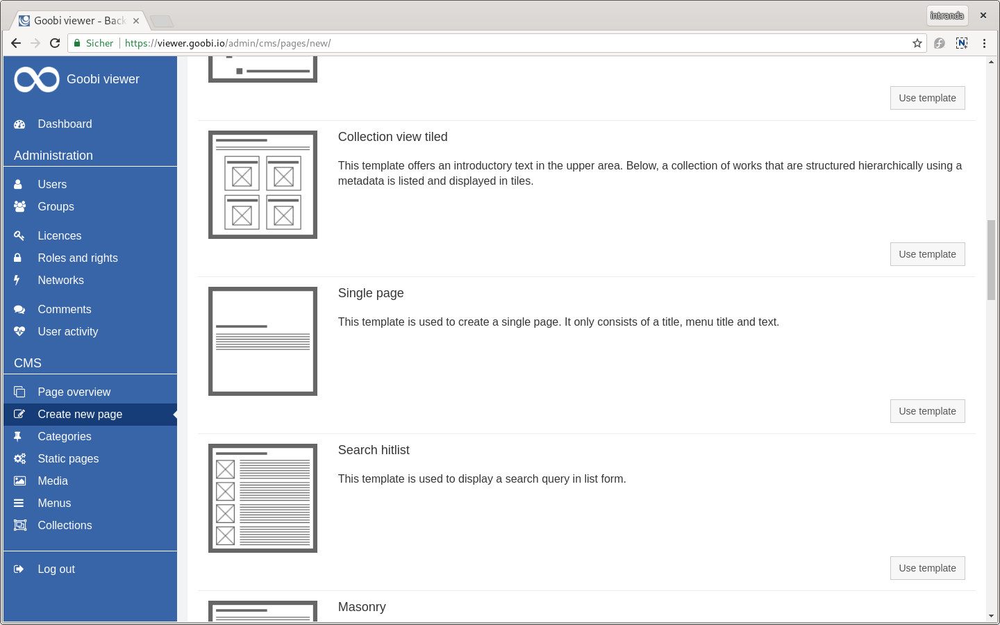
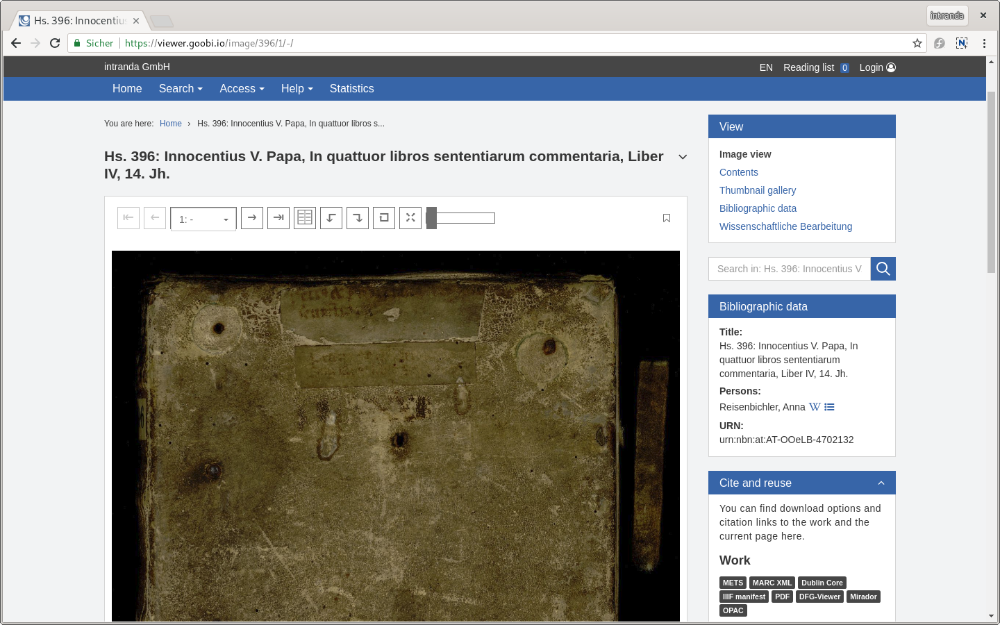
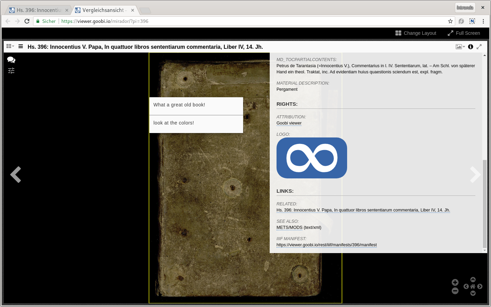
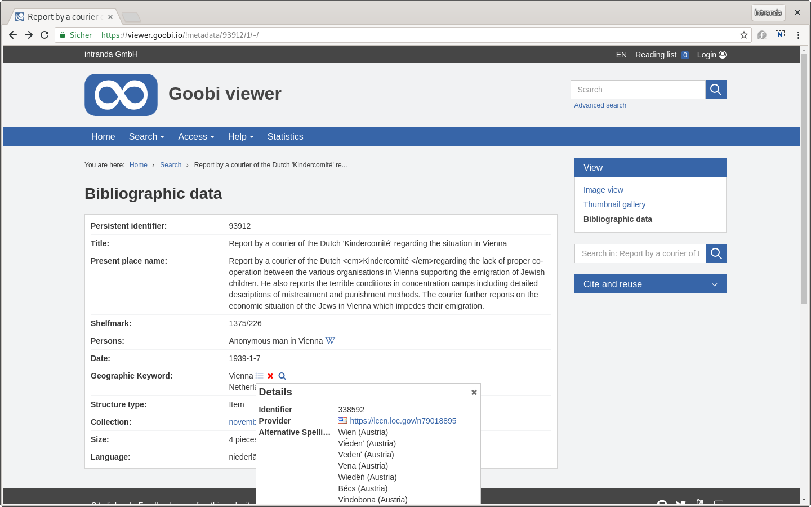

# June

We are pleased about the activation of MNHA Collections. Here the **Musée national d'histoire et d'art** from Luxembourg presents the first digitized collections. The special feature is the complete trilingual support for German, English and French in user interface and metadata. The installation can be found at the following address:

* [https://collections.mnha.lu/](https://collections.mnha.lu)



Also in June the **IIIF Conference** took place in Göttingen. There the Goobi viewer was presented in detail at a workshop:



The **Maven** conversion, which had already been discussed in detail in May, was continued in June. For example, the package structure of de.intranda.digiverso.presentation has been adapted to io.goobi.viewer, and the folder structure in the Goobi viewer Indexer and the Goobi viewer Connector now correspond to the standard Maven folder structure.&#x20;

A demo and test installation of the Goobi viewer is now available at the following address:

* [https://viewer.goobi.io](https://viewer.goobi.io)

## Developments&#x20;

### CMS&#x20;

#### Static Pages

Static cages from the Goobi viewer core can be overwritten with CMS pages. This makes it possible, for example, to create an individual start page or your own collection page in the CMS and then store it under the known URLs. The page on which this configuration is carried out has been significantly revised with regard to usability. An introductory sentence now explains what can be done on the page at all. In addition it is obvious which URL will be overwritten.

#### CMS templates&#x20;

There were several changes to the CMS templates. The title and the description are now multilingual. Since June 2019 the whole user interface is available in several languages!

Also new is the ability to configure an inline help for individual elements of a CMS template. This means that users can now have even more instruments at their fingertips to intuitively move around the backend and create their own pages.

Certain elements of a CMS page can be integrated within another. For example, a preview text of a news article on a news overview page or individual FAQ entries on a FAQ page can be combined and displayed. Until now, this mechanism was linked to the internal names of the elements and then hard-coded in the templates. New is the element `preview="true"` in the template definition, which removes this rigid link and marks the element to be included.

### IIIF&#x20;

There are three innovations in the IIIF context this month. First it is now possible to open single works in the internal Mirador. Therefore we have added a new badge "Mirador" in the widget "Cite and reuse" which opens the work accordingly.&#x20;

Comments on images that were already displayed in the manifests are now also displayed in the Mirador. For this it was important to pass the coordinates of the whole page.&#x20;

Finally, CMS pages linked to a work are automatically output as related resource in the manifest. As always, the manifests are generated on-the-fly and new comments and linked CMS pages are directly visible without any further action.

The class model for generating and processing IIIF manifests was moved from the Goobi viewer core to a separate Java library for direct use in other projects. The library can be integrated via Maven and is published on Github:

* [https://github.com/intranda/iiif-api-model](https://github.com/intranda/iiif-api-model)

### Image display&#x20;

By default, the images are always scaled to the width of the image container to ensure consistent display. However, this leads to problems if, for example, a book spine or an internal leporello is digitized. Then the displayed images are either enormously large and long, or extremely narrow and wide.

To counteract this effect, the Goobi viewer now limits the image display to a height of 1200px as soon as certain threshold values are exceeded.

See also [chapter 2.11.3](https://docs.intranda.com/goobi-viewer-en/2/2.11/2.11.3) in the documentation.

### Search&#x20;

In the search, an additional static list of sort fields can now be defined for sorting in order to always place certain works at the top based on the existence of a certain index field. The fields configured here are applied in the sort order before the normal sort fields and are not visible to the user.

See also [chapter 2.17.1](https://docs.intranda.com/goobi-viewer-en/2/2.17/2.17.1) in the documentation.

### Authority data (VIAF and search)&#x20;

The Goobi viewer now also supports the display of norm data from VIAF. In addition to the functions already known from the GND, an icon of the data supplier and a URL to the local database are also displayed.

With the new field type `normdatasearch`, a button can be rendered that starts a search with the configured index field that lists all works with this field:value combination. For example, this can be used to search for works for which the same standard data set was used.

See also [chapter 2.19.1](https://docs.intranda.com/goobi-viewer-en/2/2.19/2.19.1) in the documentation.

### Indexer&#x20;

If changes are made to the field configuration in the configuration file `solr_indexerconfig.xml`, the Goobi viewer Indexer automatically reloads the configuration file and accepts the changes. Restarting the service is only necessary if changes are made outside the range.&#x20;

### Reference Theme&#x20;

The Goobi viewer Reference Theme has been revised and adapted to the current standard of the Theme Boilerplate. Colors, spacing, font sizes and the mobile version have been revised.&#x20;

The Reference Theme is visible on the demo instance mentioned above.&#x20;

### Documentation&#x20;

The Goobi viewer documentation and the Goobi viewer digests are now also available in English on the well-known documentation platform:&#x20;

* [https://docs.intranda.com/docs/](https://docs.intranda.com/docs/)&#x20;

Time and again, we were also asked which interfaces the Goobi viewer actually supports and what they look like. Especially in the context of IIIF, the question came up more often.&#x20;

We created a page to describe the interfaces. Not only the individual interfaces are listed, but also example URLs. These URLs should be individually adapted to the respective installation when the page is transferred. The page can be reached as a copy template in German and English at the following address:&#x20;

* [https://viewer.goobi.io/interfaces/](https://viewer.goobi.io/interfaces/)
