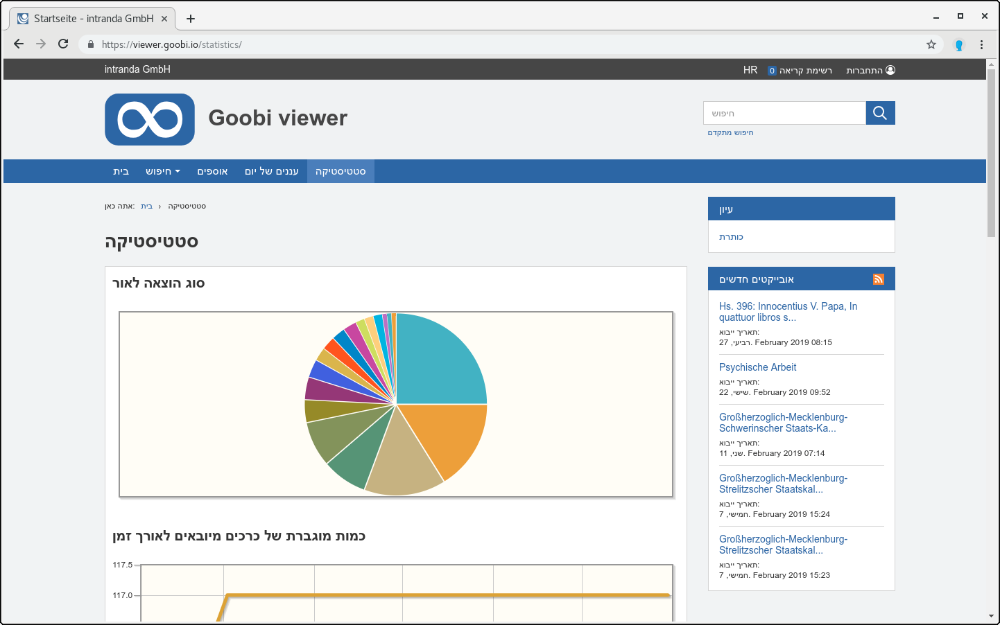
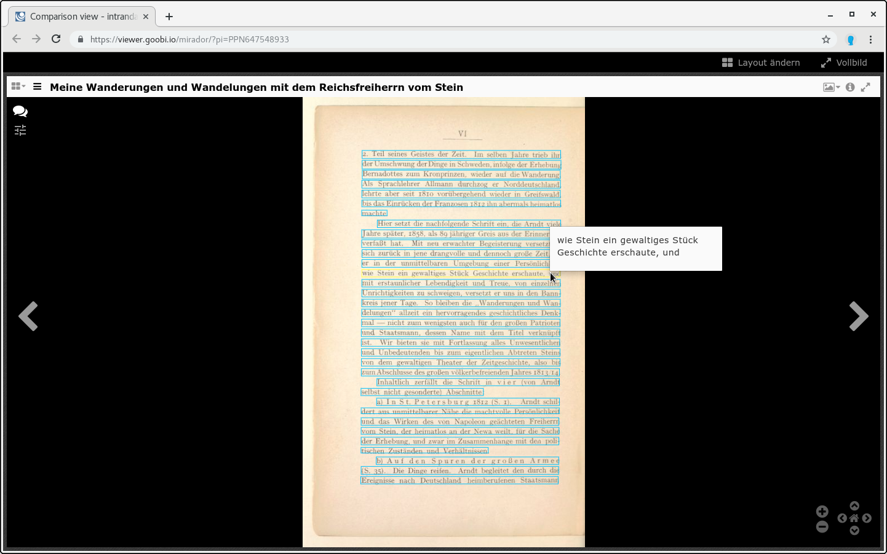

# July

As announced, July was a quiet month, albeit a very special one! Never before in one month have there been so many external contributions from the community as in the past. No less than three independent contributions in the context of languages were submitted and added into the core. 

We are also delighted that the Verein für Computergenealogie is presenting its digital library with the Goobi viewer:

* [https://www.digibib.genealogy.net/viewer/](https://www.digibib.genealogy.net/viewer/) 

Otherwise, the Goobi viewer was again a topic in the IIIF Newsletter:



And also in the broadest sense IIIF: At the conference a participant drew our attention to his personal evaluation of the software. He was very positively impressed and thanked a lot. Who of the readers can speak Japanese here? 

* [http://digitalnagasaki.hatenablog.com/entry/2019/04/24/051339](http://digitalnagasaki.hatenablog.com/entry/2019/04/24/051339) 

## Developments

### Language support

As already written there were three contributions from the community. The first is a translation of the Goobi viewer Core into Hebrew.

Secondly, work on the Portuguese translation has continued and, last but not least, a language table with official MARC language codes and their translations for German, English, French and Spanish has been adopted by the Goobi viewer. For a discussion about the language table see the following thread in the Community Forum:



### IIIF

At the IIIF conference we had many conversations and established contacts. One result is that full texts from ALTO files are output as annotations in the IIIF manifests.

### Installation and interface overview 

Again and again we are asked the following two questions: 

* Which Goobi viewer installations are there actually? 
* Which interfaces are supported? 

The list of installations is often used for inspiration when it comes to evaluating the functionality of your own digital library or preparing an update. The list of interfaces is in demand from time to time by scientists.

 In order to be able to answer these questions more easily in the future, we have published an overview at the following address: 

* [https://goobi.io/viewer/installations/](https://goobi.io/viewer/installations/)

### Indexer

If full texts in text files are not available as UTF-8, the Goobi viewer Indexer automatically converts them to the format.

