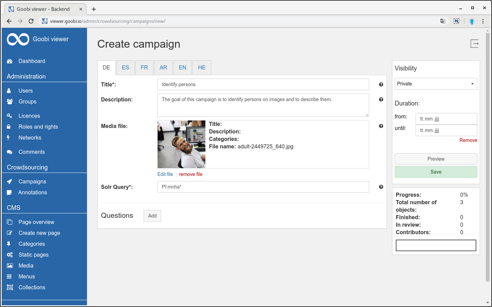

# September

In September, the campaign functionality in the Goobi viewer was completed. This lays the foundation for further development at the open source crowdsourcing functionality. Completion was accompanied by the **release of Goobi viewer 4.0**.

The crowdsourcing campaigns were already mentioned in the [latest IIIF newsletter](https://iiif.io/news/2019/10/02/newsletter/#crowdsourcing-campaigns-with-the-goobi-viewer).

At the end of the month was the annual Goobi user meeting. Once again, there was a whole series of exciting lectures and presentations in the context of Goobi viewer. Presentation slides will be published separately. Those who weren't there missed, for example, lectures on virtual exhibitions in the University Library Kassel, the recognition of objects on images using artificial intelligence or [app](https://github.com/atopion/cuby) development via REST and IIIF to the Goobi viewer backend and its contents. 😎 

## Developments

### Metadata

It is possible now to search and replace in the configuration of the metadata for display within the values. This ensures that a placeholder configured for display, such as `© [year]`, is replaced to `© 2019` without having to adjust, re-export and re-index the metadata every year.

The new possibilities are described in [chapter 2.19.1](https://docs.intranda.com/goobi-viewer-en/2/2.19/2.19.1).

### Cite and reuse

In the widget, the subheadings "Work" and "Page" have been modified to display the document type such as "Monograph", "File" or "Certificate" instead of "Work". Instead of page it is now called "Image". Through this modification, the subheadings now have less a librarian context than a general context to the presented cultural heritage.

### Crowdsourcing campaigns

At the Goobi User Meeting 2018 there was a spontaneous meeting at which more than 15 different institutions discussed how they could imagine further developing the Goobi viewer with crowdsourcing and what the priorities would be. This meeting resulted in several smaller and larger features which were then developed within the last 12 months.

The last feature is the now completed new campaign functionality. This is a generic framework that allows you to define content and link it to questions. For this purpose there is a new area available in the backend in which any number of campaigns can be created and curated.

A campaign consists of a title, an optional description and an image, as well as a Solr query that defines the records contained in the campaign. Questions can then be defined. These have a type beside the actual text - at the moment text and geocoordinate are available types - and it can be determined whether the question refers to the whole record, the displayed image or a part of the image and whether one or more answers are possible.

A campaign overview is available in the frontend, which can also be individualized via a new CMS template if required. Depending on the selected question type, a separate interface is then available within the actual crowdsourcing view. After successful processing, another user must check and confirm the results within a review mode.

The annotations created are displayed natively within the Goobi viewer interface and automatically integrated to the IIIF manifests as web annotations.

The following screenshots provide an insight into the new functionality:

In addition to the new development of the campaigns, the integration of the previous crowdsourcing module for OCR correction \(ALTO\) and transcription was also improved. A new "edit text" link in the full text display together with the new login already introduced in May has brought the functions much closer to the user.

To display the links, the new switch `<displayCrowdsourcingModuleLinks />` must be set to `true`, see also [chapter 2.24](https://docs.intranda.com/goobi-viewer-en/2/2.24) in the documentation.

### Goobi viewer Indexer 

The Goobi viewer Indexer has been extended by the functionality to index the annotations generated within the campaigns. This is accompanied by an update of the Solr schema. Both must be updated with a Goobi viewer update. A re-indexing of the database is not necessary.

