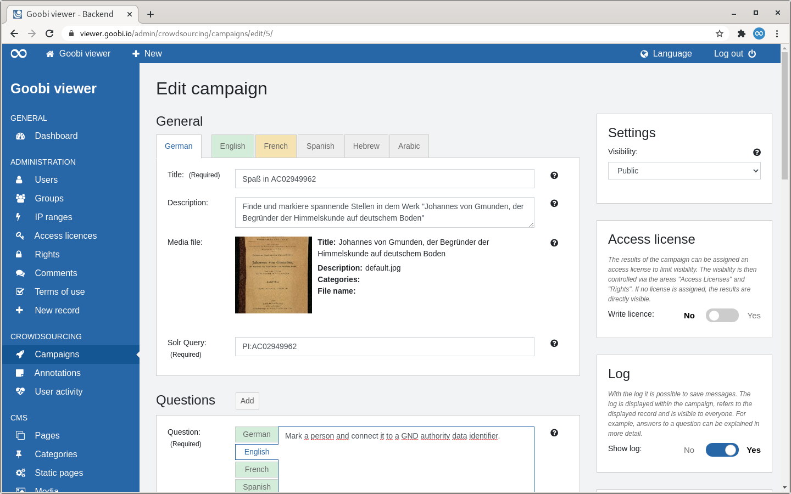
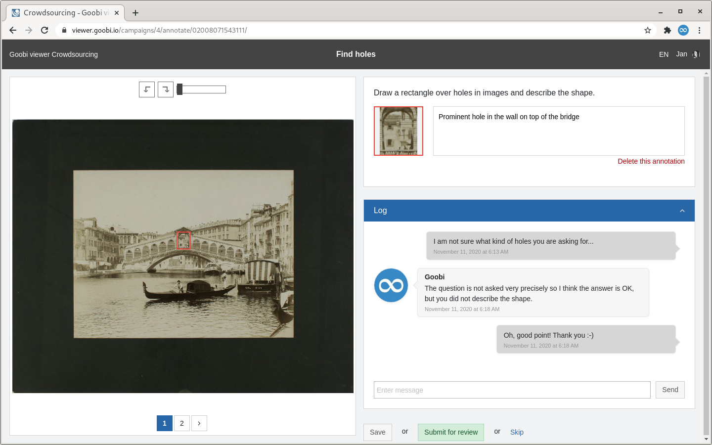
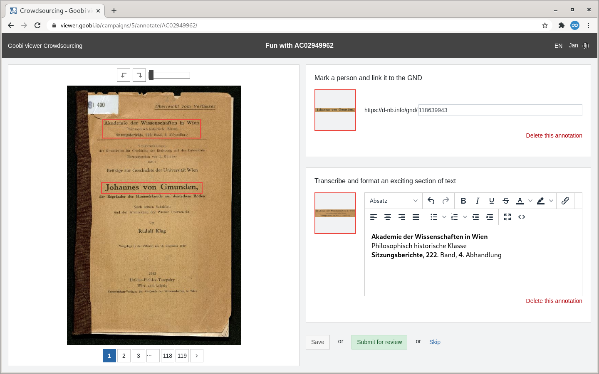
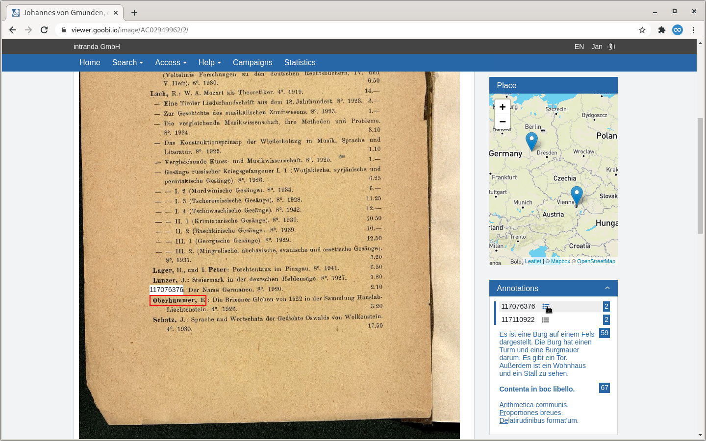
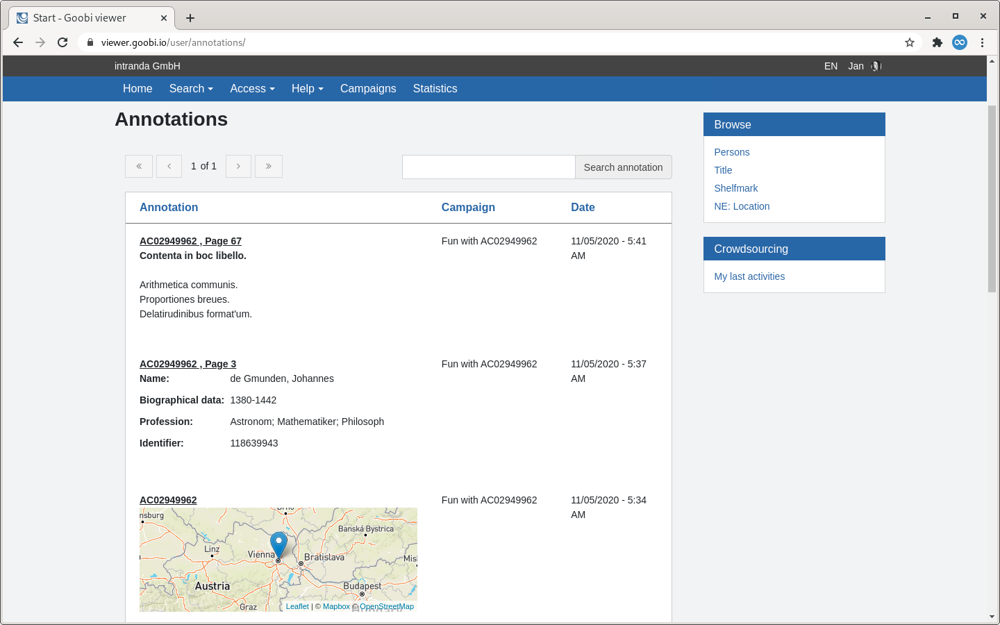
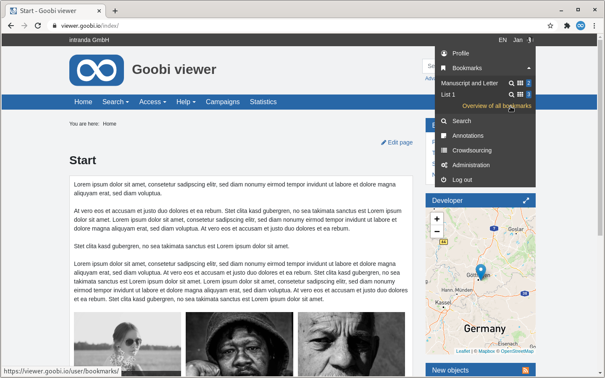

# October

## Coming soon 🚀 

* Adjustments to the **IIIF** interfaces
* **WCAG**
* Display of a **tectonic**

## Developments

### Campaigns 

The work in this version was entirely in the light of crowdsourcing campaigns. In many places there have been extensions and changes. These all had the focus on making the functionality and operation more intuitive for a limited circle of scientists. The changes are explained in the following sections: 

#### Backend 

The page for editing a campaign was transferred to the new operating concept. In the process, the new tabs for translations introduced last month were transferred to the campaigns. The areas are also visually better delimited. The operating concept to make a campaign available only for a user group or a dedicated period of time was revised: In the middle are all the setting options that affect the campaign in the front end. In the sidebar are all further setting options for the campaign. The right sidebar scrolls intelligently. Furthermore, all texts of the inline help have been checked and partly reworded to provide more detailed information.



#### Access licence 

For results of a campaign, an access licence can now be optionally activated in the backend. If active, the name of the campaign is written as a licence and the control of access to the annotations is done via the well-known areas "Access Licences" and "Rights". This means that - if a campaign is only released for one user group, for example - the results can also only be made visible for this user group. 

#### Log 

The new log offers the possibility to leave messages within a campaign and there within a record. For example, answers to a question can be explained in more detail or discussed between different employees. 

The functionality is optional and can be switched on or off for a campaign in the backend.



#### Question types

The question types have been extended by two further variants. Formatted texts can now be created with a TinyMCE editor, for example to transcribe texts. Furthermore it is possible to record GND standard data identifiers



#### Annotations in the record 

Previously, annotations were displayed in the record below the image. This area has been moved to a widget within the sidebar. This makes it easier to see selected annotations in the image. The functionality of the new widget has been extended so that all annotations within the record are now displayed. Previously only those of the current page were visible. Places are still shown on a map. The familiar popup can be opened for recorded authority data.



#### Annotations of a user 

Users have a new overview page at their disposal, which lists all annotations they have created themselves. There the annotations are displayed formatted, which means that in addition to pure text, the captured map sections, formatted text or authority data of an identifier are displayed directly. The same type of visualisation is also used in other places where annotations are listed.



#### Annotations of a campaign 

For the first time there is also an overview of all annotations created within a campaign. A new button is displayed in the campaign overview as soon as at least one annotation has been created in a campaign. A tabular overview will then be opened which is visually similar to the screenshot above. 

### Reading lists 

The user guidance in the reading lists of registered and unregistered users has changed to provide more clarity in the future. The "Reading lists" area for non-registered users is now only displayed if at least one record exists on the reading list. This extends the principle "Show only areas where there is at least one selection" to here. For session reading lists of unregistered users everything remains the same. For registered users, the selection of existing reading lists has moved to the user menu, where it has been merged with the link to the reading list overview.



### Goobi viewer Indexer

The Goobi viewer Indexer can now also index bounding box coordinates recorded in the sexagesimal system. The application scenario in [chapter 6.14](https://docs.goobi.io/goobi-viewer-en/6/6.14) of the documentation has been extended accordingly.

A further development concerns the indexing of authority data. With a new switch, authority data can optionally be written into the structural element and no longer mandatory into the grouped metadata. With the appropriate configuration, this enables the search for different spellings of the same location to always return the same number of hits. See also [chapter 3.7.5](https://docs.goobi.io/goobi-viewer-en/3/3.7#3-7-5-parameter-parameter-groupentity) in the documentation.

Finally, the indexer was adapted to correctly recognize the new annotation types and write them in Apache Solr.

### Miscellaneous

* If the CMS page for the timeline is assigned to a sub-theme, the records displayed are also only taken from the sub-theme
* If a search result list is sorted by publication date, the date field is now displayed formatted. The new switch "millisfield" was introduced. See also [chapter 2.19.1](https://docs.goobi.io/goobi-viewer-en/2/2.19/2.19.1) in the documentation.
* The URL for saved searches has been adjusted to include them below the `/user/` area like the other URLs.
* In the Goobi viewer connector there have been minor bug fixes to the OAI interface.

## Version numbers 

The versions that must be entered in the `pom.xml` of the theme in order to get the functions described in this digest are:

```markup
<dependency>
    <groupId>io.goobi.viewer</groupId>
    <artifactId>viewer-core</artifactId>
    <version>4.12.2</version>
</dependency>
<dependency>
    <groupId>io.goobi.viewer</groupId>
    <artifactId>viewer-core-config</artifactId>
    <version>4.12.0</version>
</dependency>
```

The **Goobi viewer Indexer** has the version number **4.12.0**.

The **Goobi viewer Connector** has the version number **4.12.1**.

The **Goobi viewer Crowdsourcing Module** has the version number **4.12.0**.

