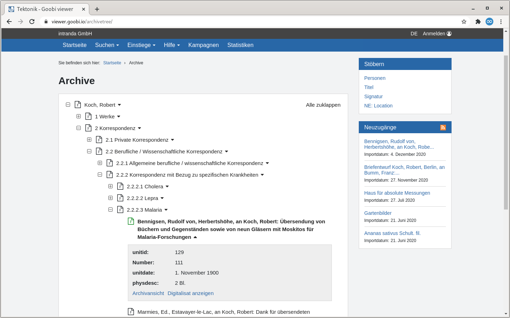
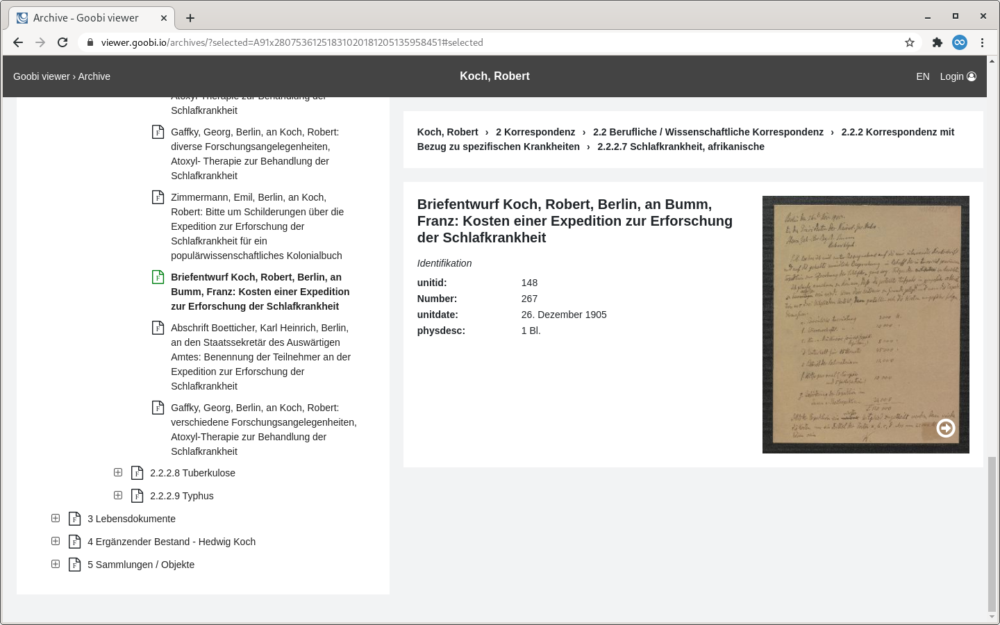
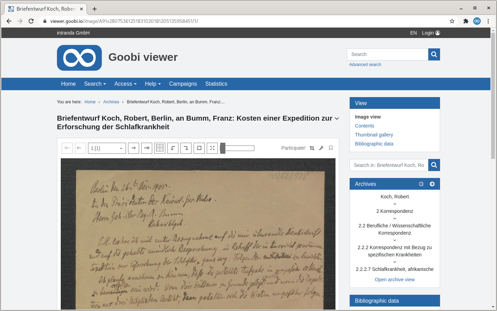
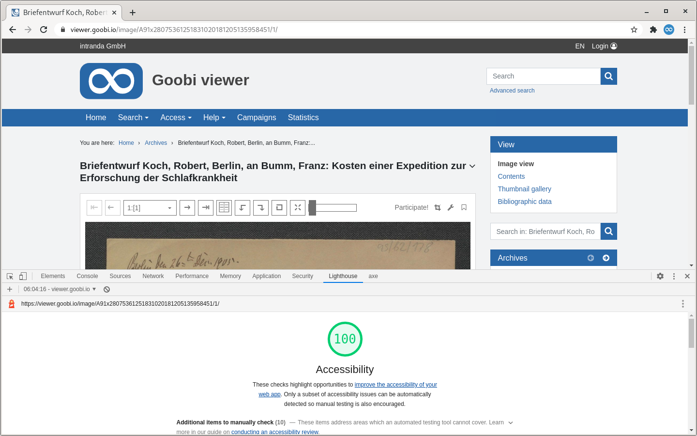

# November

## Coming soon 🚀 

* Adjustments to the **IIIF** interfaces
* Themes with **right-to-left reading direction** 
* **Record based hints** with formatted text

## Announcement

In the first quarter of 2021, extensive changes will be made to the Goobi viewer core. In order to fully support the right-to-left reading direction also in themes, XHTML structures have to be adapted and CSS instructions have to be changed to newer concepts such as CSS Grid and Flexbox. Concepts that are considered obsolete, such as floats, will be removed. Furthermore, individual solutions, for example for absolutely positioned elements or arrows, have to be worked out.   
A positive side effect is improved responsiveness for mobile devices.

These structural adjustments will have an impact on the time required for a subsequent theme update.

## Developments

### Archive

The Goobi viewer is now able to display the trees created with the archive management plugins in Goobi workflow together with potentially existing digital copies. Two new sections and a new widget have been developed for this purpose. 

The first area displays a tree within the corporate design. It can be navigated in the inventory and the metadata can be viewed. From there - if a digital copy is available - it is possible to switch to the record display. Otherwise, a link to the archive view is available.



The second area is the dedicated archive view. It extends over the entire screen and also allows a search in the inventory and the display of images directly next to the metadata.



If a reference to an archive collection exists for a digitised record, the tree structure is displayed in a new widget. From here it is also possible to switch to the archive view. In the header of the widget, it is possible to browse to the next or previous digitised record in the inventory.



### Accessibility 

The Goobi viewer Core was comprehensively reviewed and revised in the context of accessibility. The Web Content Accessibility Guidelines \(WCAG\) version 2.1 were checked for AA compatibility. The tools [axe](https://www.deque.com/axe/) and [Lighthouse](https://developers.google.com/web/tools/lighthouse/) were used for this. All annotations output there were either corrected or manually checked to rule out any violation of the guidelines. 

Based on the output of these automatic analysis tools, we can now say with a clear conscience that the guidelines are being complied with. This is also relevant with regard to the mandatory accessibility according to the "Barrierefreie-Informationstechnik-Verordnung \(BITV\) 2.0".



### CMS 

On the CMS page for the search, a filter query can be passed. This allows the search to be limited to a specific subset. What is new is that if this CMS page is assigned to a subtheme, the search will automatically be carried out in the data stock of the subtheme. The functionality is brought into line with other CMS pages. If an additional filter query exists, it can be removed during an update. 

### Download Widget

Within a record, additional files can be offered for download. Files can now be hidden by means of a regular expression. The hiding only applies to the display, the download remains possible. See also [chapter 2.23](https://docs.goobi.io/goobi-viewer-en/2/2.23) in the documentation.

### Miscellaneous

* On the privacy page, a text can now also be displayed below the Matomo opt-out iframe. 
* In the search it is possible to display the initial search hits randomised. See also [chapter 2.17.1](https://docs.goobi.io/goobi-viewer-en/2/2.17/2.17.1) in the documentation. 
* The SMTP port can now be configured individually for sending e-mails. See also [chapter 2.5.2](https://docs.goobi.io/goobi-viewer-en/2/2.5/2.5.2) in the documentation. 
* The automatic conversion of full text files to UTF-8 can now optionally be deactivated. See also [chapter 3.1.14](https://docs.goobi.io/goobi-viewer-en/3/3.1#3-1-14-parameter-fulltextforceutf8) in the documentation.

## Version numbers 

The versions that must be entered in the `pom.xml` of the theme in order to get the functions described in this digest are:

```markup
<dependency>
    <groupId>io.goobi.viewer</groupId>
    <artifactId>viewer-core</artifactId>
    <version>4.12.2</version>
</dependency>
<dependency>
    <groupId>io.goobi.viewer</groupId>
    <artifactId>viewer-core-config</artifactId>
    <version>4.12.0</version>
</dependency>
```

The **Goobi viewer Indexer** has the version number **4.12.0**.

The **Goobi viewer Connector** has the version number **4.12.1**.

The **Goobi viewer Crowdsourcing Module** has the version number **4.12.0**.


