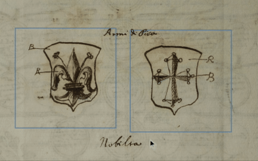
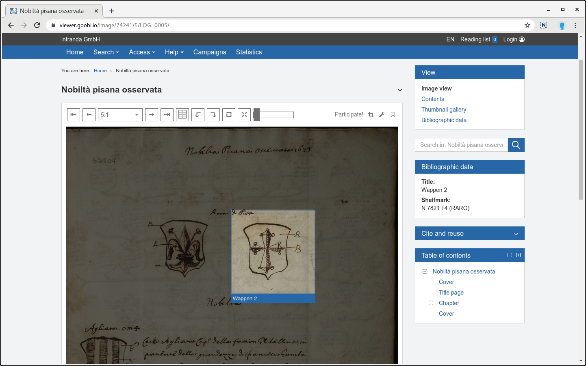
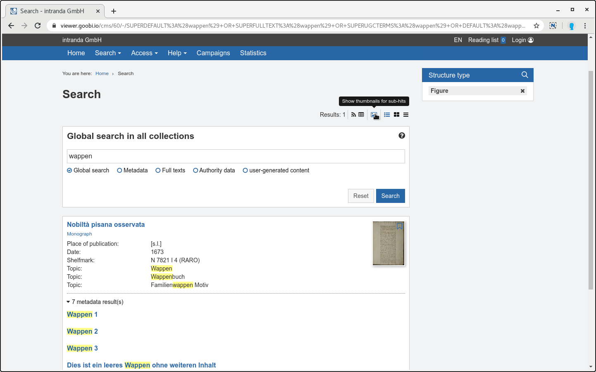
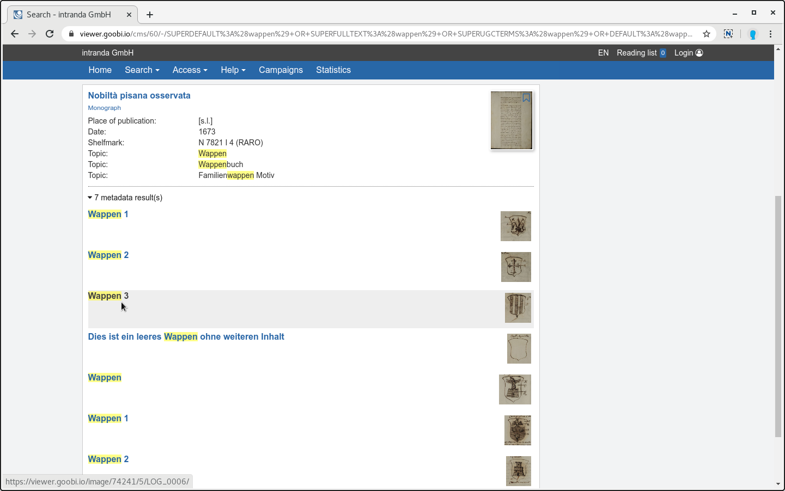
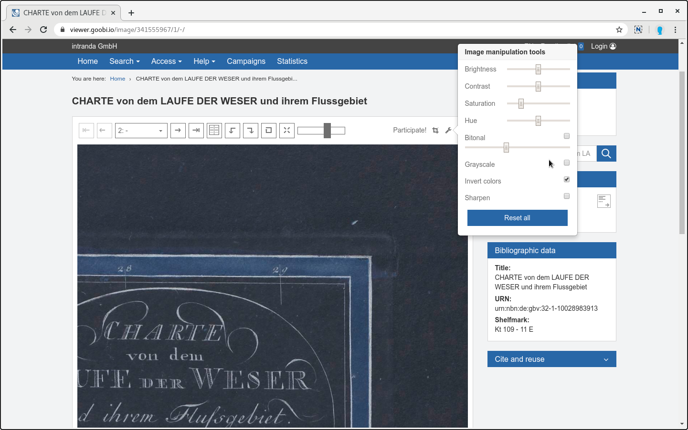
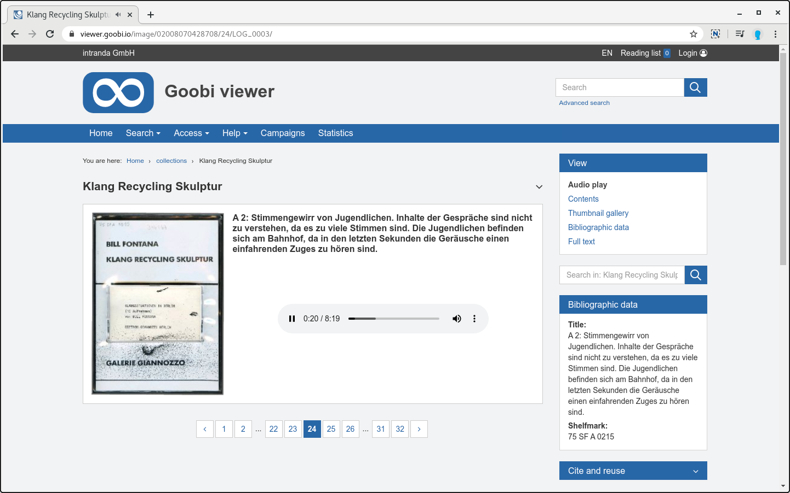

# February

## Coming soon 

* ⁉ Conditions for **displaying metadata**
* 🔐 **Shibboleth** 
* 🗺 **Maps**

## General

A lot has happened in the last few weeks! Various Goobi viewer instances have been updated, including the digital collections of the Humboldt University Library in Berlin:




The Berlin Digital State Library has also been brought up to the new code base:




The Denkmalatlas Niedersachsen went online in January, congratulations on the successful portal: 

* [https://denkmalatlas.niedersachsen.de](https://denkmalatlas.niedersachsen.de) 

Besides many new features presented below, the infrastructure for testing the Solr search index was completely renewed. Now it is possible to test even more use cases automatically.


With this version the upload of DOC, DOCX and HTML files is marked as deprecated in the backend. The functionality will be removed with one of the next releases. With the upload of PDF files a better and more reliable alternative is available.


## Developments 

### Metadata for image sections 

The Goobi workflow Digest for January 2020 presented the possibility of capturing structural and metadata for image sections. The Goobi viewer is supported for display in this release. If one or more structural elements exist on a screen, they are displayed with a light frame. If you move the mouse over them, the area is highlighted and the title of the structure item is displayed



If a structural element is clicked for a screen area, the area is highlighted and the rest of the screen darkened. The title of the structure item is displayed below the active screen section:



### Display of thumbnails for under hits 

Another new feature is the display of thumbnails for sub-hits in the search hit display. Since the introduction of the aggregated search hit display several years ago, this functionality has been in demand from time to time. To display the thumbnails, a new icon is available in the search hit display in the upper right corner, which shows and hides the images:





The following screencast explains the two functions mentioned above again and also gives an insight into the coding of the information in the METS file:




### Tools for image manipulation

New tools for image manipulation are now available in the image display and full screen mode. For example, filters can be used to adjust brightness and contrast, invert colors or binarize the displayed image.



### Reading direction: Right to left

Time and again, the topic of how to provide a native user experience for materials that are read from right to left has been discussed within the community. This ranged from questions about saving the reading direction in MODS to how the arrows for scrolling behave as natively as possible. 

Together with colleagues from the HLB Fulda, the SUB Göttingen, various Max Planck Institutes in Berlin, Frankfurt and Florence, and even native speakers in Israel, we have jointly developed a solution that allows users, researchers and native speakers alike to use a native reading direction. 

In the following video you can see the result:



Click here to [try it out for yourself](https://viewer.goobi.io/image/001935281/1/).

### Extended audio view

The view for playing audio files has been adjusted, so now the representative image of the record and the title of the track is displayed next to the actual audio player.



### Rights with licences 

Two new rights are available within the licenses: 

1. download of IIIF manifests 
2. download of metadata


The new rights are not automatically added during an update. Existing license configurations must be checked and the rights must be added manually!


## Extensions to the Goobi viewer Indexer

There have been three developments in the Goobi viewer Indexer over the past month: 

1. Support for the DenkXweb format has been further extended. 
2. METS files with structural elements that refer to image areas are now correctly recognised and indexed. The data is stored in the Solr search index as required by the Goobi viewer core for visualisation purposes. 
3. When using DataRepositories in conjunction with the `RemainingSpaceStrategy`, there was a problem if the Goobi viewer indexer moved data from one repository to another. In the Goobi viewer core, the DataRepository used for a data record is cached. This cache was not updated when the indexer moved the data. As a result, the images for the moved record were not visible again until the application was restarted. 

To ensure that the Goobi viewer Core is informed of changes to the DataRepository in future, the token for the WebAPI must be stored in `solr_indexerconfig.xml`. See also sections 3.1.15 and 2.33.3 in the documentation.


```markup
<init>
  <viewerAuthorizationToken>CHANGEME</viewerAuthorizationToken>
</init>
```


## Connector 

The Goobi viewer connector can now write the table of contents of a work in the DublinCore field `dc:description` if it is configured accordingly. To do this, the connector and core must be updated to at least version 4.4.0. 

In the OAI interface, two things must be ensured in the local `config_oai.xml` for this purpose:

1. The link to the REST API of the Goobi viewer core must be stored correctly in . This URL is used to retrieve the table of contents for the record from the Goobi viewer, see section 4.1.2 in the documentation. 
2. In the field configuration for DublinCore records, the metadata with the label `description` must be configured with the value `#TOC#`. See chapter 4.1.3 in the documentation


```markup
<oai_dc>
  <fields>
    <template name="_DEFAULT">
      <metadata label="description" value="#TOC#" />
    </template>
  </fields>
</oai_dc>
```


## Version numbers 

The versions that must be entered in the `pom.xml` of the theme in order to get the functions described in this digest are:

```markup
<dependency>
    <groupId>io.goobi.viewer</groupId>
    <artifactId>viewer-core</artifactId>
    <version>4.4.0</version>
</dependency>
<dependency>
    <groupId>io.goobi.viewer</groupId>
    <artifactId>viewer-core-config</artifactId>
    <version>4.4.0</version>
</dependency>
```

The **Goobi viewer Indexer** has the version number **4.4.0**. 

The **Goobi viewer Connector** has the version number **4.4.0**.

The **Goobi viewer Crowdsourcing Module** has the version number **1.1.10**.

