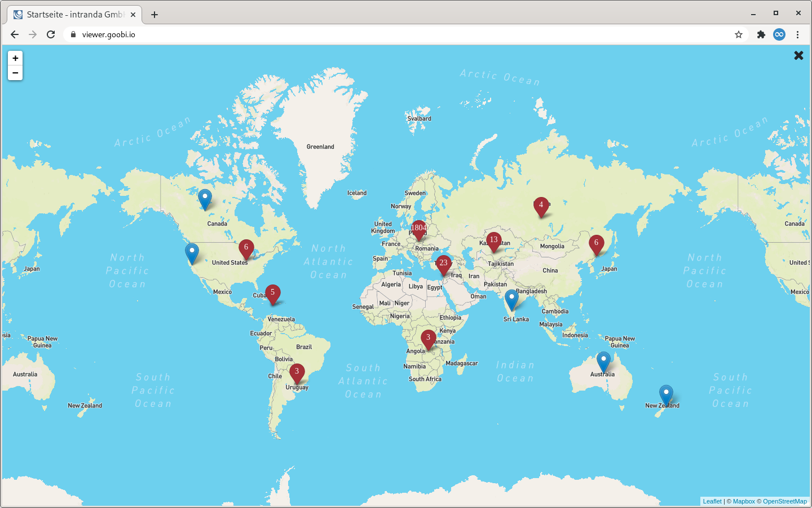
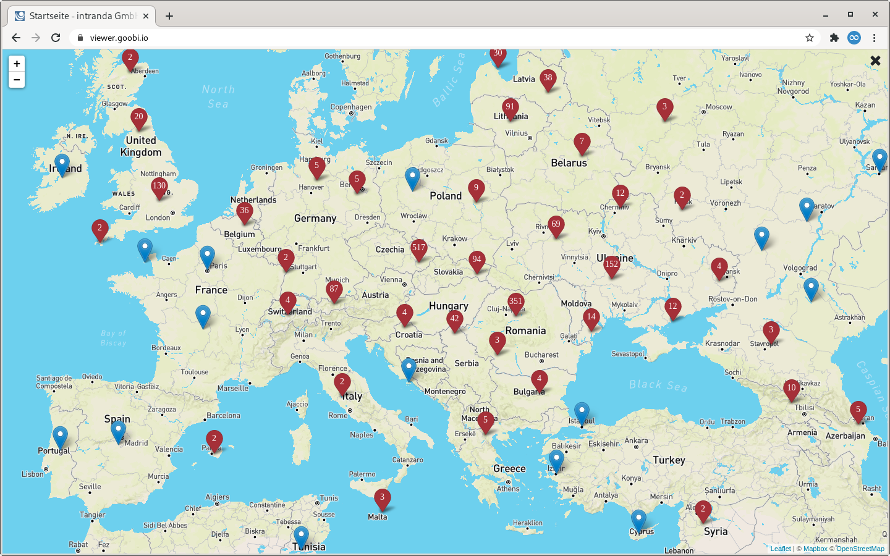
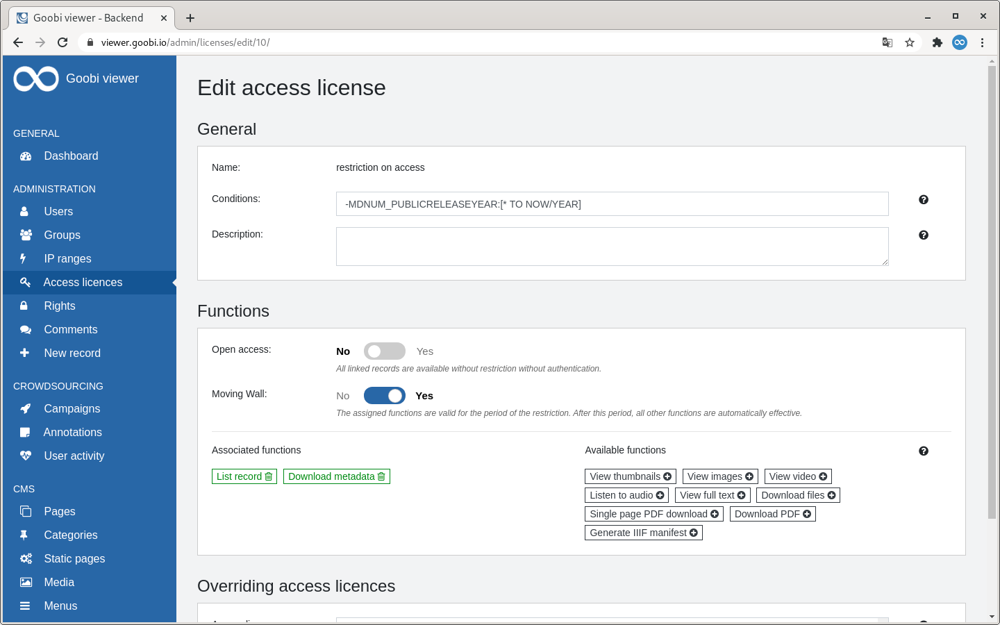
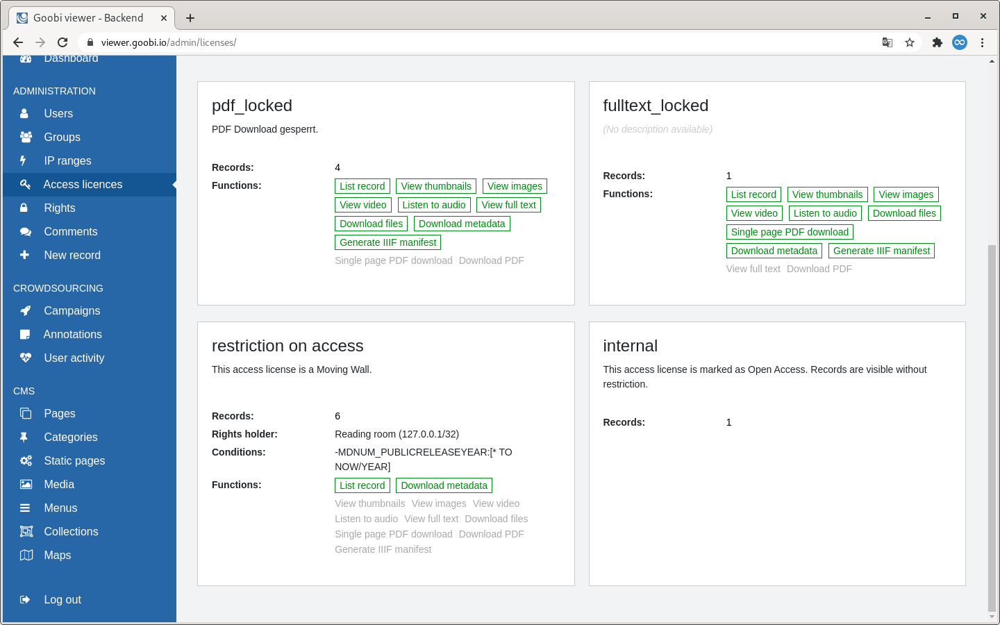
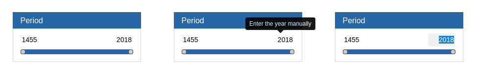

# July

## Coming soon 🚀 

* Expansion of crowdsourcing **campaigns**
* Adjustments to the **IIIF** interfaces
* Data sets without images on the **reading lists**

## Announcement 

In August and September, the Goobi viewer team will only be available to a limited extent due to parental leave and annual leave.

## Developments

### Maps

The map functionality presented in April and May was extended by a clustering of markers. Starting from a few hundred markers on a map, the performance collapsed. 

With clustering, markers that are close together are displayed in aggregated form. If you then zoom into the map area, the markers are automatically split up into the individual positions. This mechanism now allows several thousand markers to be displayed quickly and reliably.





### Backend

There have been some minor changes to the backend developments presented last month which further round off the overall picture. For example, the toggle switch for yes/no questions has been flipped to follow the general convention that no is on the left and yes on the right. 

If a right has been configured for a configured license, then this right holder is also displayed on the Access Licenses page. 

The search function on the Users page and the Pages page has been extended. Users can now be searched not only by user name or e-mail address but also by group membership. In the CMS pages, filtering is carried out not only in the title but also in the assigned categories or subthemes.





### Faceting

Until now, the start and end year of the faceting over a period of time was determined exclusively via the slider in the widget. As of this release, the years can alternatively be entered using the keyboard. To do this, the year can be clicked on in the widget and edited. The settings are accepted with Enter.



### Browse 

The browsing functionality is very complex and the requirements are very different. In the case of a title index, perhaps only those of the works should be listed and a sort field should be considered. In the case of an index of persons, the values entered from structural elements should also be included. And of course, possible access licenses must be considered. And the whole thing should perform well even with ~75,000 values with ~25,000 individual entries \(Peter Müller has 1358 entries, Christian Wagner only 2\). This task is very complex and requires a lot of time to find satisfactory solutions. 

With this release the performance of the browsing functionality has been improved. The switch `docstructFilters` has been removed and replaced by `filterQuery`. The switch `alwaysApplyFilter="true"` is new. This switch does not generate a list with all values when the browse functionality is called, but automatically facets the list to the first letter or number.

### Cookies etc.

We are frequently asked whether the Goobi viewer uses cookies and what data is stored in them. The answer to these questions is always that the Goobi viewer itself _does not_ store any cookies. In a modern world, however, there are many more ways of storing data, and the Goobi viewer makes use of them. We have made a number of changes to answer this question. 

From now on, we can say with a clear conscience: "All data created automatically by the Goobi viewer to provide functionality will be deleted again when the session ends". 

Technically speaking, there is a cookie. This is generated automatically by the Tomcat application server and nothing more than the JSESSIONID is stored in it. This session is generated on the server side when the Goobi viewer is called up and stores information such as the language selected in the user interface or whether a user has logged on. The session is deleted after 30 minutes of inactivity. The Goobi viewer also stores other data in addition to this, but in the browser session. In other words, on the user's computer and not on the server. The information stored here includes, for example, which view was selected for the search hits \(details, list, thumbnails\) or the zoom level and position of an image so that this information can be retained when scrolling. 

At this point there has been a decisive change. The browser offers different possibilities to save this information. In the past we used to use the so-called "Local storage" for this. Since then, more and more "Session storage" is used. With this release the use of "Local storage" has been abolished and all information is managed exclusively in Session storage. This storage is automatically deleted when the tab is closed or the browser window is closed.

### Other 

* The REST API has a new endpoint to access the representative of a plant independent of the file name. Here is an example URL: [https://viewer.goobi.io/api/v1/records/1045513032/representative/full/!400,400/0/default.jpg](https://viewer.goobi.io/api/v1/records/1045513032/representative/full/!400,400/0/default.jpg) 
* The display of the table of contents in the sidebar of the full screen display can now be controlled separately. See also [chapter 2.20.2](https://docs.goobi.io/goobi-viewer-en/2/2.20/2.20.2) in the documentation. 
* The PDF download via the outsourced TaskManager has been updated and can now also use the latest ContentServer compression and scaling buttons. Furthermore an error in the generation of epub files has been fixed. 
* If the collection overview shows the corresponding works, this corresponds to an internal search. With this release this is now also shown in the URL and the infix `/browse/` has been replaced by `/search/`. So it is now possible to use individual search pages also for the collections. 
* The installation guide has been updated to use Ubuntu Linux 20.04.

### Goobi viewer Connector 

When outputting Dublin Core records, the output of the `<dc:rights />` element can now be configured individually depending on the values indexed in the `ACCESSCONDITION` field. See also [chapter 4.13](https://docs.goobi.io/goobi-viewer-en/4/4.1/4.1.3) in the documentation.

## Version numbers 

The versions that must be entered in the `pom.xml` of the theme in order to get the functions described in this digest are:

```markup
<dependency>
    <groupId>io.goobi.viewer</groupId>
    <artifactId>viewer-core</artifactId>
    <version>4.9.2</version>
</dependency>
<dependency>
    <groupId>io.goobi.viewer</groupId>
    <artifactId>viewer-core-config</artifactId>
    <version>4.9.0</version>
</dependency>
```

The **Goobi viewer Indexer** has the version number **4.9.0**.

The **Goobi viewer Connector** has the version number **4.9.0**.

The **Goobi viewer Crowdsourcing Module** has the version number **1.5.0**.

