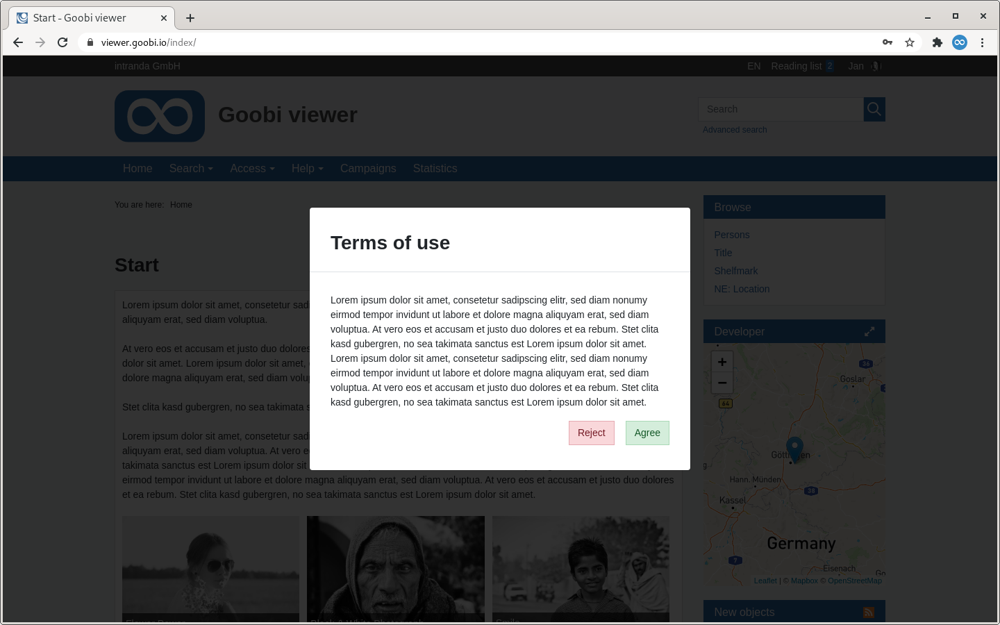

# September

## Coming soon 🚀 

* Expansion of crowdsourcing **campaigns**
* Adjustments to the **IIIF** interfaces
* **WCAG**

## Developments

### Terms of use 

Terms of use can now be stored in the Goobi viewer backend. A new area is available in the backend for this purpose:


If the function is active, a title and text in the activated languages can be stored. It is also possible to reset the approval of all users. This may become necessary if the terms of use are subsequently changed.


The terms of use must then be accepted during registration or once when logging in. For this purpose, the mask for logging in and re-registering has been redesigned. The design was adapted, the option to register a new account was highlighted more prominently and the corresponding form was redesigned. There is no need to enter an ad name, as this is not mandatory for registration and the terms of use are displayed - if active.




Along with the terms of use, a new operating concept for multilingualism was also developed. The familiar tab view has been retained but visually enhanced: 

* The default language always comes first
* The standard language is visually separated from the translations by colour and distance
* The order of the languages is fixed by the configuration file `faces-config.xml` of a theme
* The names of the languages are written out in full
* If the standard language is not filled in, it is not possible to switch to the translations
* When a language is fully translated, this is visually indicated by the colour of the tab 

The screenshot above shows the completed standard language, a completed English translation and the Spanish translation is currently in progress.

### Backend

 In the backend there are further small adjustments. A new top bar has been added which offers various links for quick access. The community forum and the documentation are now as fast accessible as the frontend or the possibility to create a new CMS page. A language switch has been integrated into the backend and the option to log off has moved from the sidebar to the topbar on the top right.

If additional modules are installed, their version number is now listed on the dashboard in the version widget.


It is also possible to create an imprint as a CMS page and map it as a static page. 

### Data sets without images on the reading lists

The reading lists can now also handle data records without images. Until now, the view at this point was very image-centred. If a reading list contains data records with and without images, the representatives are still displayed in the overview. In addition, a text is used to point out further works that do not contain images. If a reading list contains only data sets without pictures, the complete area is omitted. 

The presentation of the individual records on the list has been adapted to the layout of the search result list. 

### Advanced search 

In the advanced search, you can now also directly define a period for the search. For this purpose the attribute `range="true"` must be set for the desired field in the configuration file. Afterwards two input fields are displayed in the user interface in which the start and end year can be entered


### Controlling simultaneous access to a record

In August we wrote about how to limit the PDF download to a percentage of the work per user session. Now it is also possible to control simultaneous access to works via an access license. For this purpose - analogous to the PDF functionality - a number must be indexed in the field `ACCESSCONDITION_CONCURRENTUSE`. If this is the case, the Goobi viewer automatically recognises the value and offers the restriction in the backend. 

If the quota for simultaneous display is exhausted, the user is notified.


### Miscellaneous 

*  The list of field names in which geocoordinates are indexed is no longer fixed but can be defined individually in the `config_viewer.xml`. See also [chapter 2.36](https://docs.goobi.io/goobi-viewer-en/2/2.36) in the documentation. 
* The Goobi viewer Indexer can now optionally write default values for grouped metadata if the configured XPATH expression does not return a value. See also [chapter 3.7.5](https://docs.goobi.io/goobi-viewer-en/3/3.7#3-7-5-parameter-parameter-groupentity) in the documentation
* The version number of the crowdsourcing module has been adapted to the other components of the Goobi viewer.

## Version numbers 

The versions that must be entered in the `pom.xml` of the theme in order to get the functions described in this digest are:

```markup
<dependency>
    <groupId>io.goobi.viewer</groupId>
    <artifactId>viewer-core</artifactId>
    <version>4.11.1</version>
</dependency>
<dependency>
    <groupId>io.goobi.viewer</groupId>
    <artifactId>viewer-core-config</artifactId>
    <version>4.11.0</version>
</dependency>
```

The **Goobi viewer Indexer** has the version number **4.11.0**.

The **Goobi viewer Connector** has the version number **4.11.0**.

The **Goobi viewer Crowdsourcing Module** has the version number **4.11.0**.

