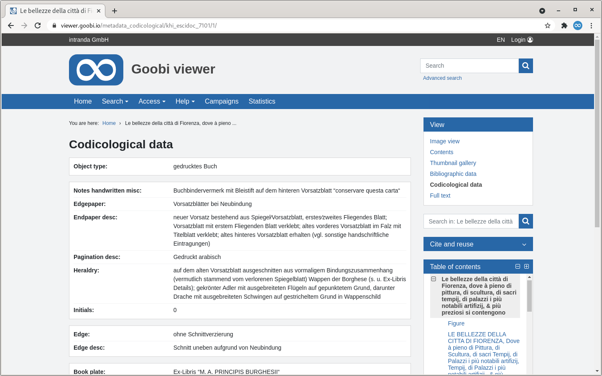
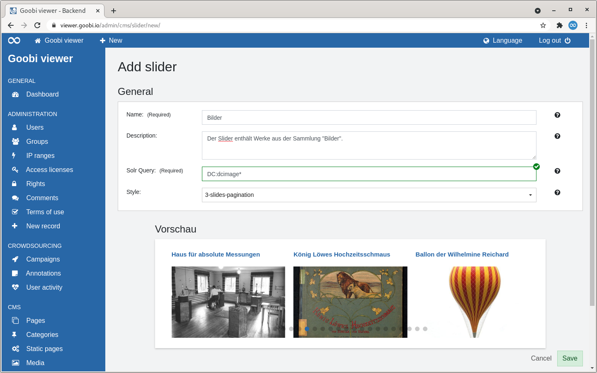
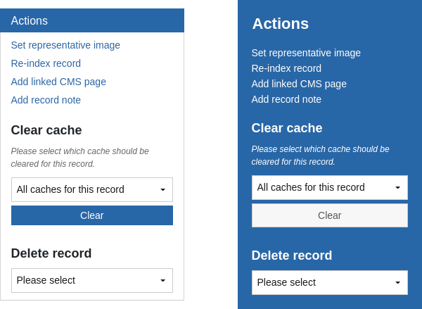
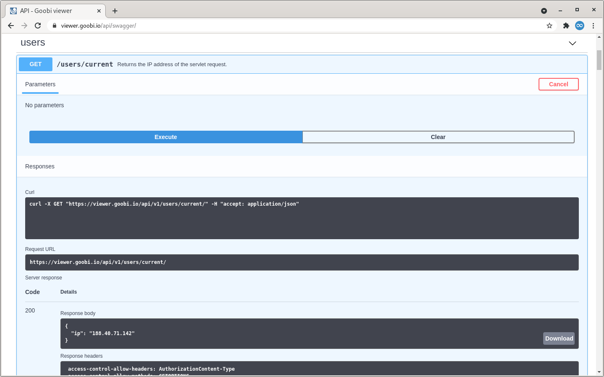

# March

## Version numbers The versions that must be entered in the pom.xml of the theme in order to get the functions described in this digest are:

 io.goobi.viewer viewer-core 21.02.4

 io.goobi.viewer viewer-core-config 21.02.1 The Goobi viewer Indexer has the version number 21.02 The Goobi viewer Connector has the version number 21.02 The Goobi viewer Crowdsourcing Module has the version number 21.02Coming soon 🚀 

* Adjustments to the **IIIF** interfaces
* Enhancements to the **maps**
* **Crowdsourcing** adjustments

## Developments

### Metadata 

Users who put a lot of love into their metadata can now present it even better. Last month, two features were developed for this purpose. 

First, metadata can now be split across multiple pages. The concrete use case for this development was the wish to display very comprehensive codicological data for manuscripts separately from the other bibliographical data of the record. The configuration file was adapted for this purpose, which now allows pages to be dynamically configured for the metadata display. See also chapter 1.19.1 in the Goobi viewer documentation. 

The other development concerns the display of metadata of structural elements. Previously, these were always displayed, even if they did not actually contain any additional relevant information. Often only the title of the structure item was displayed and this was already clear from the table of contents. A new switch in the configuration file can now be used to mark the metadata which - if they were the only ones to be displayed - would automatically be ignored.

We have included a few points in the update instructions that should be checked during an update. Maybe the result is not noticeable at first sight. But at second glance it is more logical and clearer.



### Slider

In the Goobi viewer backend there is a new area to define sliders. The following sources can be used for this: 

* **Records** These are selected via a Solr query. The title and the representative image of the record are used. The record is linked automatically. 
* **Collections** A multiselect field is available here. The translated collection name and the configured representative of a collection are used. The collection is linked to automatically. 
* **CMS pages** Categories can be selected here in which CMS pages are grouped together. The headline and a contained image are then used from the pages. The CMS page is linked automatically.
* **Media** Creates a slider based on images uploaded in the Media section and assigned to a common category. The title and the image itself are used. If a link has been specified, it will also be linked to it. 

The Goobi viewer comes with a pre-selection of different slider styles. These can be visually adapted in the theme and alternatively supplemented with your own configurations. 

A new CMS template is available for the use of the slider.



### Widget: Actions

The widget "Actions", which was revised last month, has been visually adapted once again. The community suggested that the widget, which allows administrative activities and is only available to users with the appropriate rights, should be coloured in the blue tone of the backend. This would create a visual connection and it would also be immediately visually apparent that this is an administrative option. 

We were very happy to take up this idea and implement it. Here is the old and new styling side by side:



### REST API

Access licences for records can be linked to IP addresses. This makes it possible to restrict access to a reading room, for example. In larger networks with proxies and NAT, it is sometimes difficult to find out which IP address the Goobi viewer actually sees at the end to check the access licence. To simplify this, a new REST endpoint was developed that returns exactly this IP address. This means that the URL can simply be called up from the desired PC and then used for further configuration. 

The endpoint is listed in the Swagger documentation and can be found under `/users/current/`. It can be tested on the demo instance with the following URL: [https://viewer.goobi.io/api/v1/users/current/](https://viewer.goobi.io/api/v1/users/current/)



### Miscellaneous

* For logged-in users, there is a list of the **reading lists** in the drop-down menu. The sorting used to be done in the order in which the reading lists were created. They are now **sorted in descending order** according to the last time they were edited. The lists to which records or images were last added are at the top. 
* **Annotations** can now be displayed **under the image** again. The widget in the sidebar is then hidden. See also chapter 1.24 in the Goobi viewer documentation. 
* Deactivated elements are visually marked more strongly in the backend. 
* A very old and long lasting bug could be fixed. If a **white page** is displayed during **authentication** with **Google**, the timeout for the authentication provider must be increased, for example to the value `60000`.

## Version numbers 

The versions that must be entered in the `pom.xml` of the theme in order to get the functions described in this digest are:

```markup
<dependency>
    <groupId>io.goobi.viewer</groupId>
    <artifactId>viewer-core</artifactId>
    <version>21.03</version>
</dependency>
<dependency>
    <groupId>io.goobi.viewer</groupId>
    <artifactId>viewer-core-config</artifactId>
    <version>21.03</version>
</dependency>
```

The **Goobi viewer Indexer** has the version number **21.03**

The **Goobi viewer Connector** has the version number **21.03**

The **Goobi viewer Crowdsourcing Module** has the version number **21.03**

