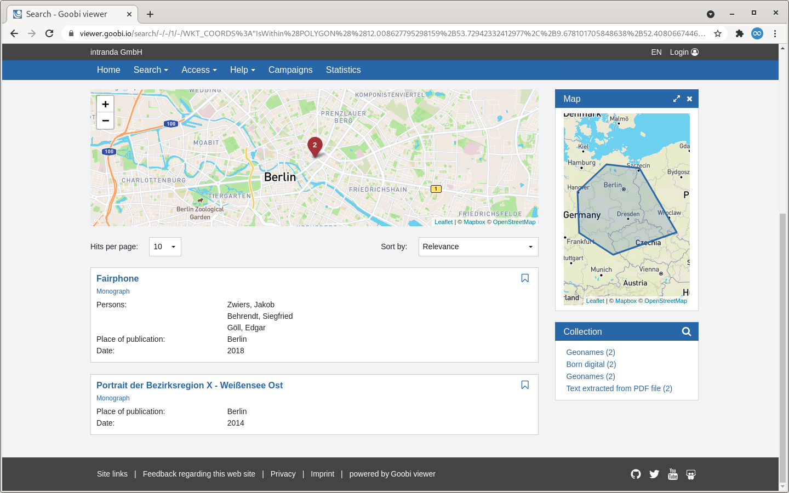

# May

## Coming soon :rocket:&#x20;

* **Collection configuration** in the backend
* **User page** in the frontend

## Developments

### Crowdsourcing campaigns&#x20;

Until now, the units in campaigns have always been the records themselves. But if, for example, there are only five records with 1,000 images each and the questions refer to the individual images, then the consideration at record level is a limitation.&#x20;

For this reason, the possibility was created within a campaign to change the record-based view to an image-based view.


There is now a new thumbnail display in the frontend. The active image is highlighted with a blue border. Images that are in review mode, completed or edited by another user are greyed out and slightly blurred. If you move the mouse over an image, the exact status of the image is displayed via an icon and a tooltip. This also describes the next innovation: During image-based viewing, locking takes place at the image level. This prevents several people from working on an image at the same time. Previously, locking took place exclusively at the record level.

When using Mapbox, a search option is available in the map with which you can search for a place or an address.


When saving an annotation, the user gets a visual success message.


Other new features are that we have made the join button in the campaign overview more colourful and that the listing of records within a campaign is no longer random but sorted. Both changes are based on direct feedback from users who wanted this to be easier to use.

### Maps&#x20;

The map support of the Goobi viewer is gradually being expanded. In addition to the previous functions, it is now possible to search on a map and to faceted in the search results on a map. A new page is available for this which can be linked in the menu if required. For faceting, the field `WKT_COORDS` must be configured as in the configuration file.&#x20;

If search results with coordinates are found, a map is automatically displayed in which the indexed coordinates are shown. In addition, a widget is available in which faceting can be carried out





### Double pages

In the context of double pages, there are two innovations in the Goobi viewer. The first is that the coding of the double-page display now also takes place in the URL. This means that it is now possible to forward a double-page display as a link to others. The second new feature is that if individual pages are marked as double pages in Goobi workflow, this information in the double page display of the Goobi viewer leads to individual images being displayed here. It is easier to explain with an example:&#x20;

_A monograph has 100 pages. This was digitised as single pages. At the end there is a table that extends over two pages. For this, the two pages were scanned as double pages. When the double-page display is active, the Goobi viewer always displays two individual images together. With the scanned double-page image, however, only this one image is displayed. So it is not obvious at first glance whether it is two single pages or a double page._


### CMS: Text with search results

In the CMS template "Text with search results", a new checkbox is available with which structural elements are found instead of listing the records as before. This can be used to formulate Solr queries for the search results, which, for example, list all maps contained in telephone and address books in order to offer a corresponding overview.&#x20;

### Metadata&#x20;

Metadata can now be displayed based on conditions. In the realised use case, literature references with links to the catalogue were available, some of which had already been digitised. For these records, an additional link to the digitised item should be displayed, but not globally for each record in order to avoid generating broken links. See also the documentation for `<param condition="" />` in [chapter 1.19.1](https://docs.goobi.io/goobi-viewer-en/conf/1/19/1) of the Goobi viewer Core documentation.&#x20;

### Backend&#x20;

The backend now uses a consistent [Inter](https://rsms.me/inter/) font. In addition, the accent colours in red, orange and green have been adjusted to a stronger hue.


### Goobi viewer Indexer&#x20;

An update of the Goobi viewer Indexer is necessary to support the indexing of information for the modified double page view. Furthermore, a switch has been added to store coordinates from authority datasets in a different way. See also the description of the `addCoordsToDocstruct` switch in [chapter 2.5](https://docs.goobi.io/goobi-viewer-de/conf/2/5) of the Goobi viewer Indexer configuration.&#x20;

### Goobi viewer Connector

In the Goobi viewer Connector there were two small bugfixes to the OAI interface.

## Version numbers&#x20;

The versions that must be entered in the `pom.xml` of the theme in order to get the functions described in this digest are:

```markup
<dependency>
    <groupId>io.goobi.viewer</groupId>
    <artifactId>viewer-core</artifactId>
    <version>21.05.2</version>
</dependency>
<dependency>
    <groupId>io.goobi.viewer</groupId>
    <artifactId>viewer-core-config</artifactId>
    <version>21.05</version>
</dependency>
```

The **Goobi viewer Indexer** has the version number **21.05**

The **Goobi viewer Connector** has the version number **21.05**

The **Goobi viewer Crowdsourcing Module** has the version number **21.05.1**
