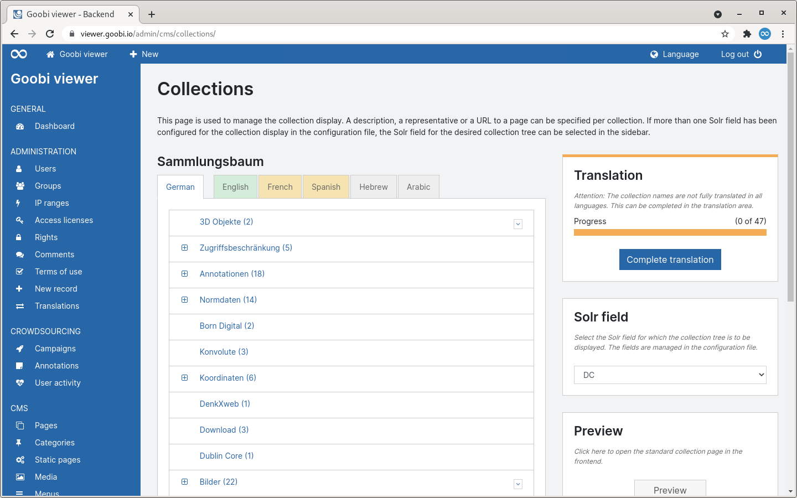
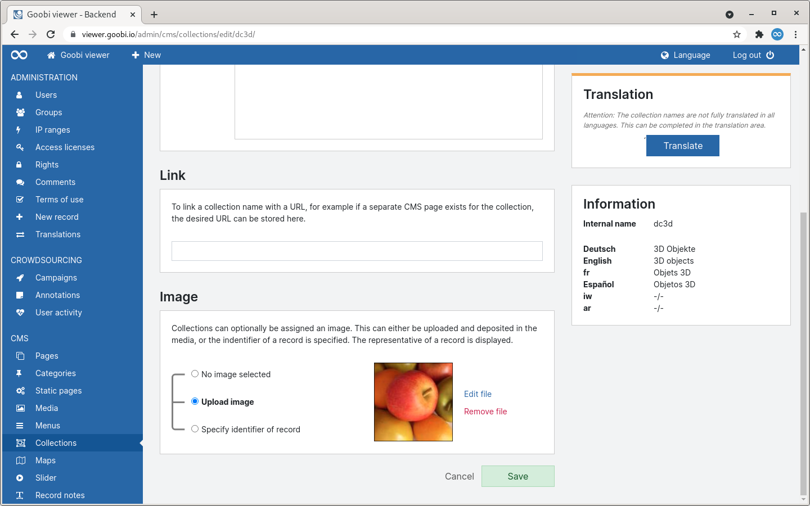
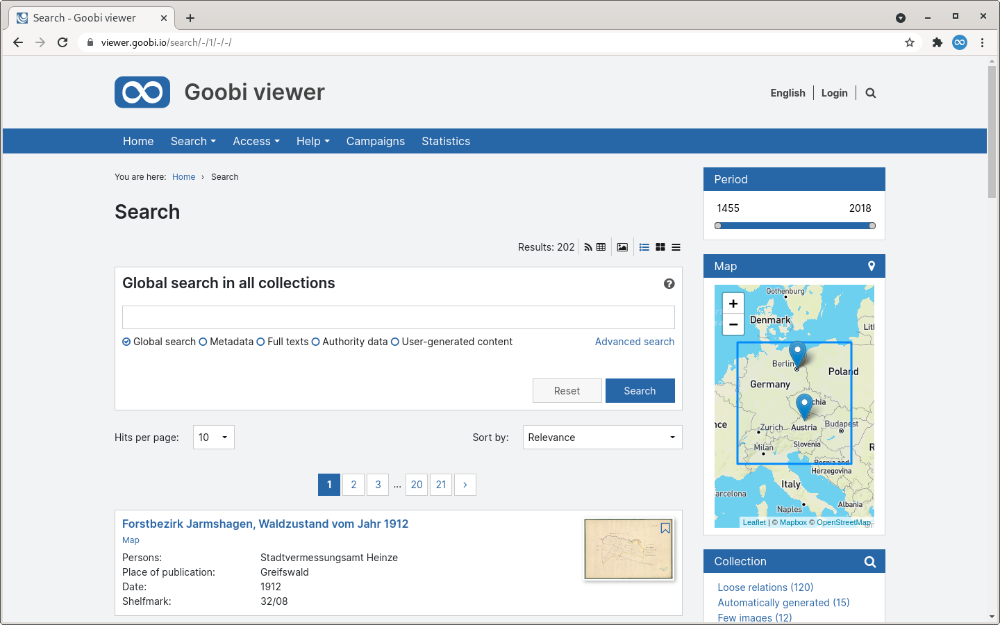
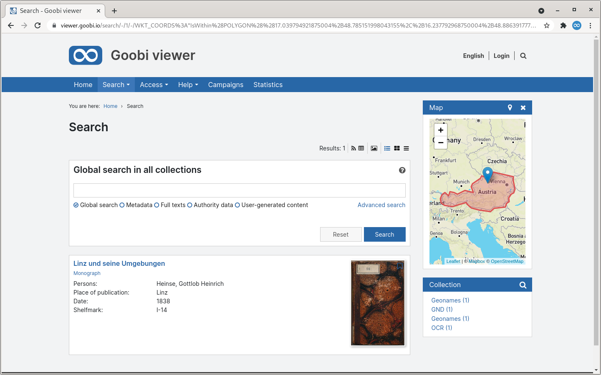
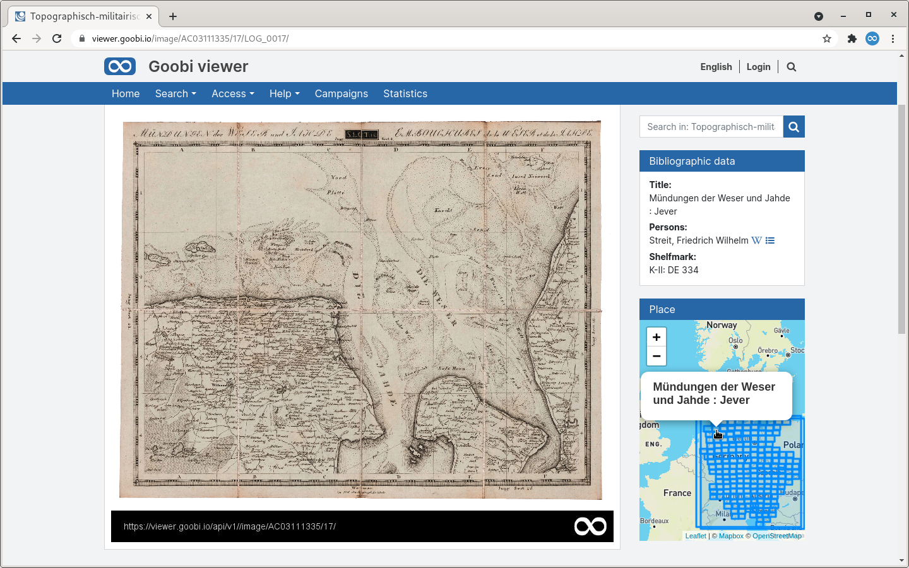
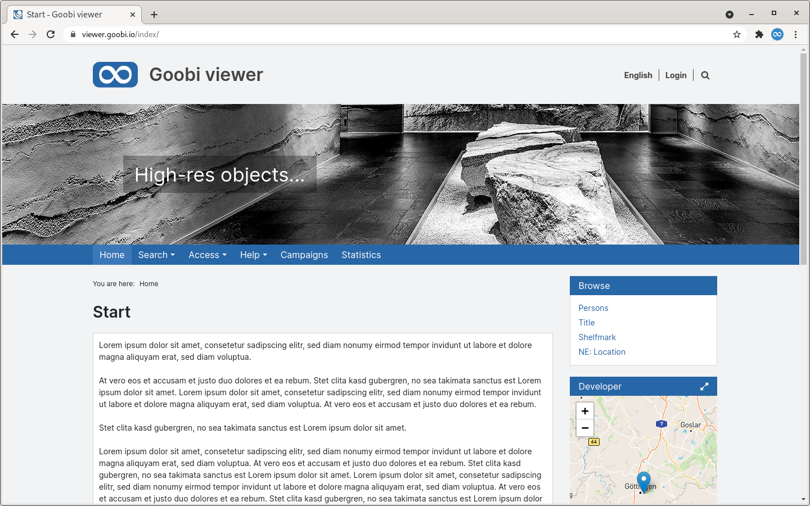
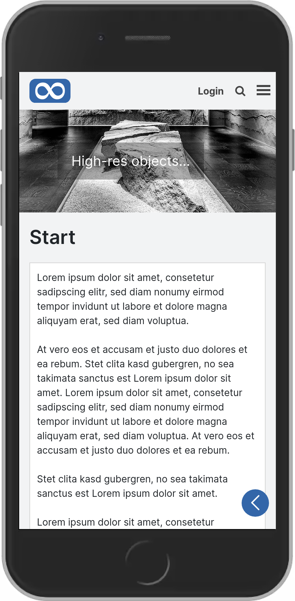
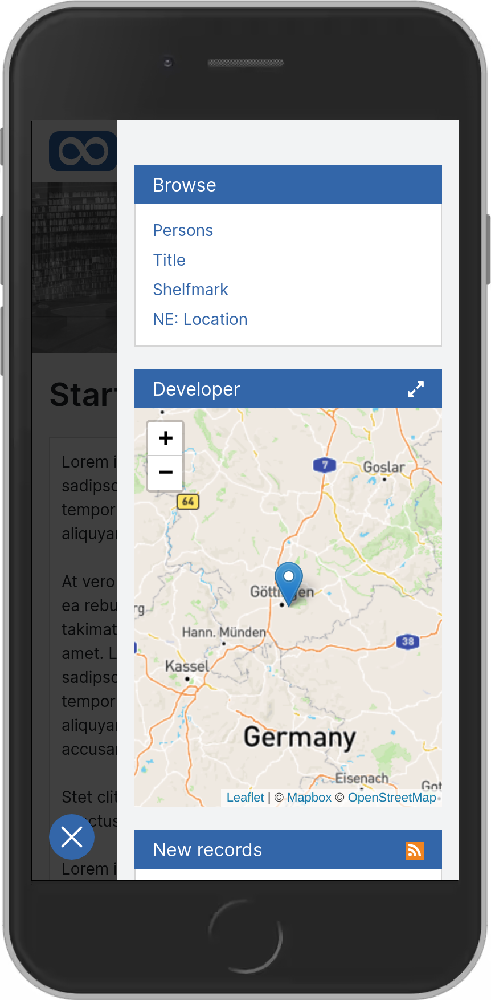
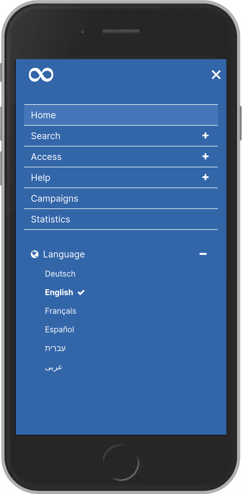
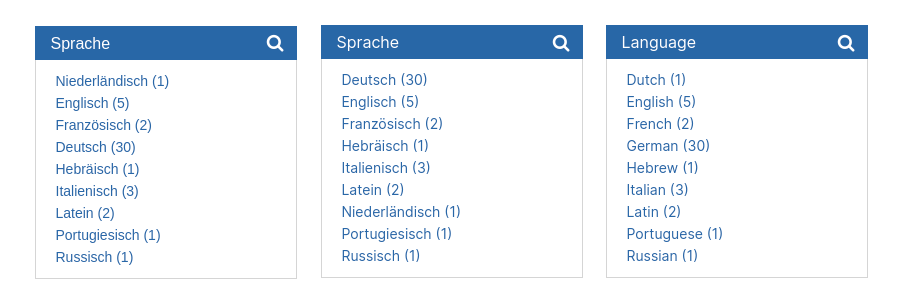

# June

## Coming soon 🚀 

* Revision of the **feedback** form
* Improvements to the **citation links**
* **User page** in the frontend

## Announcements

We have been using Java 11 in development for some time now. Even with new installations and updates, the installed systems will be converted to **Java 11**. This Java version will become **mandatory on 1 September 2021**. If a system has not yet been updated, this must be done after this date at the latest with a Goobi viewer update. 

In the months of July and August, the Goobi viewer team will only be available to a limited extent due to various annual holidays.

## Developments

### Collections 

The functionality to configure the collection tree has been available in the backend for a long time. This area has been completely revised and now also implements the new operating concept. When the page is called up, the collection tree is displayed as it is by default in the frontend. The tabs show directly whether the collection tree has been completely translated into the available languages:



If the translation is incomplete, the corresponding area in the translations can be accessed directly from the sidebar to complete the entries in the languages. If more than one Solr field has been configured as a collection field, for example for knowledge areas or similar, then it is possible to switch between the individual collection trees. 

A click on a collection name opens the editing view. A new feature here is that descriptions can also contain formatting. The selection of images has also been made more intuitive.




### Maps

Last month we announced great developments in the maps section. This month we have expanded them a little more and revised them in the context of usability. 

The map with the search results above the result list and the map for faceting in the sidebar have been merged. The results can be shown and hidden in the sidebar. The faceting is still done in a full-screen overlay:





In addition, the map has been extended to show indexed bounding boxes. These bounding boxes can also be displayed in the record. For example, if an atlas exists with many individual maps recorded, a visual table of contents is created in this way:



### Slider

Sliders that are based on a Solr query can now also be given a sort field. This makes it possible, for example, to display new entries in the form of a slider. 

Furthermore, the CMS area has been extended so that a slider can be defined for each CMS page. 

### Reference

In the Reference theme, adjustments were made to the header area of the page so that it appears more modern and less technical. On the start page, users are welcomed by a new slider. The search function opens on the desktop as well as the mobile version after a click on the magnifying glass symbol and can thus be operated identically in both views. While the menu has been minimally restyled in the desktop view, it now overlaps the entire page in the mobile view and is thus much easier to use. The sidebar is now shown and hidden in the mobile view via a permanently visible icon at the bottom right. 

The language switcher has been moved to the menu in the mobile version and its usability has been adapted. 

If you are interested, all changes can also be incorporated into your own theme.



Here are a few impressions of the mobile view:







### Search

Within the faceting, when using the `sortOrder="alphabetical_asc"` or `sortOrder="alphabetical_desc"`, the translated labels are now also considered. Previously, sorting was always done according to the internal key name. However, this has disadvantages for the user in some places which have now been remedied. This can be seen clearly in the descending alphabetical sorting of the language. The following screenshots show the sorting in German on the left, the sorting in German today in the middle, and the sorting in English today on the right.



### Primefaces 

The Goobi viewer has removed the dependency on Primefaces. This Java library provides various functions and graphical elements. However, it is difficult to style them individually and to adapt them to the many different visual variations that the Goobi viewer themes provide. Most recently, Primefaces was only used for automatically suggesting search terms in the simple search. We have now been able to replace this functionality with an alternative solution and have removed Primefaces completely from Goobi viewer. 

This is particularly worth mentioning because it means that we no longer have to obtain the jQuery Javascript library from Primefaces, but can integrate it ourselves. This allows us to update the library quickly and easily, even in the case of security fixes. This was not possible before, as Primefaces only provides these updates for paying "Primefaces Elite" subscribers, whereby Primefaces Elite may not be used in open source applications... 

Especially outdated jQuery versions have been part of security audit reports of various Goobi viewer installations in the past. 

### Goobi viewer Indexer 

The Goobi viewer Indexer now recognises location coordinates available in GND authority data and automatically indexes them in the form required by the Goobi viewer. A map with a marker for these coordinates is then displayed in the sidebar of the record. Here is an example of a MODS printout for a place linked to a GND authorty dataset:

```markup
<mods:placeTerm authority="gnd" authorityURI="http://d-nb.info/gnd/" type="text" valueURI="http://d-nb.info/gnd/4057392-8">Alten Stettin</mods:placeTerm>
```

### Miscellaneous 

* Backend: The toggle for displaying or hiding the plant notes is now in the sidebar. 
* Campaigns: If these are completely finished, the Participate button is now hidden. Furthermore, the colour and naming of the reject button in the review mode has been changed. 
* Collection listing: The performance of the collection listing has been massively increased.

## Version numbers 

The versions that must be entered in the `pom.xml` of the theme in order to get the functions described in this digest are:

```markup
<dependency>
    <groupId>io.goobi.viewer</groupId>
    <artifactId>viewer-core</artifactId>
    <version>21.06.1</version>
</dependency>
<dependency>
    <groupId>io.goobi.viewer</groupId>
    <artifactId>viewer-core-config</artifactId>
    <version>21.06.1</version>
</dependency>
```

The **Goobi viewer Indexer** has the version number **21.06**

The **Goobi viewer Connector** has the version number **21.06**

The **Goobi viewer Crowdsourcing Module** has the version number **21.06**

