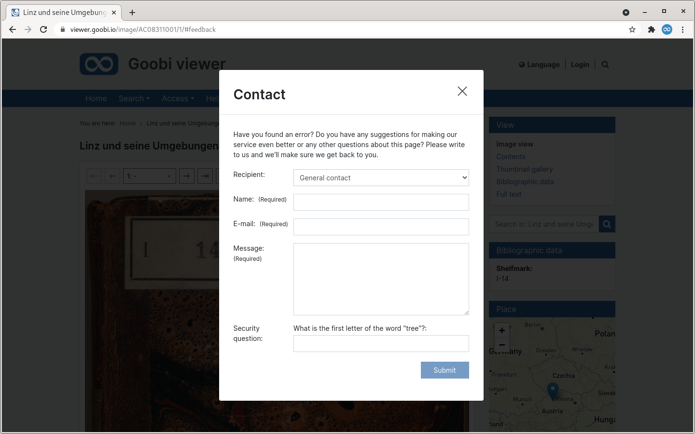
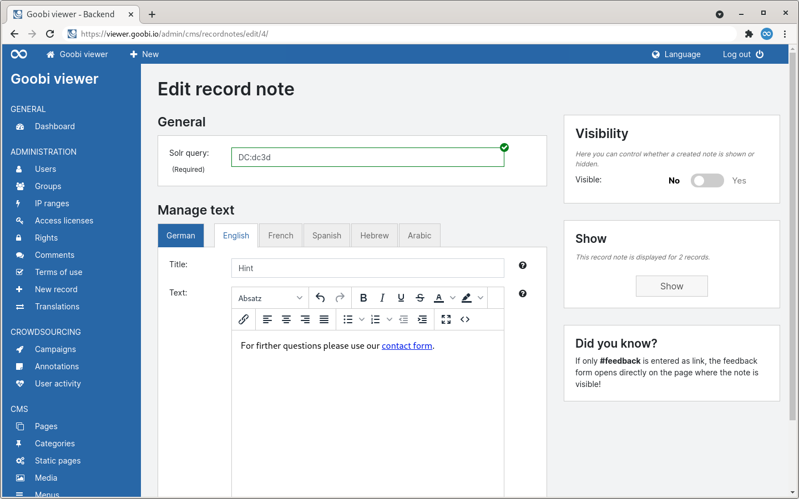
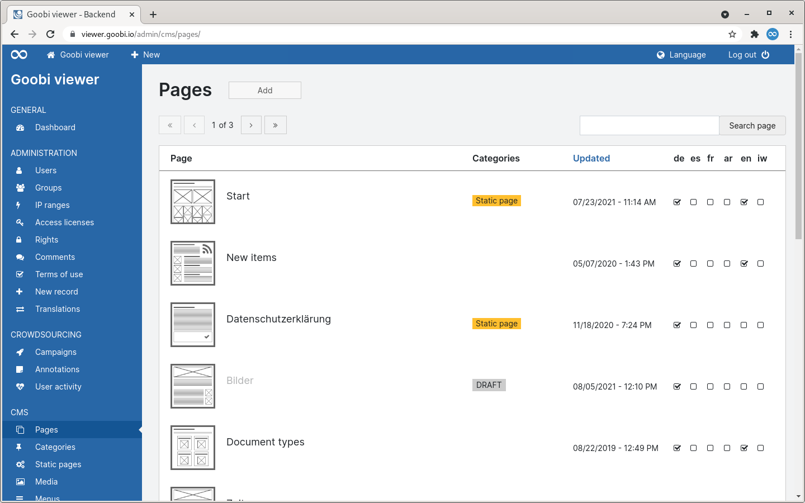
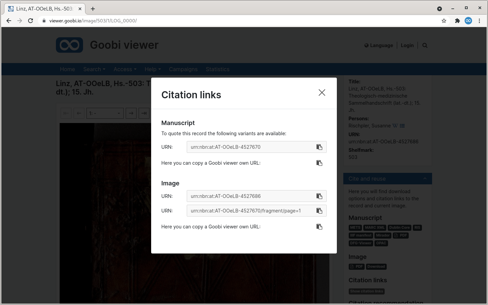

# July

## Coming soon 🚀 

* **Comments** revision
* **Docker** container
* **User page** in the frontend

## Announcements

In August, the Goobi viewer team will have limited availability due to various annual vacations.


As already announced in the last Digest, **Java 11 will be mandatory from September 1, 2021**. If a system has not yet been updated, this must be done at the latest with a Goobi viewer update after this date.


## Developments 

### Feedback

The feedback form has been reworked and is now displayed by default as an overlay above the currently displayed page. This has the great advantage that when a message is sent at a certain point, the user is no longer redirected away from the page, but remains there.

With the visual revision there are also functional enhancements. It is now possible to add a list of potential recipients. If more than one entry exists, a drop-down menu is automatically displayed in which the desired recipient can be selected. 

Furthermore, a message is now also sent as a copy to the sender by default. 

Another new feature is the possibility to call the form automatically via the web fragment `#feedback` on every page. This makes it possible to easily use the new functionality also in the menu or in the record notes.



### Record notes 

Until now, the notes were linked to a record identifier. From now on, record notes can also be created for Solr queries. This makes it possible, for example, to formulate and display a note for all records in a specific collection or all records with a specific document type. 

Using the new features in the feedback form, record notes can also open the form, for example. A corresponding hint on how to use the functionality is displayed in the sidebar.



### CMS

In the page overview, CMS pages that have been created but are still in draft form are grayed out and marked with a corresponding badge.



### Monitoring

A new monitoring endpoint is available via the REST API. From the Goobi viewer's perspective, the following three functionalities are checked when called: 

* Connection to the database
* Connection to the Solr search index
* Image display

The JSON output returns either `ok` or `error` status for the functionalities. If this endpoint is included in an automatic monitoring system such as Icinga and checked regularly, errors can be detected early and reacted to with event handlers. Example output from the monitoring endpoint:

```javascript
	"solr": "ok",
	"database": "ok",
	"images": "ok"
}
```

### Tasks in the hotfolder 

In April we introduced the functionality to display the number of tasks in the hotfolder for administrators in the blue topbar. Until now, the display was updated when the page was reloaded. From now on this is done automatically via websockets without any user interaction.

### Citation links

For the provision of citation links, there was a program logic in the Goobi viewer that is now ten years old. There the "PURL" to the current record and the current page was provided. About eight years ago, the logic was extended so that - if URNs are available - a URL to the internal URN resolver is output. Otherwise still the PURL of the Goobi viewer. 

However, time has not stood still and therefore it was urgently necessary to revise this area. Besides PURLs and URNs there are also DOIs and Handles and ARKs and so on. In addition, it is challenging in practice to guarantee the persistence of URNs in a granular way, which has led to requests to be able to reference pages via fragments attached to the record identifier. 

With this release a completely revised logic for the display of citation links is available. The access to the citation links is still done via the widget "Cite and reuse". Clicking on the badge there opens an overlay in which the existing citation links can be displayed and copied. A new section in the configuration file allows you to specify which fields from the Solr search index should be offered as citation links and whether they should be supplemented with prefixes and suffixes. 

The Goobi viewer comes in the standard configuration with entries for URN, URN granular, DOIs and Handles, which - if available - are displayed.



### Miscellaneous

* If a representative exists for a record, the RSS feed now automatically links to it. 
* The download option can now be globally disabled in the "Cite and reuse" widget.
* When collections are linked in the bibliographic data via the "hierarchicalfield" parameter, a configured sort field for a collection is now also taken into account.
* Passing a text for the footer can now be disabled.
* In the backend, the translation of purely local strings can now be maintained.

## Version numbers 

The versions that must be entered in the `pom.xml` of the theme in order to get the functions described in this digest are:

```markup
<dependency>
    <groupId>io.goobi.viewer</groupId>
    <artifactId>viewer-core</artifactId>
    <version>21.07.1</version>
</dependency>
<dependency>
    <groupId>io.goobi.viewer</groupId>
    <artifactId>viewer-core-config</artifactId>
    <version>21.07</version>
</dependency>
```

The **Goobi viewer Indexer** has the version number **21.07.2**

The **Goobi viewer Connector** has the version number **21.07**

The **Goobi viewer Crowdsourcing Module** has the version number **21.07**

