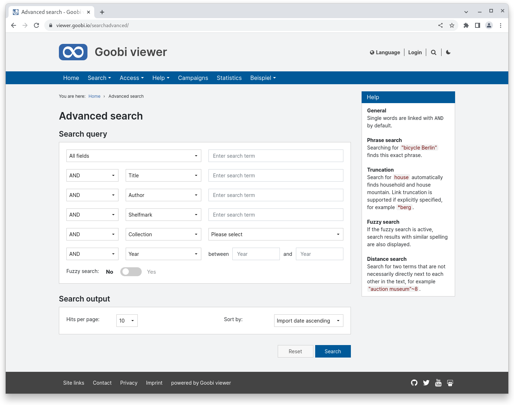
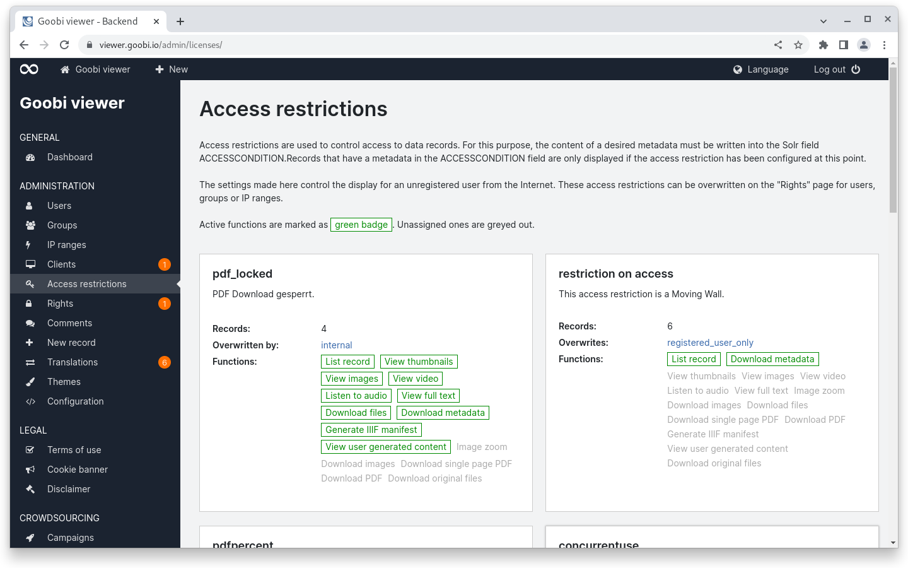
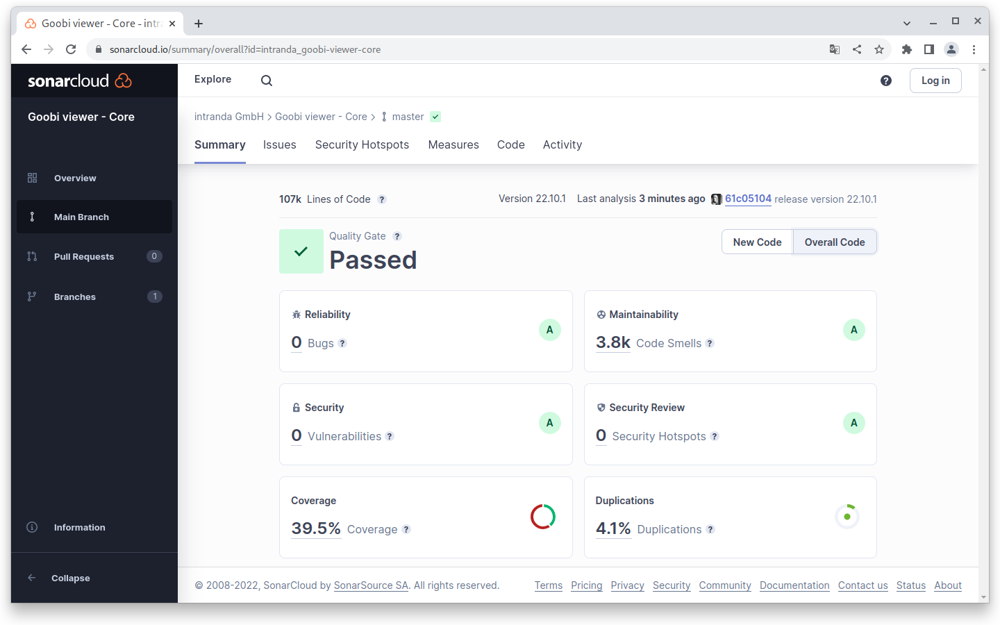
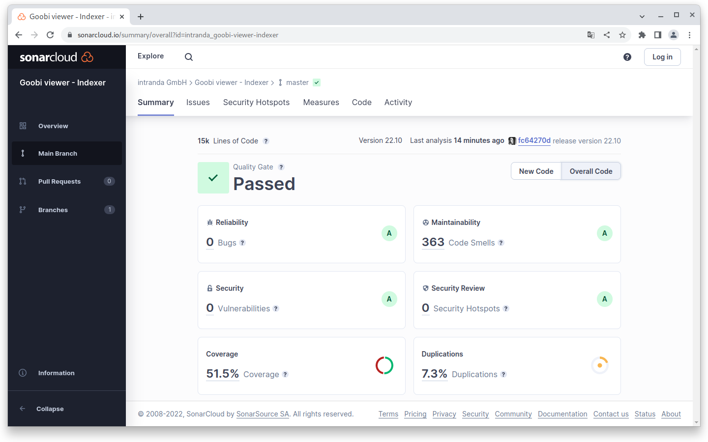
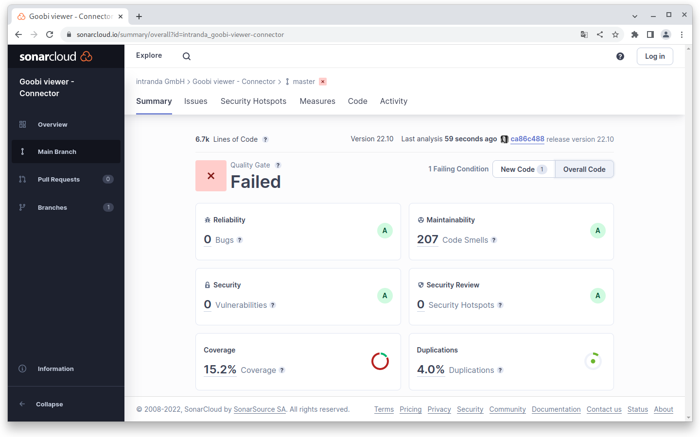

# October

## Coming soon :rocket:&#x20;

* **Revision** of the **CMS** area
* **Compact** and high-resolution **PDF files**
* **Authentication**

## Developments

### Search&#x20;

The interface for the advanced search has been completely revised. In doing so, we broke away from the existing concept and developed and implemented a proposal based on an evaluation with the community.&#x20;

The new search mask is now basically only designed to be displayed on a separate page. Previously, the search results could optionally be placed underneath. This circumstance always led to a conflict between usability and functionality. The clear separation clears this up and brings many advantages. For example, for the first time, a directly visible help is now available in the sidebar, which describes the various search options including examples. In addition, the fuzzy search can now be optionally switched on for a search query. Previously, the functionality had to be globally switched on or off for an installation.

<figure><figcaption><p>New page for the advanced search</p></figcaption></figure>

### Configuration

A year ago we tidied up the configuration file and standardised the spelling, etc. See also the Digest from August 2021:



Last month we took up the topic again, tidied it up properly and completed the work in this area for the time being. Elements that were configurable but never adapted have been removed, switches have been moved or documented at all. The aim of this work was and is to keep the meanwhile considerably large configuration file comprehensible. For example, we believe it is important that the terminology in the frontend, code and backend is consistent. Also, switches should always be worded the same and not have `<functionFoo enabled="true />` on one and `<barFunction disabled="true" />` on another. \
Removing obsolete entries also helps to keep the configuration file clear despite its size.&#x20;

More on this topic in the [update instructions](https://docs.goobi.io/goobi-viewer-de/devop/1/2022#22.10)

### Access restrictions

Especially when functionality is not used very often, it must be as clear as possible. However, this is all the more difficult the more complex the matter becomes. One of these areas is in the access restrictions: A data set can contain several access restrictions. The following use case illustrates this:&#x20;

* A dataset has the access restriction `metadata_registered` and `free_reading_room`.&#x20;
* The dataset is _**not**_** visible worldwide by default**&#x20;
* The access restriction `metadata_registered` means that researchers belonging to a certain user group are **allowed to read the metadata of the dataset after logging in**.&#x20;
* The access restriction `free_reading_room` means that the dataset is **fully accessible from the IP address range of the reading room**.&#x20;

At this point it is necessary to determine which of the two access restrictions is weighted higher and overrides the other. Otherwise it can happen that a researcher logs into the reading room and subsequently sees less than before.&#x20;

To make this clearer, we have adapted the logic, naming and explanation in the backend. Among other things, the overview page of the access restrictions now shows in the tiles whether one restriction overwrites another or whether it is overwritten by another.

<figure><figcaption><p>Further information on the configured access restriction in the overview</p></figcaption></figure>


The logic for overwriting access restrictions is now different than before. This functionality must be checked during an update if it is used!


### REST API&#x20;

A new endpoint is available in the REST API to generate a list of all records that have been/will be released in a given year via the Moving Wall functionality.&#x20;

The response will always return all records for the requested year. If a data record is only released at a later point in time in the requested year, this is also included. However, since an exact date is displayed for each record, these cases can be identified very easily.&#x20;

Access to the information is secured and only possible with a TOKEN.&#x20;

### Desktop Client&#x20;

The source code of the Desktop Client is now available on Github:



### Snippets&#x20;

* In the backend, more notifications have been switched to sweetalerts to ensure a homogeneous UI.&#x20;
* Indexing of authority data can now be completely disabled in the Goobi viewer indexer.&#x20;
* The parameters from/until are now also evaluated in the Goobi viewer Connector for the OAI interface when sets are queried.&#x20;
* We have scanned the application externally with various external tools to find possible XSS vulnerabilities. No vulnerabilities were found.

## Code analysis

The following screenshots show the SonarCloud analysis of the current release. More information is available directly on the [project page](https://sonarcloud.io/organizations/intranda/projects).

<figure><figcaption><p>SonarCloud Analysis: Goobi viewer Core - for the Git Tag v22.10.1</p></figcaption></figure>

<figure><figcaption><p>SonarCloud Analysis: Goobi viewer Indexer - for the Git Tag v22.10</p></figcaption></figure>

<figure><figcaption><p>SonarCloud Analysis: Goobi viewer Connector - for the Git Tag v22.10</p></figcaption></figure>

A few words about the failed analysis in the Connector:&#x20;

In SonarCloud, quality requirements, so-called quality gates, can be defined. The quality gates are applied once to the entire source text and once to the source text that has been changed in the last 30 days.&#x20;

The quality gate that is now failing in the Goobi viewer Connector refers to the adapted source code in the last 30 days. There, a test coverage of 25% is required, but there is only a coverage of 17.8%. The reason for this is that a lot of source code was touched during refactoring work and this is now considered new.&#x20;

The quality gate for the entire source text is met.

&#x20;In absolute terms, 178 code smells were removed in the Goobi viewer Connector compared to last month, 15 unit tests were added and the test coverage increased by 5%!

## Version numbers&#x20;

The versions that must be entered in the `pom.xml` of the theme in order to get the functions described in this digest are:

```markup
<dependency>
    <groupId>io.goobi.viewer</groupId>
    <artifactId>viewer-core</artifactId>
    <version>22.10.2</version>
</dependency>
<dependency>
    <groupId>io.goobi.viewer</groupId>
    <artifactId>viewer-core-config</artifactId>
    <version>22.10.1</version>
</dependency>
<dependency>
    <groupId>io.goobi.viewer</groupId>
    <artifactId>viewer-connector</artifactId>
    <version>22.10</version>
</dependency>
```

The **Goobi viewer Indexer** has the version number **22.10**

The **Goobi viewer Crowdsourcing Module** has the version number **22.10**
