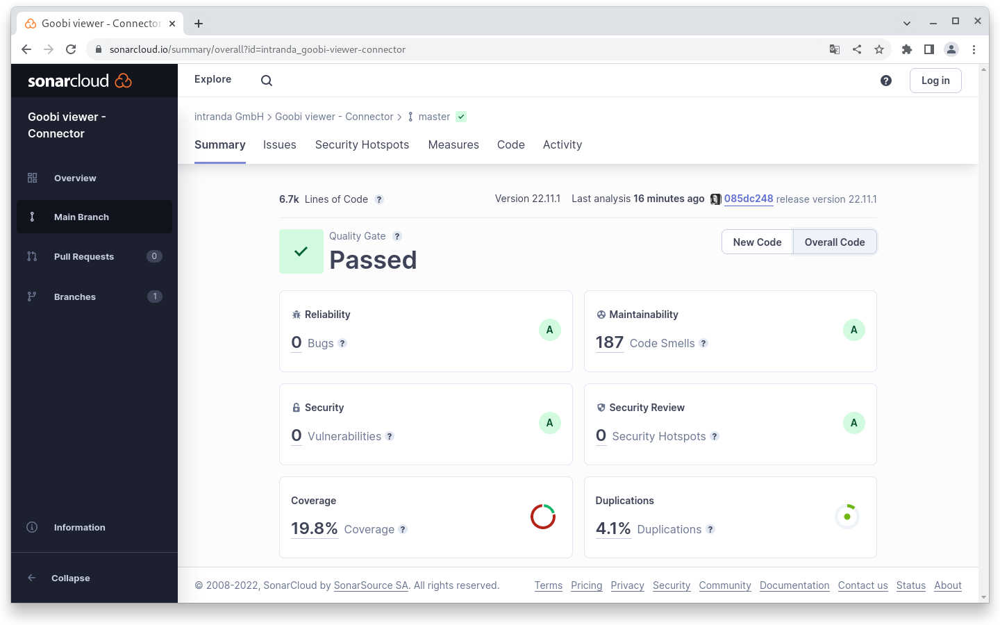

# November

## Coming soon :rocket:&#x20;

* **Revision** of the **CMS** area
* **Compact** and high-resolution **PDF files**

## Developments

### SAML / Shibboleth&#x20;

Already in April 2002, a first SAML implementation for authentication was adopted in the Goobi viewer core. Now, two and a half years later, this implementation is complete and has become so generic that it allows authentication via Shibboleth, for example.&#x20;

The current implementation in Goobi viewer is based on what has existed in Goobi workflow for some time and has proven its practicality there. The solution allows the evaluation of HTTP headers or attributes for authentication. This has the great advantage that it can be used for many different application scenarios. The actual authentication - in this specific case with Shibboleth - is now left to the shibd service provider and an Apache module. In the end, the Goobi viewer only evaluates the result. In this way, many other authentication methods are possible.

Since the initial configuration is a bit more complex, we have highlighted our experiences again in a dedicated use case. See also chapter 1.14 in the miscellaneous section of the Goobi viewer documentation.

<figure><figcaption><p>Login screen with activated Shibboleth authentication</p></figcaption></figure>

### Snippets

* If multiple Goobi viewer instances are installed on a server and until now the default path to the  local `<configPath />` had to be adjusted in the global configuration file with each update, this can now also be passed as a Java variable. The setting can be made in `/etc/default/tomcat9`, for example: \
  `JAVA_OPTS="${JAVA_OPTS} -DconfigFolder=/path/to/second/viewer/config/"`&#x20;
* The crowdsourcing module was changed internally to the standard Maven order structure.&#x20;
* Based on a [discussion in the community forum](https://community.goobi.io/t/zitierempfehlung-konfigurierbar/868), there have been minor changes to the citation recommendation options&#x20;
* In the Goobi viewer indexer, the file name is now explicitly mentioned in the error email in case of a failed indexing.

## Code analysis

The following screenshots show the SonarCloud analysis of the current release. More information is available directly on the [project page](https://sonarcloud.io/organizations/intranda/projects).

<figure><figcaption><p>SonarCloud Analyse: Goobi viewer Core - für den Git Tag v22.11.1</p></figcaption></figure>

<figure><figcaption><p>SonarCloud Analyse: Goobi viewer Indexer - für den Git Tag v22.11 </p></figcaption></figure>

<figure><figcaption><p>SonarCloud Analyse: Goobi viewer Connector - für den Git Tag v22.11.1</p></figcaption></figure>

## Version numbers&#x20;

The versions that must be entered in the `pom.xml` of the theme in order to get the functions described in this digest are:

```markup
<dependency>
    <groupId>io.goobi.viewer</groupId>
    <artifactId>viewer-core</artifactId>
    <version>22.11.1</version>
</dependency>
<dependency>
    <groupId>io.goobi.viewer</groupId>
    <artifactId>viewer-core-config</artifactId>
    <version>22.11</version>
</dependency>
<dependency>
    <groupId>io.goobi.viewer</groupId>
    <artifactId>viewer-connector</artifactId>
    <version>22.11.1</version>
</dependency>
```

The **Goobi viewer Indexer** has the version number **22.11**

The **Goobi viewer Crowdsourcing Module** has the version number **22.11**
