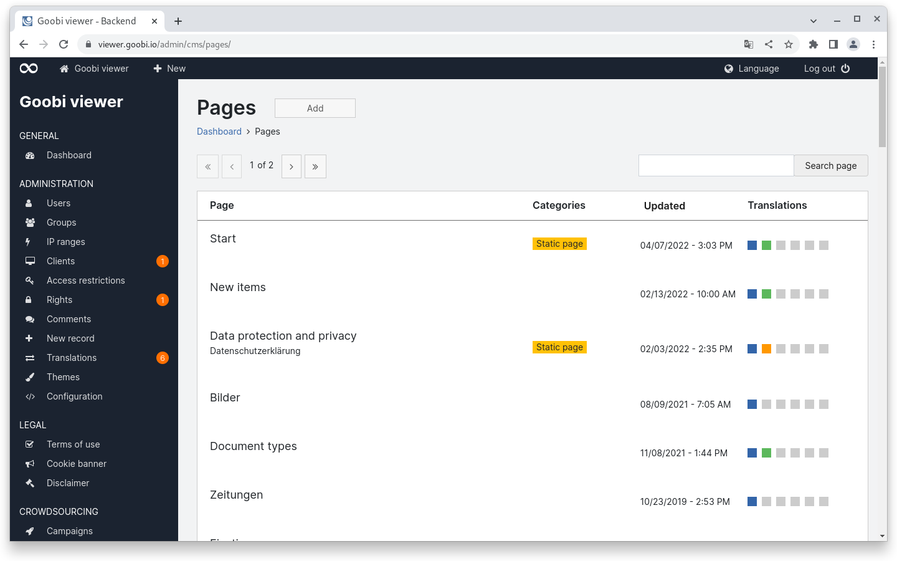
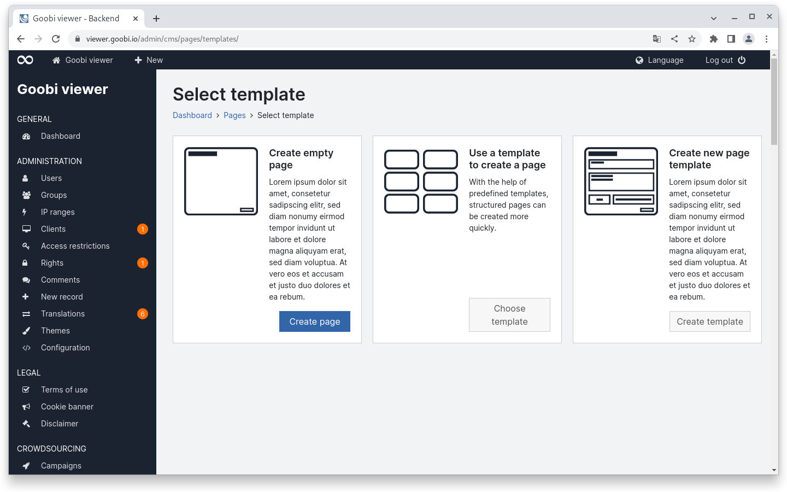
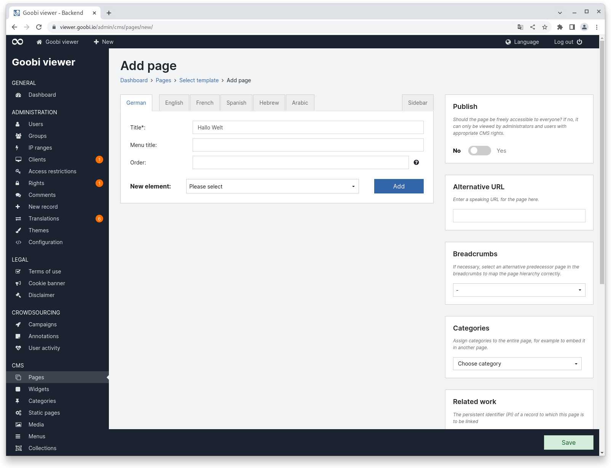
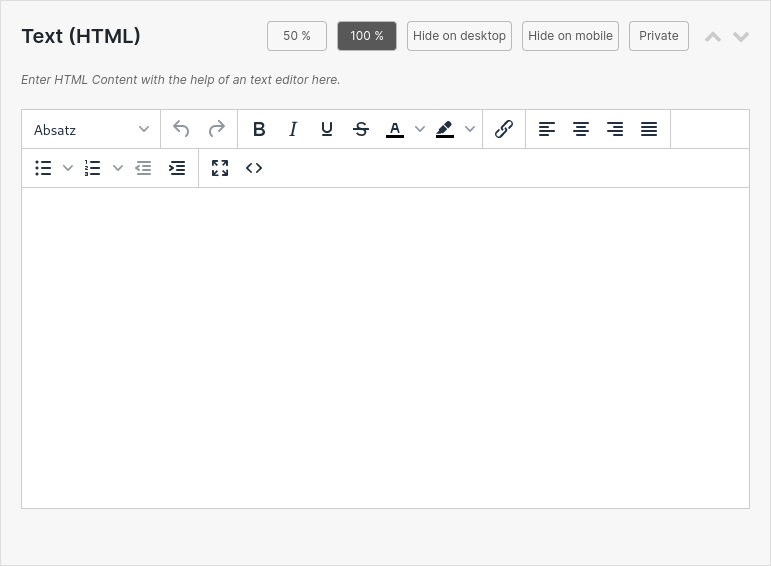
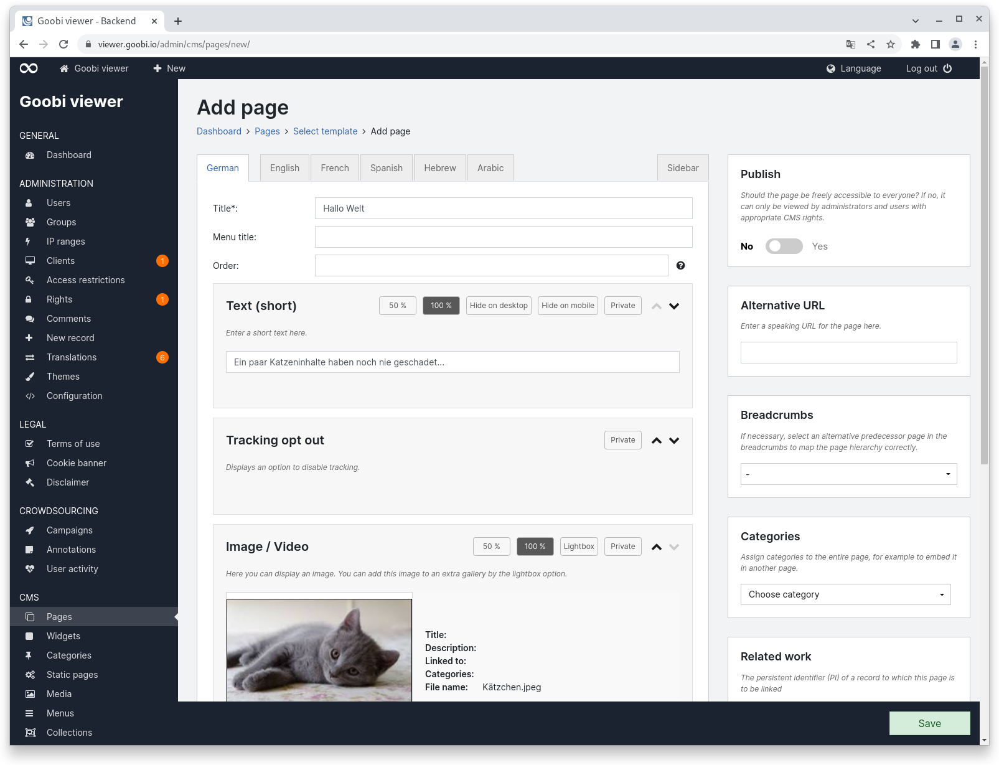
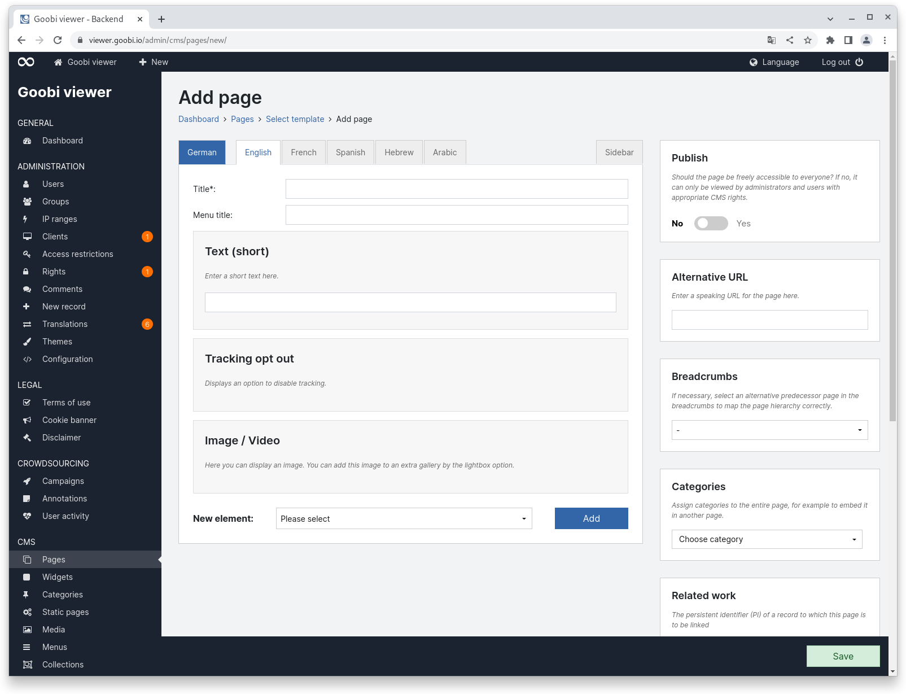
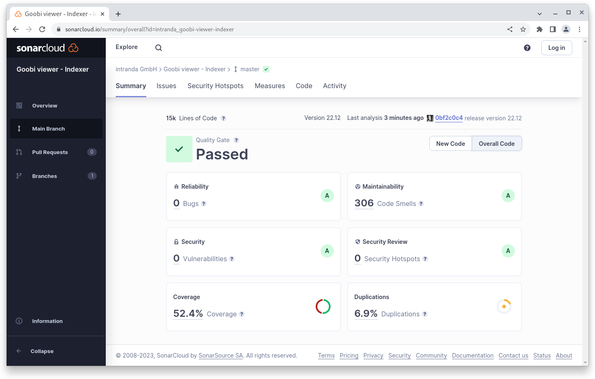
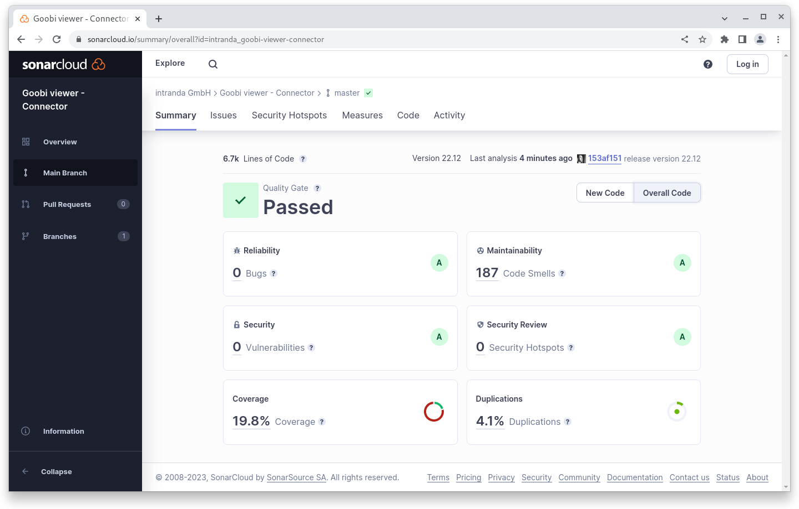

# December

## Coming soon :rocket:&#x20;

* **Compact** and high-resolution **PDF files**

## Developments

### CMS

Finally it's here. We've been talking about it for a long time and developing it for far too long, but the initial impact for the overhaul of the CMS area is ready. The ideas for it are already almost three years old, a concept was created two years ago and the presentation in the community forum was also over a year and a half ago. We have been developing for a long time, and in the process we have had to realise time and again that ideas could not be realised in this form or that we had forgotten to consider certain areas. Now we have reached a status where we would like to publish the developments.&#x20;

#### Background&#x20;

The CMS area of the Goobi viewer was conceived in 2014 and since then has only been expanded in terms of content, but never evaluated in terms of its design and structure. This had various reasons but should then no longer be an excuse a few years ago, where we see the CMS area as one of the core components of the Goobi viewer, alongside the image display and the search index. The core idea of the CMS area was that a page structure can be specified via templates. On the one hand, these templates are available globally, but on the other hand they can also be developed customer-specifically and then stored in the theme. A CMS template consists of various contents such as text, images, search hits, etc. The content of the CMS template should be defined by the user. In addition to this content itself, it should also be partially configurable and the page itself also contains setting options for the page itself. Configuration of content is, for example, a Solr query to restrict search hits, configuration of the page itself is, for example, the alternative URL. In addition, every CMS page contains a sidebar and this can also be configured page-specifically.&#x20;

#### Previous restrictions

One of the main limitations in the previous model was the rigidity of the pages. If a page needed to display two texts, a tile grid and a search hit list, then we could map exactly that using a custom template. But if another text was to be added, we had to update the template and, in case of doubt, the entire Goobi viewer. For a small text adjustment to a CMS page, which can be done within five minutes, our side was faced with perhaps several hours of work. This was not only unsatisfactory for the users, but also for us. The simple and creative creation of pages was not possible. In addition, a system that had grown over many years simply became confusing. Ideas we had in the initial conception turned out to be practical, but were not changed. New functionality came along and was simply added somewhere where it just fitted. In addition, it is easier to provide a checkbox in which a user has to click if he wants something than to solve it with logic in the code and to design it "intelligently".

#### What is new

When revising this area, we first made sure to adapt the visual elements from the operating concept of the other areas to the CMS area. For example, the translation status of a page in the overview is now also displayed via the coloured boxes and no longer via the checkboxes. This has the advantage that even partially translated pages can be visualised.

<figure><figcaption><p>CMS page overview with new translation display</p></figcaption></figure>

When a new CMS page is to be added, a choice is now available as to whether to start with an empty page, create a page based on a template or create a new page template.

<figure><figcaption><p>Selection of what is to be added to the CMS</p></figcaption></figure>

The display for adding or editing a page or template is always structured in the same way. The main area contains the familiar tabs for the available languages, which also visualise the translation status. To the right of the translations is the tab for the sidebar of the page. In the sidebar are all the options that contain general page settings. At the very bottom of the page, there is always a visible action bar that - depending on the page status - contains the buttons for saving, deleting and displaying. This prevents the actions from scrolling out.

Within the main area, the title is the only mandatory field for a page.

<figure><figcaption><p>New empty CMS page</p></figcaption></figure>

A completely new feature is the possibility to select, arrange and configure the elements on a CMS page. The elements that can be added to the page are available in alphabetical order in a drop-down menu. An element consists of different contents. In addition to the heading, there are attributes that control the element. In the following example for an HTML text these are the following:&#x20;

* 50% and 100%: Controls how much width the element should take up in the content area of the page. Two 50% contents are automatically displayed next to each other.
* Hide on desktop / mobile: Controls whether the element should be hidden on a large screen or on a mobile device.&#x20;
* Private: Controls whether the element should be published or not. Elements marked as private are only visible to administrators and are also visually marked on the page.
* Order: The order of the elements on a page can be freely moved up and down using the two up and down arrows.

<figure><figcaption><p>Text (HTML) element with attributes in the header area</p></figcaption></figure>

As a rule, an element also has a small help text. Depending on what is possible with an element, there are further options. In the example of the HTML text, a corresponding text can be entered.&#x20;

Other elements, such as a tracking opt-out, have no further setting options but are only displayed as an element.&#x20;

Elements such as the search hits can then be further configured: Solr query, sort fields, grouping etc.&#x20;

The only restriction that exists at this point is that no more than one element may be used per CMS page that potentially has multiple pages. Since the pagination is mapped via the URL in order to be able to simply pass on the currently visible page, it would otherwise not be clear which element had been browsed.&#x20;

In the tabs with translations, all elements are displayed, but only the translatable contents are controllable. Attributes, configuration options or the option to delete is only available in the primary language. This is to avoid the impression that different setting options are available for different languages.

<figure><figcaption><p>Setting options for elements are only available in the primary language</p></figcaption></figure>

<figure><figcaption><p>The structure of the elements is visible in the translations, but only texts can be edited.</p></figcaption></figure>

Existing CMS pages from earlier core templates are automatically migrated during an update. For this purpose, a legacy component was created for each old template. Nevertheless, all existing pages should be checked manually each time you update to a Goobi viewer with the new CMS. We also recommend transferring the existing pages from legacy templates to dynamic pages. If we are asked for an update, we are happy to offer this. Existing theme templates would have to be checked and, if necessary, converted into new elements. This is checked individually from installation to installation.&#x20;


**Finally, a word**: The conversion was massive and we cannot exclude the possibility that there may still be a hitch in one or two places. We ask for your indulgence and will correct errors ourselves and make them available with point releases. Missing features will then be included in the next stable version.


### Snippets

* The Goobi viewer Core as well as the Goobi viewer Indexer can now use a proxy server when connecting externally. This is useful for live queries of standards data, for example.&#x20;
* If DataRepositories are activated, the Goobi view Indexer checks after indexing whether the same data set is also contained in another DataRepository and deletes it if it exists there.
* Tables in the backend now contain significantly more entries, so that less scrolling is required.&#x20;
* Pages in the backend now have breadcrumbs. This makes navigation in the page hierarchy much more ergonomic.

### What will come

#### Queue

Already in development is a revised queue functionality that will add functionality such as persistence, graphical interface, potential clustering and advanced control options such as pausing individual jobs to the tasts previously only available in the REST API. The development is accompanied by the ability to automatically pre-render PDF files in the Goobi viewer.

#### Facets

This year we will continue to work on the ergonomics of the search. For example, improved faceting options are on the agenda. Faceting by time should be possible independently over several different metadata (for example, date of birth and date of death). In addition, a graph will visualise the number of search hits in a time period. Another new feature is the possibility of faceting by first letter. Similar to browsing, but with full-fledged search hits that also include thumbnails and further information.

#### Maps

Markers on maps are to be given a type, so that, for example, a map showing the stations in an artist's life can be displayed, on which individual station types (place of birth, place of education, place of creation of a work, places of exhibition, place of death) are each given their own markers.

#### Sidebar

It is also planned to make the control of the sidebar components per page configurable. This will require major technical modifications to enable configurability in the Java code. So far, the control is only possible for CMS pages, but from then on it will also apply to core pages.

This development should then also make it possible to automatically extend the content area to the entire width of the page if no sidebar widgets are displayed.

#### Further

Basically, we are planning to improve the usability of the frontend. In consultation with users, we want to identify and revise larger and smaller sections so that these areas feel less grown and more consistent.

## Code analysis

The following screenshots show the SonarCloud analysis of the current release. More information is available directly on the [project page](https://sonarcloud.io/organizations/intranda/projects).

<figure><figcaption><p>SonarCloud Analysis: Goobi viewer Core - for the Git Tag v22.12</p></figcaption></figure>

<figure><figcaption><p>SonarCloud Analysis: Goobi viewer Indexer - for the Git Tag v22.12</p></figcaption></figure>

<figure><figcaption><p>SonarCloud Analysis: Goobi viewer Connector - for the Git Tag v22.12</p></figcaption></figure>

## Version numbers&#x20;

The versions that must be entered in the `pom.xml` of the theme in order to get the functions described in this digest are:

```markup
<dependency>
    <groupId>io.goobi.viewer</groupId>
    <artifactId>viewer-core</artifactId>
    <version>22.12</version>
</dependency>
<dependency>
    <groupId>io.goobi.viewer</groupId>
    <artifactId>viewer-core-config</artifactId>
    <version>22.12</version>
</dependency>
<dependency>
    <groupId>io.goobi.viewer</groupId>
    <artifactId>viewer-connector</artifactId>
    <version>22.12</version>
</dependency>
```

The **Goobi viewer Indexer** has the version number **22.12**

The **Goobi viewer Crowdsourcing Module** has the version number **22.12**
