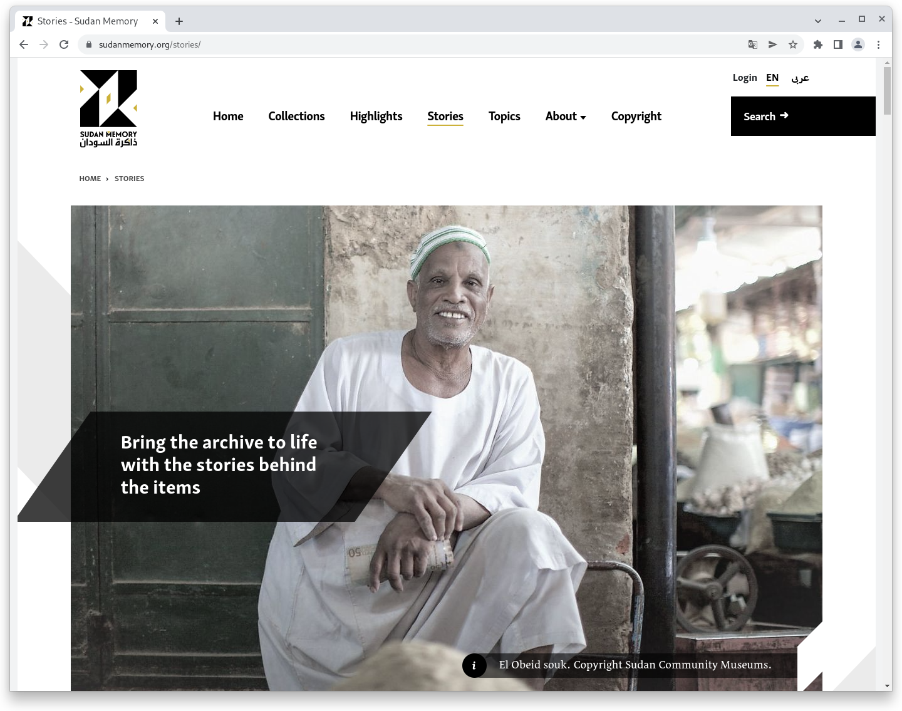

# May

## Coming soon :rocket:&#x20;

* Innovations in **access restrictions**
* **Revision** of the **CMS** area

## Behind the scenes

In the first half of the year we have already completed many projects. We would like to mention two of them here as examples and invite you to browse through the results.

### Sudan Memory



> The Sudan Memory project seeks to conserve and promote valuable cultural materials from and about Sudan through digitisation and via an online platform. Throughout the country, many interesting and rich archives are at risk for a number of reasons: extreme weather conditions, lack of appropriate storage conditions, neglect and conflict. Many public and private collections are also locked away and not easily accessible.
>
> Our mission is to help preserve these archives and their stories, so that current and future generations can benefit from this precious and important heritage.&#x20;



### ZentralGut



> ZentralGut opens up opportunities to make the cultural assets of the Central Switzerland region accessible and present them in a multi-layered way, without being tied to a specific location and with few barriers. The portal for digitised cultural assets of Central Switzerland is open to interested memory and cultural institutions from the region to publish object images, photographs and texts from their holdings.&#x20;
>
> ZentralGut is a diverse regional cultural heritage platform that - like our cultural heritage itself - is constantly expanding and updating. The texts, images, sound and video documents can be researched, existing objects can be commented on and extensive Citizen Science projects can be implemented. But not only institutions, but also private individuals are invited to share their knowledge about the region and contribute their own treasures.


## Developments

### Hardening&#x20;

In this release we have worked on improving the security of the Goobi viewer. In doing so, we have looked at and improved several areas.&#x20;

#### Passwords&#x20;

Passwords must have a minimum length of 8 characters. This check has been in place for some time, but was not active in some places, so shorter passwords were sometimes accepted. This behaviour has now been stopped. In addition, the validator has been extended so that the maximum permitted number of bytes of the bcrypt hash algorithm used is also checked.

If a user wants to change his password, it is now also necessary to enter the current password. For example, if a user has not logged out correctly in the reading room, another user cannot simply change the password. Administrators can still reset passwords without further knowledge.&#x20;

#### Brute-Force&#x20;

To make brute force attacks more difficult, a counter for the entered e-mail address is incremented in the event of a failed login attempt. After a failed login attempt, the number of failed attempts times three seconds must be waited for. Attempts before the waiting time has elapsed are always rejected. All counters are reset at the next successful login.&#x20;

#### Configuration&#x20;

The Apache web and Tomcat application server default settings have been adjusted in both the installation instructions for the classic and Docker-based installation, as well as in the update instructions, so that they provide higher security and reveal less general system information.

### Upload records&#x20;

A new functionality allows visitors to the Goobi viewer to contribute their own content. This creates new opportunities for interaction. The functionality can be activated in the configuration file.&#x20;

Once set up, the new "Add content" area is available to logged-in visitors. In a very simple form, a title and an optional description can be entered, and images can be uploaded. When the form is submitted, a process is automatically created in the background within Goobi workflow. The data can then be checked there:&#x20;

* Does the uploaded data meet the desired requirements?&#x20;
* Do the title and description fit?&#x20;
* What about copyright?&#x20;
* ...&#x20;

For optional clarification, the email address of the user who contributed the content is displayed.&#x20;

The Goobi viewer periodically checks the status of the submitted content. There are three possible statuses:&#x20;

* **Waiting**. This status is visualised by an hourglass. It means that processing within Goobi workflow is still pending.&#x20;
* **Successful**. This status is visualised by a tick. It means that the processing has been successfully completed and the record has been exported to Goobi viewer.&#x20;
* **Rejected**. This status is visualised by an X. It means that the contribution cannot be found in Goobi workflow OR that it has been rejected. If a reason was entered, it will also be displayed in Goobi viewer.&#x20;

The new functionality adds a new option to the portfolio for interaction between users and institutions. By using the proven infrastructure of Goobi workflow, all questions regarding moderation, backup, archiving, etc. are answered.


### Campaigns

For campaigns, it is now configurable whether content is opened in a fixed order or randomly.&#x20;

Furthermore, it is now possible to use the regular OpenStreetMap view for georeferencing within the campaigns. The centre point and the standard zoom factor can now also be set. This means that a non-Germany-centred entry point can also be selected.


### Snippets&#x20;

* Annotations are now better found and displayed in search&#x20;
* Alternative URLs for CMS pages can now no longer contain spaces In various places
* German has been removed as the hard-coded default fallback language and replaced with the configured default value.

## Version numbers&#x20;

The versions that must be entered in the `pom.xml` of the theme in order to get the functions described in this digest are:

```markup
<dependency>
    <groupId>io.goobi.viewer</groupId>
    <artifactId>viewer-core</artifactId>
    <version>22.05</version>
</dependency>
<dependency>
    <groupId>io.goobi.viewer</groupId>
    <artifactId>viewer-core-config</artifactId>
    <version>22.05</version>
</dependency>
<dependency>
    <groupId>io.goobi.viewer</groupId>
    <artifactId>viewer-connector</artifactId>
    <version>22.05</version>
</dependency>
```

The **Goobi viewer Indexer** has the version number **22.05**

The **Goobi viewer Crowdsourcing Module** has the version number **22.05**
