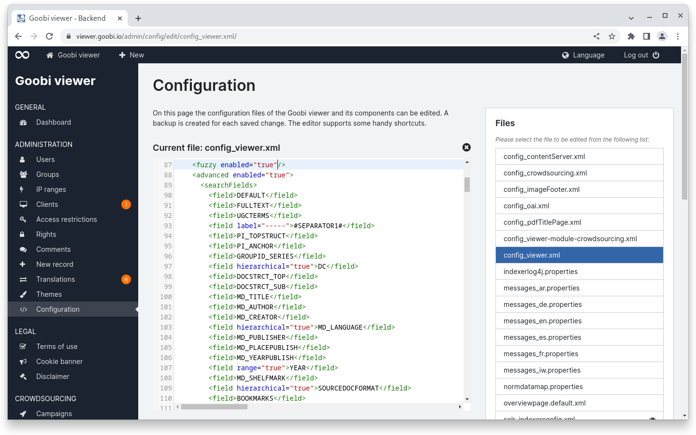
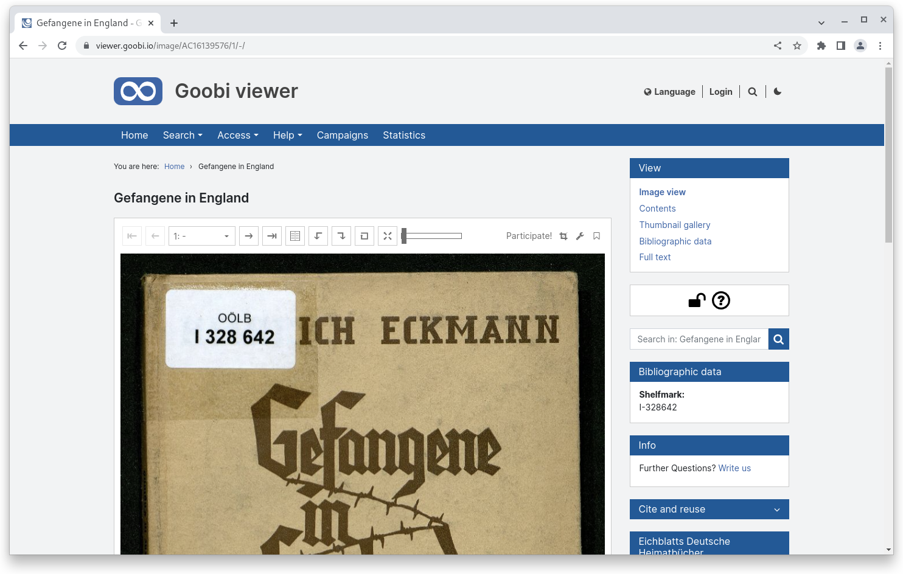
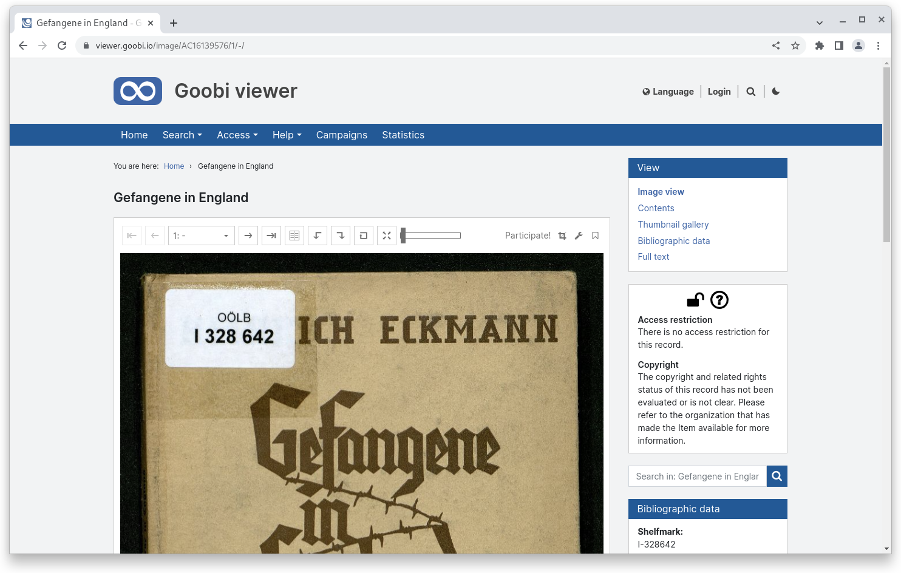
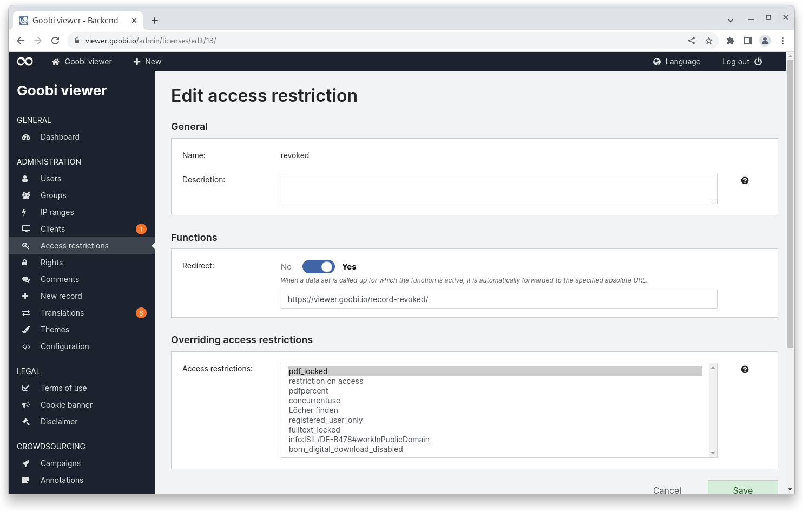
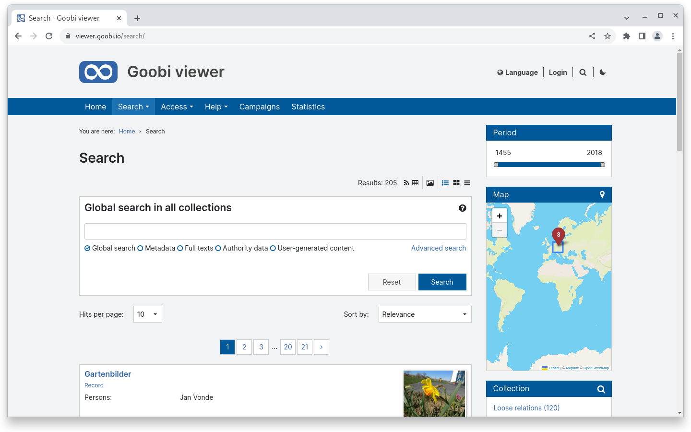
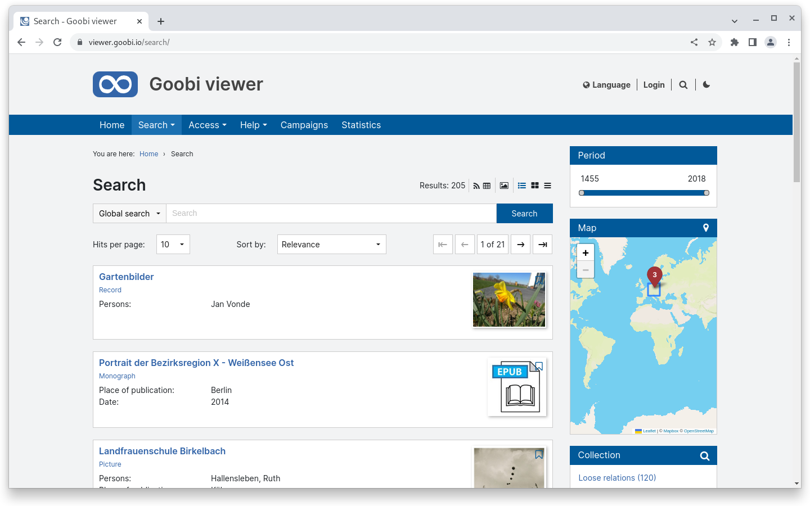
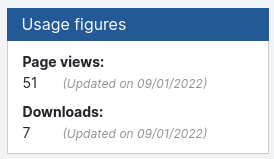

# August

## Coming soon :rocket:&#x20;

* **Revision** of the **CMS** area
* **Revision** of the **advanced search**
* **Goobi users meeting** :tada:

## Developments

### Config Editor

Finally, the configuration files of the Goobi viewer can be edited directly in the backend. The new "Configuration" page is available for this purpose. In the sidebar there is a list of files that can be edited. Backups are created automatically and can be downloaded if necessary. An intelligent locking mechanism prevents several people from accessing individual files at the same time. The saving of invalid XML is prevented so that the Goobi viewer interface cannot simply break due to syntax errors.

<figure><figcaption><p>Config editor with config_viewer.xml open</p></figcaption></figure>

### Access restriction and licence of use&#x20;

Is access to a record restricted and if so, what does that mean? And is a record published under a specific use licence and if so which one? Until now, these questions could only be answered implicitly or hidden.&#x20;

From now on, the Goobi viewer can display this information prominently in the sidebar. There is a new widget directly below the navigation bar that makes both pieces of information quickly accessible at a glance. Whether a record has an access restriction is visualised with a lock icon. The licence of use also has corresponding icons. Clicking on the widget displays further descriptive texts. These are controlled via the configuration file.&#x20;

A standard configuration for the most common use licences is provided. This includes licences from Creative Commons, RightsStatements.org or examples for german copyright and VG Wort.

<div>

<figure><figcaption><p>Widget with icons</p></figcaption></figure>

 

<figure><figcaption><p>expanded widget with icons and text</p></figcaption></figure>

</div>

The information can alternatively be displayed in the form of a traffic light next to the heading above the record.

### Access restrictions

Records that have an access restriction can now be configured to redirect to a specific URL. This is particularly useful when a record is withdrawn and a message is subsequently displayed. The functionality can also be used in conjunction with Goobi workflow to display a "record in digitisation" message.

<figure><figcaption><p>Redirection to a URL for access restrictions</p></figcaption></figure>

### Search

The header area of the search results page has been revised so that there is now significantly more space available. Here is a before / after comparison:

<figure><figcaption><p>Search results page before</p></figcaption></figure>

<figure><figcaption><p>Search results page now</p></figcaption></figure>

### Usage figures

The Goobi viewer can now automatically collect and store the following usage figures for individual data sets:

* absolute number of page views (each view of a page of a work)&#x20;
* unique page views (each view of a page of a work is counted only once per user session)&#x20;
* absolute number of downloads (each download of a file)&#x20;
* unique downloads (each download of a file is counted only once per user session).

A user session is the session as seen by the Goobi viewer.&#x20;

The logic is that all calls that open a record are cached in a database. Full days can then be transferred to the Solr search index. Once the data is in the search index, it can either be displayed in a widget or retrieved via the REST API.

<figure><figcaption><p>Widget "Usage figures</p></figcaption></figure>

### Snippets&#x20;

* Metadata values can now be dynamically output as a seeAlso reference within an IIIF manifest.&#x20;
* In the backend, overridden entries are displayed in the overview for access restrictions.

## Version numbers&#x20;

The versions that must be entered in the `pom.xml` of the theme in order to get the functions described in this digest are:

```markup
<dependency>
    <groupId>io.goobi.viewer</groupId>
    <artifactId>viewer-core</artifactId>
    <version>22.08.1</version>
</dependency>
<dependency>
    <groupId>io.goobi.viewer</groupId>
    <artifactId>viewer-core-config</artifactId>
    <version>22.08</version>
</dependency>
<dependency>
    <groupId>io.goobi.viewer</groupId>
    <artifactId>viewer-connector</artifactId>
    <version>22.08</version>
</dependency>
```

The **Goobi viewer Indexer** has the version number **22.08.1**

The **Goobi viewer Crowdsourcing Module** has the version number **22.08.1**
