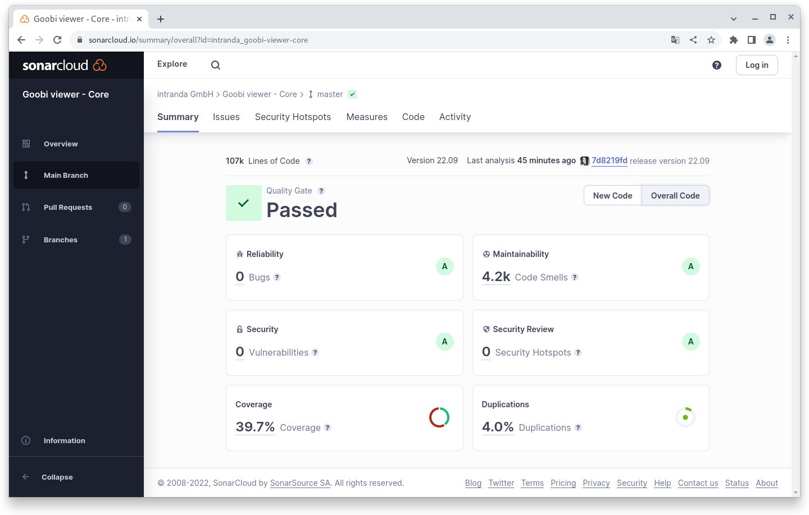
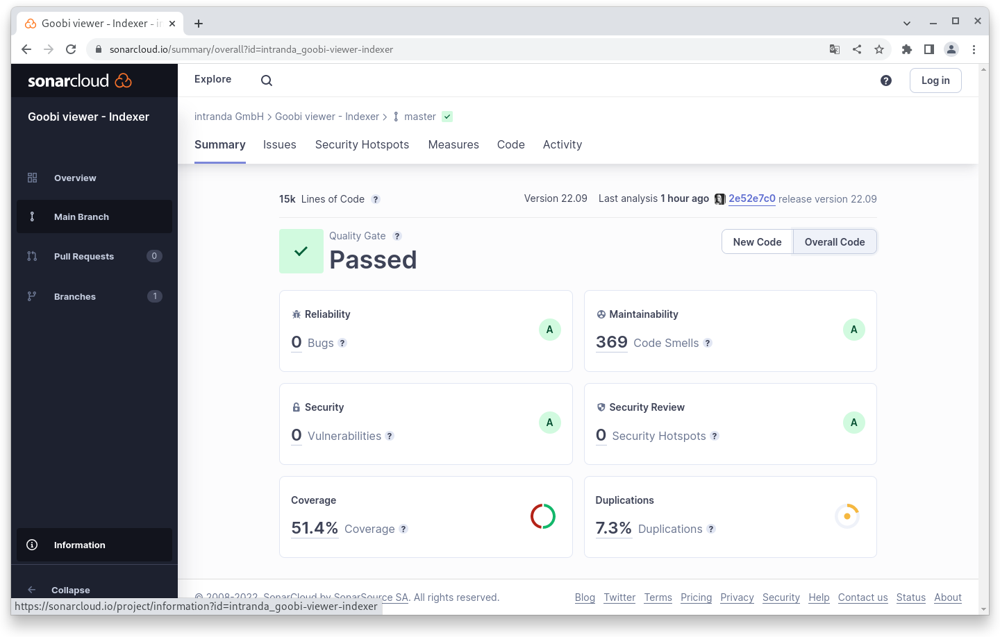
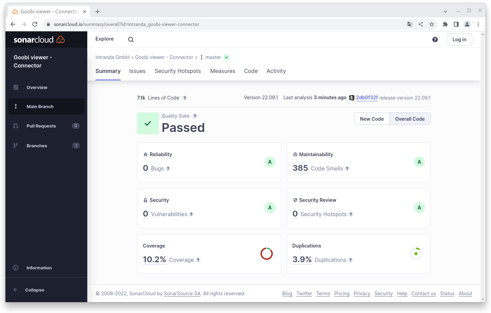

# September

## Coming soon :rocket:&#x20;

* **Revision** of the **CMS** area
* **Revision** of the **advanced search**

## Announcements

In September we worked a lot on the Coming Soon features. Unfortunately, these are not yet ready for the release, so that this month's digest - also due to the Goobi days - is less extensive.&#x20;

New, however, is the section "Code analysis", in which we provide information about the release.

## Developments

### Resolver&#x20;

The URN resolver can now search URNs for a record in more than one Solr field. For this purpose, any number of fields can now be specified in the configuration file.&#x20;

### Search&#x20;

In the source code, some preliminary work has been done to better predefine the field selection for the advanced search when calling via URLs.

### Libs&#x20;

Under the hood, we swapped the logging framework SLF4J for native Log4j2. Also, for database connectivity, EclipseLink was upgraded from version 2 to version 4, which was accompanied by a major code adjustment due to changed package names (javax -> jakarta).

### Goobi viewer Indexer&#x20;

The SMTP port for sending mail can now be configured individually in the Goobi viewer Indexer.&#x20;

## Code analysis

The following screenshots show the SonarCloud analysis of the current release. More information is available directly on the [project page](https://sonarcloud.io/organizations/intranda/projects).

<figure><figcaption><p>SonarCloud Analysis: Goobi viewer Core - for the Git Tag v22.09<br></p></figcaption></figure>

<figure><figcaption><p>SonarCloud Analysis: Goobi viewer Indexer - for the Git Tag v22.09<br></p></figcaption></figure>

<figure><figcaption><p>SonarCloud Analysis: Goobi viewer Connector - for the Git Tag v22.09.1</p></figcaption></figure>

## Version numbers&#x20;

The versions that must be entered in the `pom.xml` of the theme in order to get the functions described in this digest are:

```markup
<dependency>
    <groupId>io.goobi.viewer</groupId>
    <artifactId>viewer-core</artifactId>
    <version>22.09</version>
</dependency>
<dependency>
    <groupId>io.goobi.viewer</groupId>
    <artifactId>viewer-core-config</artifactId>
    <version>22.09</version>
</dependency>
<dependency>
    <groupId>io.goobi.viewer</groupId>
    <artifactId>viewer-connector</artifactId>
    <version>22.09</version>
</dependency>
```

The **Goobi viewer Indexer** has the version number **22.09**

The **Goobi viewer Crowdsourcing Module** has the version number **22.09**
