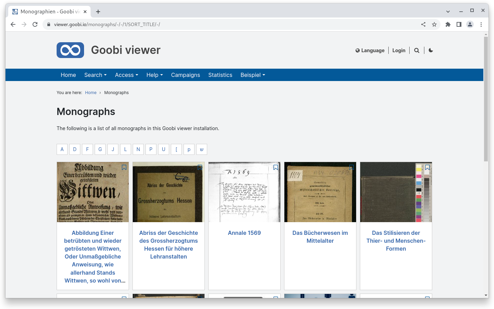
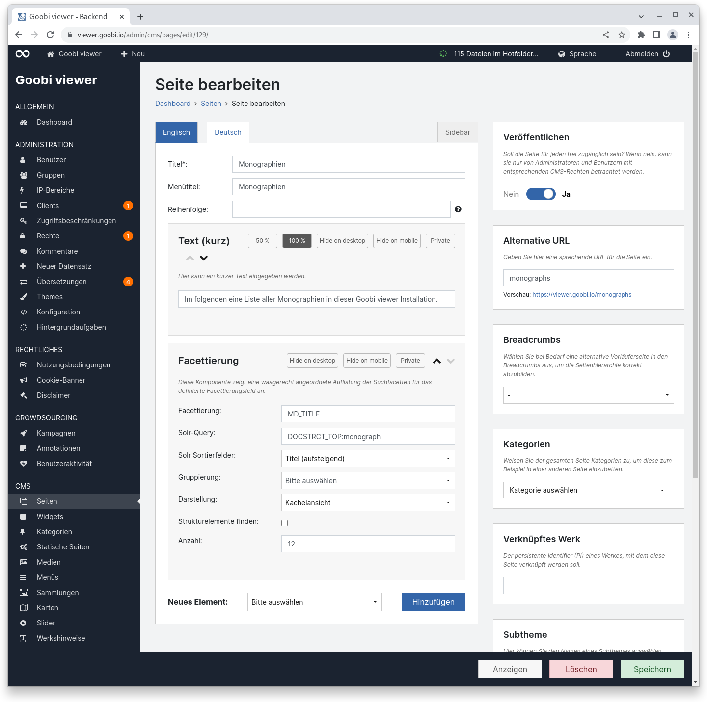
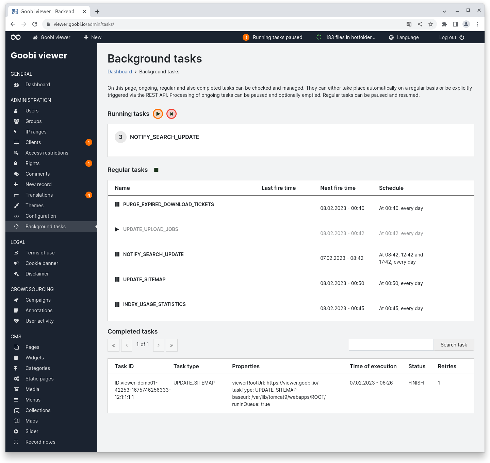
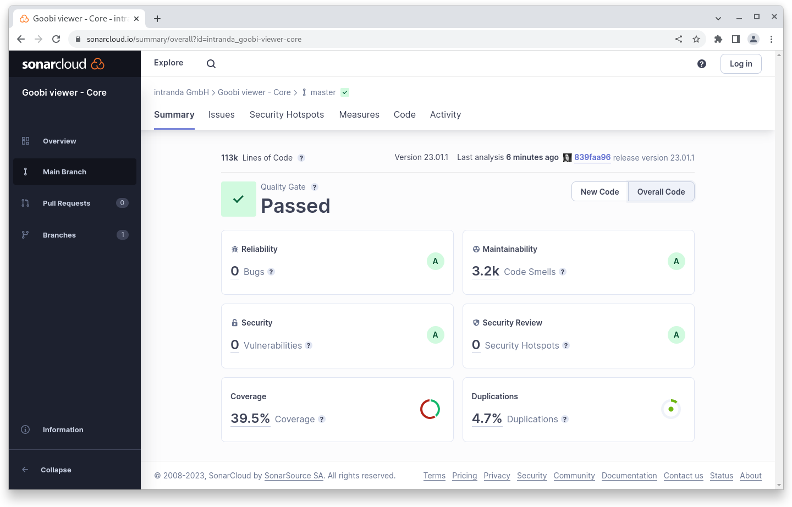
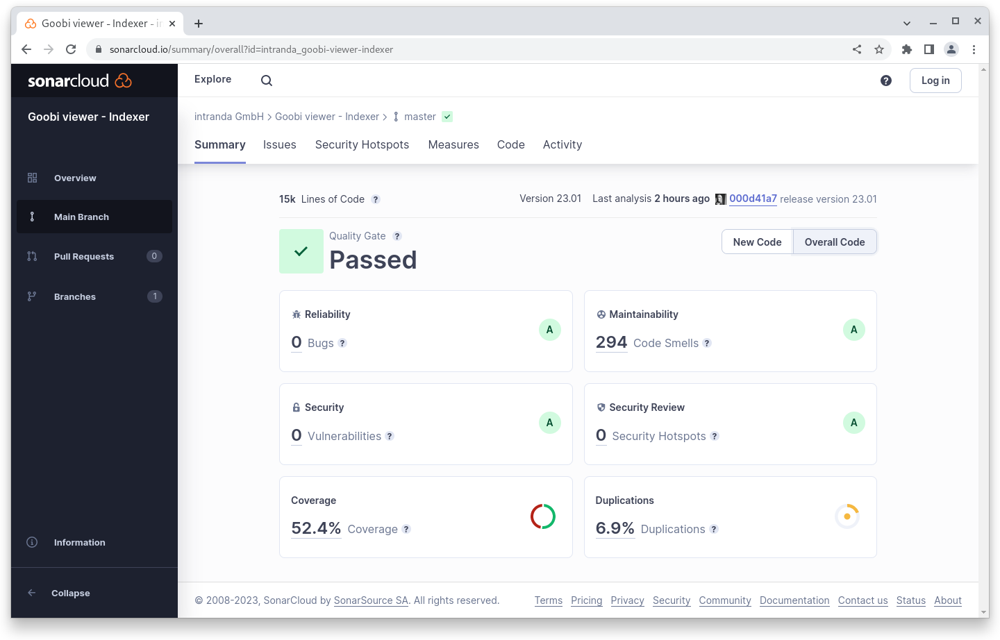

# January

## Coming soon :rocket:&#x20;

* **Compact** and high-resolution **PDF files**

## Developments

### Faceting

The new element "faceting" has been developed for CMS pages. It is a mixture of a search results list and the restriction by letter as it is known from browsing. While a classic browse page displays a list of terms in text form, the element can also be used to display images. Here is an example where monographs are listed and faceted by initial letter:&#x20;

<figure><figcaption><p>Sample frontend CMS page for faceting by letter</p></figcaption></figure>

<figure><figcaption><p>Example configuration for CMS page with element faceting (German)</p></figcaption></figure>

### Background tasks

Under the hood, a lot has happened in the month of January in terms of infrastructure. Two features known in Goobi workflow have also been integrated into Goobi viewer:&#x20;

* a queue (based on ActiveMQ)&#x20;
* regular tasks (based on Quartz)&#x20;

This functionality replaces the "tasks" previously realised purely via the REST interface and cronjobs. For this purpose, a new page "Background Tasks" was created in the backend. It is divided into three areas:&#x20;

* Running tasks&#x20;
* Regular tasks&#x20;
* Completed tasks

&#x20;In the case of running tasks, the current content of the queue is displayed. The execution can be paused and continued. As a rule, the processing of running tasks is very fast, so that it is rare to find entries here in an environment that is not paused. If there are running tasks, a box is available for each task type that shows how many tasks exist. The box can optionally be opened and individual tickets can be deleted from the queue.&#x20;

For regular tasks, there is a list of things that can be executed regularly according to a schedule. All regular tasks can be paused together, but also only individual tasks can be paused. It is also possible to execute a regular task once. The action is displayed as usual onHover above the respective line.&#x20;

The completed tasks are a logbook that shows what was done when, whether the task was successful, how many attempts were needed and whether the task was completed successfully or only with an error. Entries older than 90 days are automatically deleted. If running or regular tasks are completely paused, this is visualised by an indicator in the top bar.

With the background tasks, a system break is removed and the Goobi view becomes more self-sufficient, as it implements functionality itself and is no longer dependent on external services. The queue provides an infrastructure that can be used to reliably schedule and process tasks across application restarts. It is already prepared for clustering tasks across different servers if this becomes necessary. Via the page in the backend, it is possible to pause tasks for maintenance work or to check whether all tasks are regularly executed without errors.

<figure><figcaption><p>Backend page for background tasks with paused running tasks</p></figcaption></figure>

## Snippets

* The documentation for setting up the development environment has been extended by a few points&#x20;
* The Goobi viewer Indexer has received some improvements for indexing documents with the LIDO 1.1 standard&#x20;
* In the Goobi viewer Connector there have been changes to the SRU interface and the general maintainability of the code as well as the test coverage

## Code analysis

The following screenshots show the SonarCloud analysis of the current release. More information is available directly on the [project page](https://sonarcloud.io/organizations/intranda/projects).

<figure><figcaption><p>SonarCloud Analysis: Goobi viewer Core - for the Git Tag v23.01.1</p></figcaption></figure>

<figure><figcaption><p>SonarCloud Analysis: Goobi viewer Indexer - for the Git Tag v23.01</p></figcaption></figure>

<figure><figcaption><p>SonarCloud Analysis: Goobi viewer Connector - for the Git Tag v23.01.1</p></figcaption></figure>

## Version numbers&#x20;

The versions that must be entered in the `pom.xml` of the theme in order to get the functions described in this digest are:

```markup
<dependency>
    <groupId>io.goobi.viewer</groupId>
    <artifactId>viewer-core</artifactId>
    <version>23.01.1</version>
</dependency>
<dependency>
    <groupId>io.goobi.viewer</groupId>
    <artifactId>viewer-core-config</artifactId>
    <version>23.01</version>
</dependency>
<dependency>
    <groupId>io.goobi.viewer</groupId>
    <artifactId>viewer-connector</artifactId>
    <version>23.01.1</version>
</dependency>
```

The **Goobi viewer Indexer** has the version number **23.01**

The **Goobi viewer Crowdsourcing Module** has the version number **23.01**
