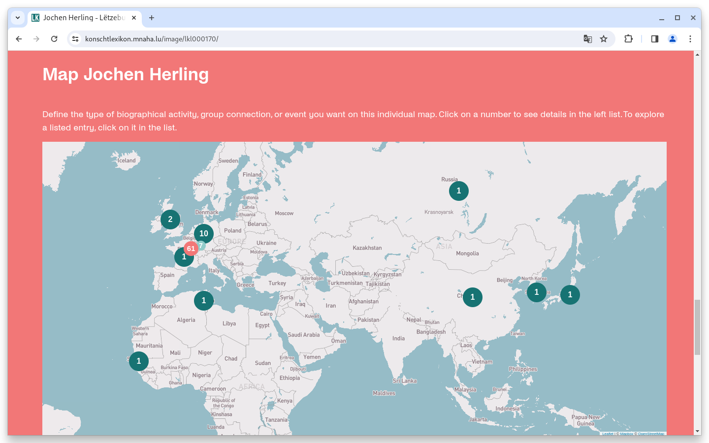

# October

## Coming soon :rocket:&#x20;

* **Search engine optimisation**
* **Live preparation** of data sets

## Announcements


On **January 1, 2024**, we plan to make **Java 17** mandatory for new installations and updates. An update to the current **Solr 9** version is also planned. If a system does not yet meet the basic requirements, this must be done after this date at the latest with a Goobi viewer update. Both requirements are fulfilled with a current Ubuntu Linux.


## Developments

### Maps

The maps in the Goobi viewer backend now have feature sets. This allows different marker types to be set on a map. These can be manually set locations, but a combination of several different automatically generated Solr hit sets can also be displayed accordingly.&#x20;

This functionality was developed for the Lëtzebuerger Konschtlexikon. Here, different types of places can be visualized on a map in different colors. Here is an example:

<figure><figcaption><p>Map with different feature sets</p></figcaption></figure>

The map can be viewed and tried out in a Goobi viewer on the following page:

* [https://www.konschtlexikon.mnaha.lu/image/lkl000170/](https://www.konschtlexikon.mnaha.lu/image/lkl000170/)

To improve the performance of maps, a background task has also been implemented that automatically pre-generates and caches the maps.

### Goobi viewer Indexer

The Goobi viewer Indexer now also supports the indexing of metadata from a METS/MARC section. No further settings are necessary for this, it is sufficient to define the corresponding XPATH expressions for the fields in `config_indexer.xml`.

### Snippets

* The client has been updated to close a Chromium WebP vulnerability.

## Code analysis

The following screenshots show the SonarCloud analysis of the current release. More information is available directly on the [project page](https://sonarcloud.io/organizations/intranda/projects).

<figure><figcaption><p>SonarCloud Analysis: Goobi viewer Core - for the Git Tag v23.10</p></figcaption></figure>

<figure><figcaption><p>SonarCloud Analysis: Goobi viewer Indexer - for the Git Tag v23.10</p></figcaption></figure>

<figure><figcaption><p>SonarCloud Analysis: Goobi viewer Connectoe - for the Git Tag v23.10</p></figcaption></figure>

## Version numbers&#x20;

The versions that must be entered in the `pom.xml` of the theme in order to get the functions described in this digest are:

```markup
<dependency>
    <groupId>io.goobi.viewer</groupId>
    <artifactId>viewer-core</artifactId>
    <version>23.10.9</version>
</dependency>
<dependency>
    <groupId>io.goobi.viewer</groupId>
    <artifactId>viewer-core-config</artifactId>
    <version>23.10.2</version>
</dependency>
<dependency>
    <groupId>io.goobi.viewer</groupId>
    <artifactId>viewer-connector</artifactId>
    <version>23.10</version>
</dependency>
```

The **Goobi viewer Indexer** has the version number **23.10.1**\
The **Goobi viewer Crowdsourcing Module** has the version number **23.10**
