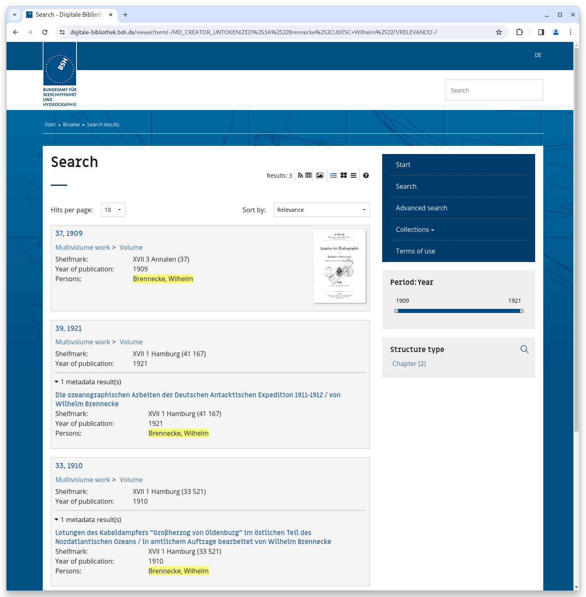

# November

## Coming soon :rocket:&#x20;

* **Search engine optimisation**
* **Live preparation** of data sets

## Announcements


On **January 1, 2024**, we plan to make **Java 17** mandatory for new installations and updates. An update to the current **Solr 9** version is also planned. If a system does not yet meet the basic requirements, this must be done after this date at the latest with a Goobi viewer update. Both requirements are fulfilled with a current Ubuntu Linux.


## Developments

### Search

In the simple search, the drop-down for the various search filters (search in all data, metadata, full texts, ... ) is hidden if only a single option exists.

### Faceting

The Goobi viewer supports the search in possible values of a facet. For this purpose, a small magnifying glass is displayed in the title of the widget. This feature does not make sense for facets with only a few values or in some other setups. For this reason, an additional switch in the configuration file can now be used to control for each facet whether the search should be available or not.

### Browse

Within the browse functionality, sub-elements of records are now also displayed if they contain the selected field:value pair. Previously, only the main record was found.

It becomes clearer with an example from practice: If there are different articles with different authors within a journal volume, then all authors are listed in the browse functionality, including those of the journal articles. If you then click on an author, the volume is displayed. Now the volume is displayed, as well as the sub-hit with the corresponding journal article and the highlighted name responsible for the result.

<figure><figcaption>
Browse now also opens sub-hits with the requested field:Value pair
</figcaption></figure>

### Goobi viewer Indexer

The Goobi viewer Indexer has received various minor improvements. For example, the recognition of volumes has been made more precise if a `<mods:relatedItem type="host" />` describes something else. Furthermore, the deletion of orphaned information from Solr has been improved if, for example, a volume was incorrectly exported with the identifier of the anchor and this was subsequently corrected.

Finally, the query of an external catalog for indexing additional metadata has been extended so that an OAI interface can also be queried. The functionality was added in February 2021 and described in the [digest at the time](https://docs.goobi.io/goobi-viewer-digests-en/2021/2#goobi-viewer-indexer).


There was no dedicated Goobi viewer release in November.

