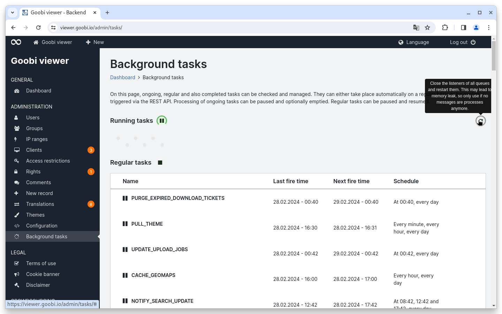
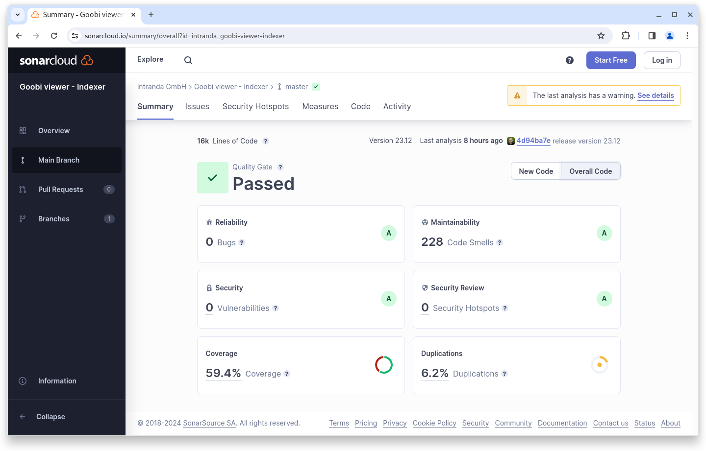
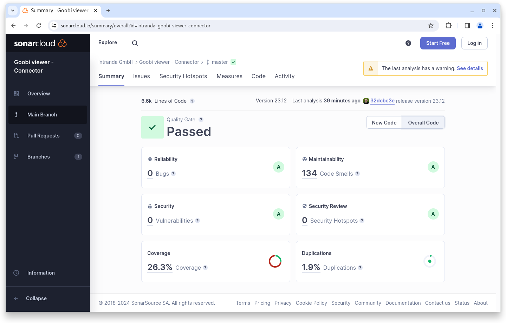

# Dezember

## Coming soon :rocket:&#x20;

* **Java 17** and **Solr 9**
* **IIIF manifests** with only one image
* **New widgets** for download, metadata, links and citation
* **Live preparation** of data sets

## Announcements


On **January 1, 2024**, we plan to make **Java 17** mandatory for new installations and updates. An update to the current **Solr 9** version is also planned. If a system does not yet meet the basic requirements, this must be done after this date at the latest with a Goobi viewer update. Both requirements are fulfilled with a current Ubuntu Linux.


## Developments

### Search engine optimization

After a long time, something has happened again in this context. We have extended the tagging of alternative links to the content in order to be able to identify more precisely for search engines what the primary URL is and what alternative URLs to the same content are.

### Faceting

The slider in the year search can now optionally be set to a start and end time. This allows outliers in the facet to be deliberately excluded if the records are not easy to correct.

### CMS

The actions on the page for editing a CMS page have been expanded to include a cancel option that links to the overview page.

### Background tasks

Sometimes the queue gets stuck and a restart is necessary. We have integrated a new button into the page for this purpose.

<figure><figcaption><p>Button to restart the queue</p></figcaption></figure>

### Hardening

To further increase security, in this release we have introduced a restriction and check on the image types used for the user avatars as well as a size restriction for the uploaded files.

## Code analysis

The following screenshots show the SonarCloud analysis of the current release. More information is available directly on the [project page](https://sonarcloud.io/organizations/intranda/projects).

<figure><figcaption><p>SonarCloud Analysis: Goobi viewer Core - for the Git Tag v23.12.1</p></figcaption></figure>

<figure><figcaption><p>SonarCloud Analysis: Goobi viewer Indexer - for the Git Tag v23.12</p></figcaption></figure>

<figure><figcaption><p>SonarCloud Analysis: Goobi viewer Connector - for the Git Tag v23.12</p></figcaption></figure>

## Version numbers&#x20;

The versions that must be entered in the `pom.xml` of the theme in order to get the functions described in this digest are:

```markup
<dependency>
    <groupId>io.goobi.viewer</groupId>
    <artifactId>viewer-core</artifactId>
    <version>23.12.2</version>
</dependency>
<dependency>
    <groupId>io.goobi.viewer</groupId>
    <artifactId>viewer-core-config</artifactId>
    <version>23.12</version>
</dependency>
<dependency>
    <groupId>io.goobi.viewer</groupId>
    <artifactId>viewer-connector</artifactId>
    <version>23.12</version>
</dependency>
```

The **Goobi viewer Indexer** has the version number **23.12**\
The **Goobi viewer Crowdsourcing Module** has the version number **23.12**
