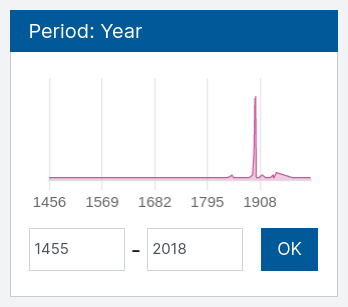
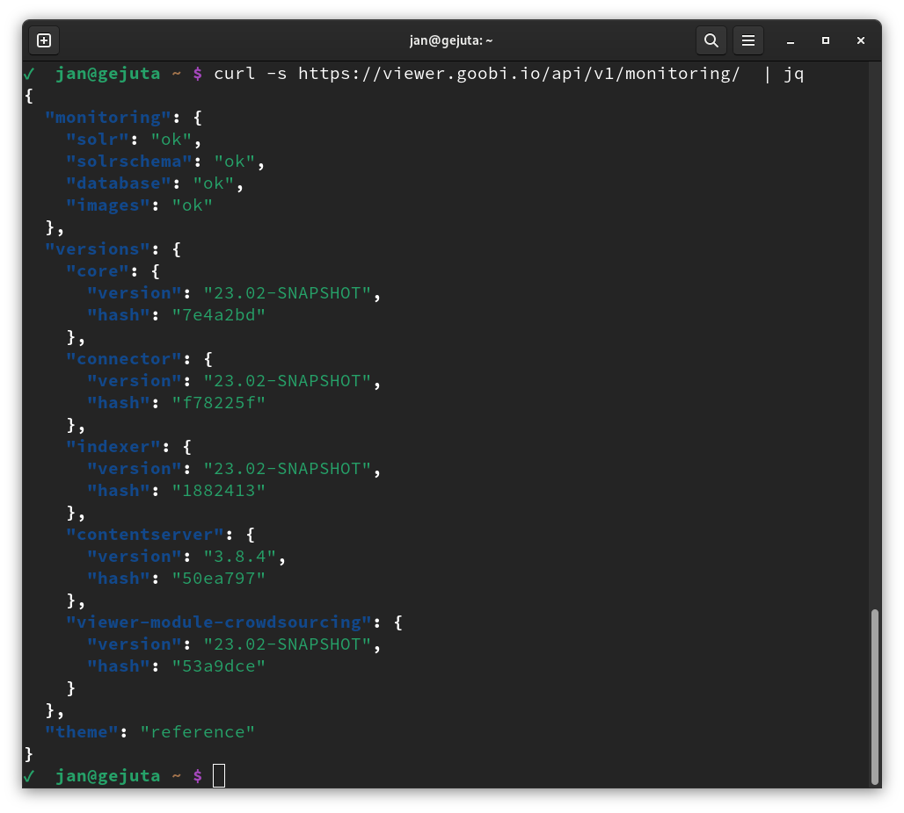
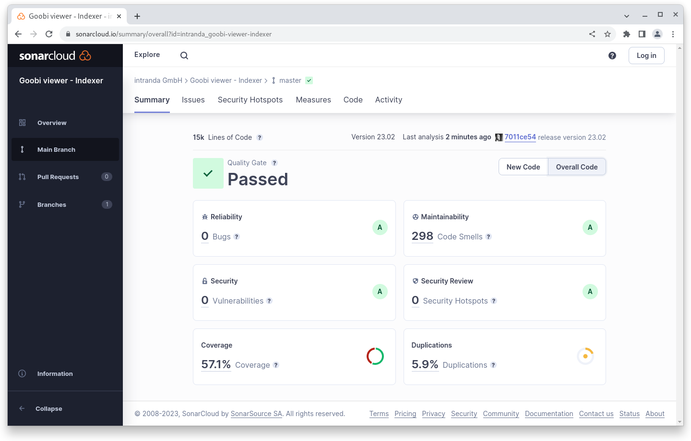
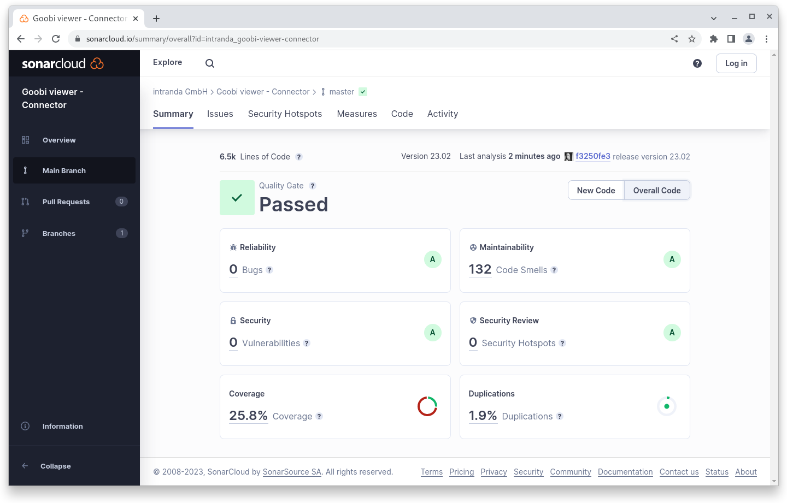

# February

## Coming soon :rocket:&#x20;

* **Compact** and high-resolution **PDF files**

## Announcements

In February we worked a lot on projects and less on the Core itself. That's why this month's digest is shorter than usual.

## Developments

### Faceting&#x20;

In faceting, it is now possible to display more than one facet with a slider. For example, values such as "date of birth" and "date of death" can both be configured.&#x20;

In addition, it is possible to optionally display the slider as a graph. This visually highlights directly within the facet how many results are to be expected.

<figure><figcaption><p>Facet displayed as a graph</p></figcaption></figure>

### REST

The REST endpoint for monitoring has been revised and now contains additional status information that simplifies diagnosis in the event of an error.

<figure><figcaption><p>Extended information in Monitoring REST Endpoint</p></figcaption></figure>

## Code analysis

The following screenshots show the SonarCloud analysis of the current release. More information is available directly on the [project page](https://sonarcloud.io/organizations/intranda/projects).

<figure><figcaption><p>SonarCloud Analysis: Goobi viewer Core - for the Git Tag v23.02</p></figcaption></figure>

<figure><figcaption><p>SonarCloud Analysis: Goobi viewer Indexer - for the Git Tag v23.02</p></figcaption></figure>

<figure><figcaption><p>SonarCloud Analysis: Goobi viewer Connector - for the Git Tag v23.02</p></figcaption></figure>

## Version numbers&#x20;

The versions that must be entered in the `pom.xml` of the theme in order to get the functions described in this digest are:

```markup
<dependency>
    <groupId>io.goobi.viewer</groupId>
    <artifactId>viewer-core</artifactId>
    <version>23.02</version>
</dependency>
<dependency>
    <groupId>io.goobi.viewer</groupId>
    <artifactId>viewer-core-config</artifactId>
    <version>23.02</version>
</dependency>
<dependency>
    <groupId>io.goobi.viewer</groupId>
    <artifactId>viewer-connector</artifactId>
    <version>23.02</version>
</dependency>
```

The **Goobi viewer Indexer** has the version number **23.02**

The **Goobi viewer Crowdsourcing Module** has the version number **23.02**
