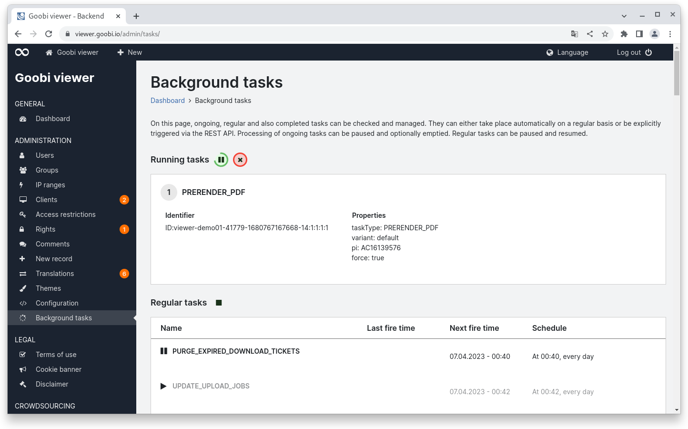
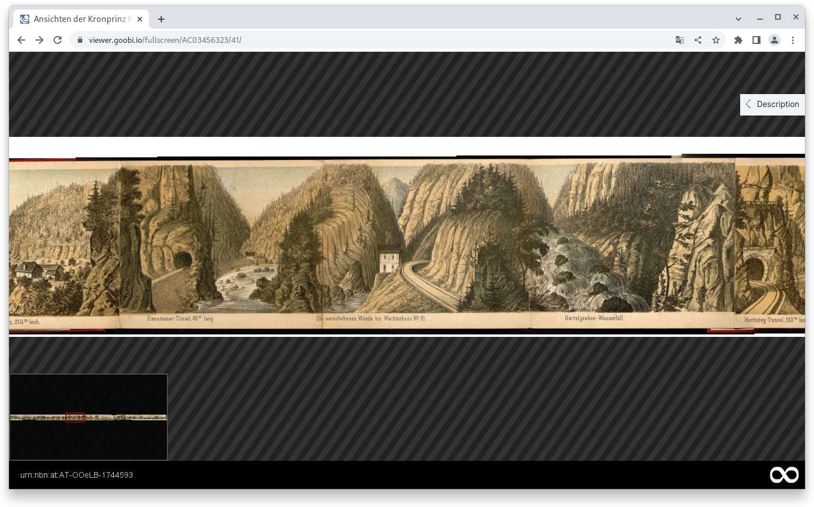
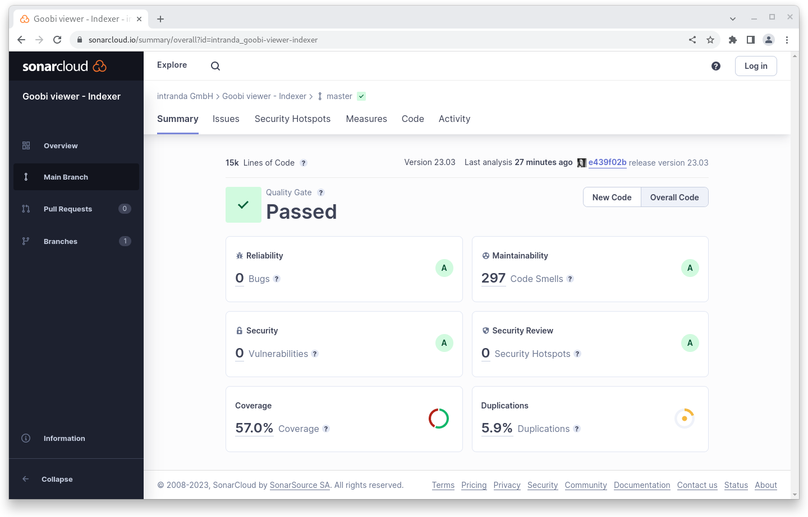
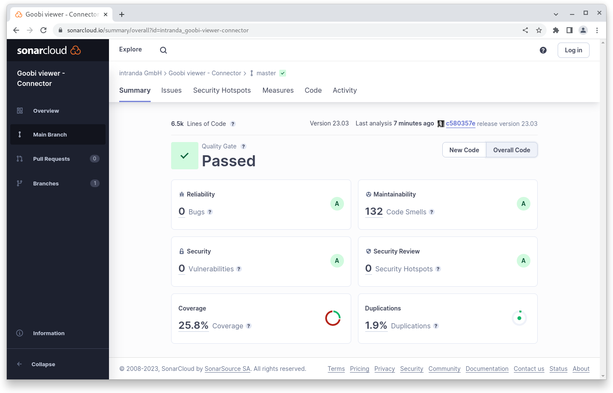

# March

## Coming soon :rocket:&#x20;

* **Highlights**
* **Search results groups**

## Anouncement


We are hiring and looking for **Web designers (m/f/d)** and **Java developers (m/f/d)** to support our team.


## Developments

### PDF generation

In January, we integrated the background queuing tasks into Goobi viewer. With the March release this functionality is used to optionally automatically generate PDF files and keep them in the file system.&#x20;

The PDF generation of the Goobi viewer works in such a way that based on available images and optional METS file and OCR results a PDF file is generated on-the-fly. Since we can never know in advance whether and if so which page of a record, which structural element or which complete record will be requested for download and when, this approach can minimize memory consumption. On-the-fly generation can be outsourced to the intranda TaskManager for clustering and e-mail notification. Once generated, PDF files are cached in a cache. This is usually 30GB in size. When it is full, the oldest files are deleted. This means that frequently requested files remain in the cache and can be delivered more quickly.&#x20;

In addition to on-the-fly generation, Goobi viewer also supports the concatenation of already existing PDF files. Sometimes PDF files for individual pages already come from an OCR. If these are available in Goobi viewer, only the existing files are concatenated. This is much faster than on-the-fly generation.&#x20;

PDF generation is handled by the ContentServer. This was extended last month to provide different configuration variants for the generation. One variant can scale the PDF files down and compress them more, while another variant delivers the original size.&#x20;

Whether PDF files should be generated automatically and stored in the file system is controlled by the Goobi viewer Indexer. The configuration file has been extended to enable or disable this functionality. If active, generation is always triggered if images were also in the file system during indexing. This way, all new works as well as those with a modified image stack are automatically captured. In addition there is the possibility to force the generation, so that with the first start-up a re-indexing of the METS files is sufficient to trigger the generation for all existing data sets. The configuration variant to be used in the ContentServer can be specified via a further switch.&#x20;

The generation is then processed via the background tasks. For this purpose, a second queue has been introduced that runs parallel to the previous one. This way, PDF generation can run over several days and does not interfere with other tasks such as generating a new site map or notification of new search hits. I

f pre-generated PDF files are available, the "Cite and repurpose" widget automatically offers to download PDF documents compressed or in original size.

<figure><figcaption><p>PDF files are pre-generated for a record as a background task</p></figcaption></figure>

<figure><figcaption><p>If pre-generated PDF files are available, they are offered in the "Cite and repurpose" widget.</p></figcaption></figure>

### Image navigation

&#x20;In full screen mode, navigation in the image can now be optionally activated. A new configuration button is available for this purpose. When active, the image is displayed as a thumbnail in the lower left corner, including a box that visualizes the currently selected section. This can be useful especially for larger maps.

<figure><figcaption><p>Full screen mode with active navigator at the bottom left</p></figcaption></figure>

### Security

In March we were informed about a cross-site scripting vulnerability in the Goobi viewer. The behavior was quickly confirmed. However, after a thorough review of the situation, we consider the risk of active exploitation as well as the potential damage to be not critical.

In the course of the review, we analyzed and addressed potential issues at various points. This mainly concerns:&#x20;

* Possibility of cross-site scripting via URL parameters or input forms.&#x20;
* Checking potential possibilities of solr injection&#x20;
* Hardening in the context upload that could possibly lead to a Denial of Service

For each of the cross-site scripting vulnerabilities, we have created a Security Advisory on Github that has been assigned the CVE IDs [CVE-2023-29014](https://github.com/intranda/goobi-viewer-core/security/advisories/GHSA-7v7g-9vx6-vcg2), [CVE-2023-29015](https://github.com/intranda/goobi-viewer-core/security/advisories/GHSA-622w-995c-3c3h), and [CVE-2023-29016](https://github.com/intranda/goobi-viewer-core/security/advisories/GHSA-2r9r-8fcg-m38g).

### Faceting&#x20;

Multiple facets from the same field were previously ORed. This caused confusion in operation so we have now changed the logic to AND by default. If you still want to use OR, you can specify this explicitly in the configuration file for the field within the facets.

## Code analysis

The following screenshots show the SonarCloud analysis of the current release. More information is available directly on the [project page](https://sonarcloud.io/organizations/intranda/projects).

<figure><figcaption><p>SonarCloud Analysis: Goobi viewer Core - for the Git Tag v23.03</p></figcaption></figure>

<figure><figcaption><p>SonarCloud Analysis: Goobi viewer Indexer - for the Git Tag v23.03</p></figcaption></figure>

<figure><figcaption><p>SonarCloud Analysis: Goobi viewer Connector - for the Git Tag v23.03</p></figcaption></figure>

## Version numbers&#x20;

The versions that must be entered in the `pom.xml` of the theme in order to get the functions described in this digest are:

```markup
<dependency>
    <groupId>io.goobi.viewer</groupId>
    <artifactId>viewer-core</artifactId>
    <version>23.03</version>
</dependency>
<dependency>
    <groupId>io.goobi.viewer</groupId>
    <artifactId>viewer-core-config</artifactId>
    <version>23.03.1</version>
</dependency>
<dependency>
    <groupId>io.goobi.viewer</groupId>
    <artifactId>viewer-connector</artifactId>
    <version>23.03</version>
</dependency>
```

The **Goobi viewer Indexer** has the version number **23.03.1**

The **Goobi viewer Crowdsourcing Module** has the version number **23.03**
