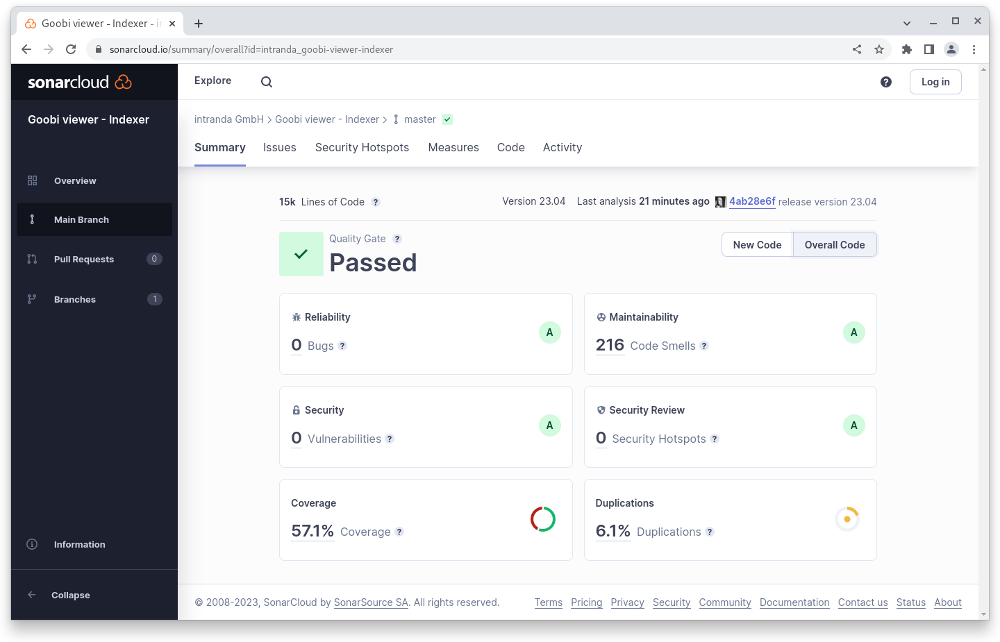

# April

## Coming soon :rocket:&#x20;

* **Highlights**
* **Search results groups**

## Anouncement


We are hiring and looking for **Web designers (m/f/d)** and **Java developers (m/f/d)** to support our team.


In the background we are fully occupied in various projects. Feature developments that could be mentioned here are not yet completed and will be included into the upcoming releases after completion in the project context.

## Developments

### RIS Export

Search results can now be exported in RIS format. The functionality can be used analog to the Excel export.

### Docker Images

The Docker Inc. company first announced the discontinuation of free offerings under the "Docker Free Team" model in recent months and asked users to switch to a paid subscription model. Later, this announcement was withdrawn. We still decided to switch from the Docker Hub Container Image Library to the Github Container Registry.

### Snippets

* In core, the URL to the METS file for the DFG viewer is now configurable. This is needed, for example, if they are in a separate folder.
* In the Core, support for Chinese characters in the search has been improved.
* The Connector now automatically delivers XML responses in the correct content type
* The indexer has undergone several improvements, including better error handling for mixed permissions in the file system

## Code analysis

The following screenshots show the SonarCloud analysis of the current release. More information is available directly on the [project page](https://sonarcloud.io/organizations/intranda/projects).

<figure><figcaption><p>SonarCloud Analysis: Goobi viewer Core - for the Git Tag v23.04</p></figcaption></figure>

<figure><figcaption><p>SonarCloud Analysis: Goobi viewer Indexer - for the Git Tag v23.04</p></figcaption></figure>

<figure><figcaption><p>SonarCloud Analysis: Goobi viewer Connector - for the Git Tag v23.04</p></figcaption></figure>

## Version numbers&#x20;

The versions that must be entered in the `pom.xml` of the theme in order to get the functions described in this digest are:

```markup
<dependency>
    <groupId>io.goobi.viewer</groupId>
    <artifactId>viewer-core</artifactId>
    <version>23.04</version>
</dependency>
<dependency>
    <groupId>io.goobi.viewer</groupId>
    <artifactId>viewer-core-config</artifactId>
    <version>23.04</version>
</dependency>
<dependency>
    <groupId>io.goobi.viewer</groupId>
    <artifactId>viewer-connector</artifactId>
    <version>23.04</version>
</dependency>
```

The **Goobi viewer Indexer** has the version number **23.04**

The **Goobi viewer Crowdsourcing Module** has the version number **23.04**
