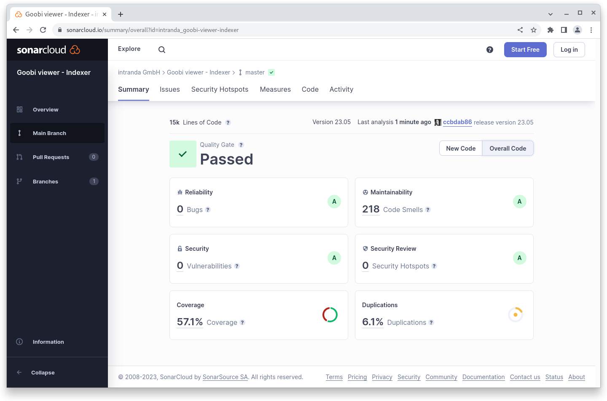

# May

## Coming soon :rocket:&#x20;

* **Highlights**
* **Search results groups**

## Developments

### Search results&#x20;

There have been several small developments for the display of search results. For example, **search results** can now optionally be **numbered**.&#x20;

In addition, the length of **metadata in the search results list** can be **limited** automatically. If, for example, a complete abstract is available as a metadata for an e-publication, the display of a search hit can become very long. With the new feature, only the relevant snippet can be displayed with a configurable number of characters before and after it.&#x20;

If there are **multiple entries for a metadata**, each entry is displayed in a new line. If more than one person has worked on an e-publication, this can also make the search result very long. A new feature is the possibility to **change the separator** from a line break to something separate, for example a semicolon.

<figure><figcaption><p>Optional numbering of search results</p></figcaption></figure>

Finally, there is a small innovation in the static, hidden sorting of search results, because these hidden sort fields can now also be sorted the other way around with a preceding exclamation mark.&#x20;

Application scenario for this case was that in a list of search results always all records with images should be displayed on top and then those without images. For this a BOOL\_ field is available in the index in which depending upon presence of pictures the value `true` or `false` stands. However, since the letter f comes before t, all records without images were always displayed first. Now it works as desired :wink:

### REST API&#x20;

The monitoring endpoint now also lists whether the ActiveMQ queue is running.

<figure><figcaption><p>JSON output of the monitoring endpoint from Goobi viewer Core</p></figcaption></figure>

## Code analysis

The following screenshots show the SonarCloud analysis of the current release. More information is available directly on the [project page](https://sonarcloud.io/organizations/intranda/projects).

<figure><figcaption><p>SonarCloud Analysis: Goobi viewer Core - for the Git Tag v23.05</p></figcaption></figure>

<figure><figcaption><p>SonarCloud Analysis: Goobi viewer Indexer - for the Git Tag v23.05</p></figcaption></figure>

<figure><figcaption><p>SonarCloud Analysis: Goobi viewer Connector - for the Git Tag v23.05</p></figcaption></figure>

## Version numbers&#x20;

The versions that must be entered in the `pom.xml` of the theme in order to get the functions described in this digest are:

```markup
<dependency>
    <groupId>io.goobi.viewer</groupId>
    <artifactId>viewer-core</artifactId>
    <version>23.05</version>
</dependency>
<dependency>
    <groupId>io.goobi.viewer</groupId>
    <artifactId>viewer-core-config</artifactId>
    <version>23.05</version>
</dependency>
<dependency>
    <groupId>io.goobi.viewer</groupId>
    <artifactId>viewer-connector</artifactId>
    <version>23.05</version>
</dependency>
```

The **Goobi viewer Indexer** has the version number **23.05**

The **Goobi viewer Crowdsourcing Module** has the version number **23.05**
