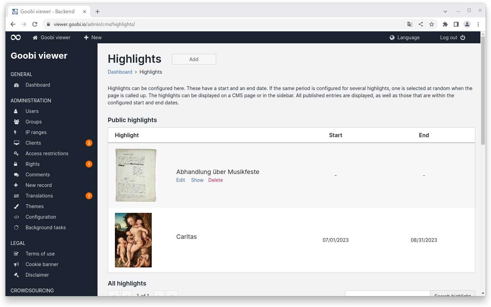
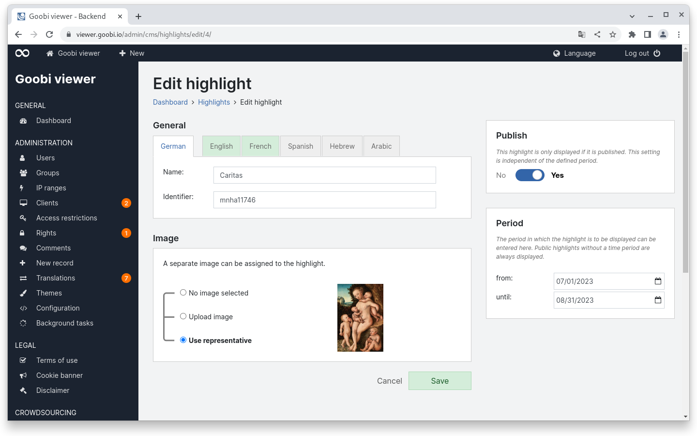
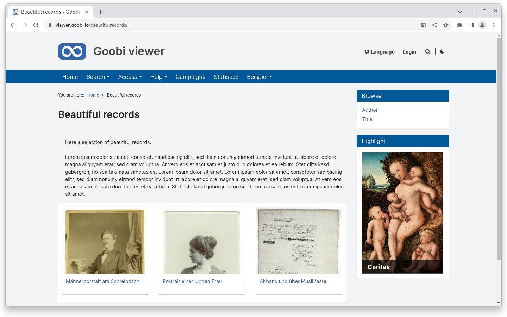

# June

## Coming soon :rocket:&#x20;

* **Search results groups**
* **external download links** for records

## Developments

### Highlights

Whether as "object of the month", "treasures from the inventory" or simply highlights: In the backend, data records or alternatively URLs to (CMS) pages can now be defined as highlights.&#x20;

Highlights can be prepared and then published as needed. In addition, they can also be displayed automatically for a configured period of time, so that, for example, an object of the month can already be pre-configured for several months.&#x20;

The highlights can be embedded either as a widget in CMS pages or as an element on a CMS page.

<figure><figcaption><p>Highlights overview in the backend</p></figcaption></figure>

<figure><figcaption><p>Highlight configuration in the backend</p></figcaption></figure>

<figure><figcaption><p>Highlight in a sidebar widget in the frontend</p></figcaption></figure>

### Goobi viewer Indexer

The indexing of representatives is now further configurable. The previous logic was that if an image was explicitly marked as a representative in a data set, it was taken over. If no image was marked, there was an automatic fallback to the first image of the data set.

Within this logic there are now two innovations. Firstly, representatives can now be marked with `xlink:label="START_PAGE"` in addition to the already known `use="banner"` attribute. Secondly, the fallback to the first image can be switched off so that data sets with referenced images have no representative at all.

### Snippets

* **Core**: The configuration of the metadata lists has been simplified. The various XML elements such as `<searchHitMetadataList />` or `<sidebBarMetadataList />` became `<metadataList type="searchHit" />` or `<metadataList type="sideBar" />`. This makes it easier to add further lists of metadata in the future without extensive adjustments to the code.
* **Connector**: isShownBy has been added to the metadata output via OAI for Europeana.
* **Indexer**: Image dimensions can now also be read and indexed from the info.json of IIIF image manifests.

## Code analysis

The following screenshots show the SonarCloud analysis of the current release. More information is available directly on the [project page](https://sonarcloud.io/organizations/intranda/projects).

<figure><figcaption><p>SonarCloud Analysis: Goobi viewer Core - for the Git Tag v23.06</p></figcaption></figure>

<figure><figcaption><p>SonarCloud Analysis: Goobi viewer Indexer - for the Git Tag v23.06</p></figcaption></figure>

<figure><figcaption><p>SonarCloud Analysis: Goobi viewer Connector - for the Git Tag v23.06</p></figcaption></figure>

In SonarCloud, quality requirements, so-called quality gates, can be defined. The quality gates are applied once to the entire source code and once to the source code that has been modified in the last 30 days.

The quality gate that is now failing in the Goobi viewer Connector refers to the adapted source code in the last 30 days. There, a test coverage of 25% is required, but this is not achieved.

The quality gate for the entire source text is fulfilled.

## Version numbers&#x20;

The versions that must be entered in the `pom.xml` of the theme in order to get the functions described in this digest are:

```markup
<dependency>
    <groupId>io.goobi.viewer</groupId>
    <artifactId>viewer-core</artifactId>
    <version>23.06</version>
</dependency>
<dependency>
    <groupId>io.goobi.viewer</groupId>
    <artifactId>viewer-core-config</artifactId>
    <version>23.06</version>
</dependency>
<dependency>
    <groupId>io.goobi.viewer</groupId>
    <artifactId>viewer-connector</artifactId>
    <version>23.06</version>
</dependency>
```

The **Goobi viewer Indexer** has the version number **23.06**

The **Goobi viewer Crowdsourcing Module** has the version number **23.06**
