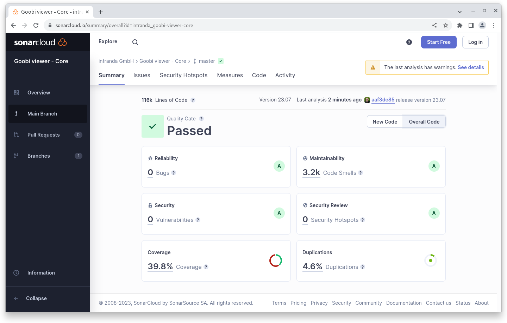

# July

## Coming soon :rocket:&#x20;

* **Search results groups**
* **Text** as main view for records

## Developments

### External download links

It sometimes happens that in METS files there is a `DOWNLOAD` file group, in which a URL to a PDF file or a dedicated download page for the record is referenced for portal solutions. The Goobi viewer Indexer and Goobi viewer Core now support this solution.

Here is an example of the file group:

<pre class="language-xml"><code class="lang-xml">&#x3C;mets:fileGrp USE="DOWNLOAD">
<strong>    &#x3C;mets:file ID="DOWNLOAD_file_0000" MIMETYPE="text/html">
</strong>        &#x3C;mets:FLocat LOCTYPE="URL" xlink:href="https://repository.example.org/download/identifier=12345"/>
<strong>    &#x3C;/mets:file>
</strong>&#x3C;/mets:fileGrp>
</code></pre>

If the indexer recognises the METS file group, it indexes the URL it contains into the `MD2_DOWNLOAD_URL` field. The Goobi viewer in turn recognises such a URL and then hides its own PDF generation functionality in the table of contents or in the "Cite and reuse" widget. Instead, a download badge is offered in the widget that refers to the indexed URL.

### Access restrictions

If a record is subject to multiple access restrictions, the texts of all restrictions are now displayed in the sidebar widget with the information on access restrictions and usage licence.

### Search

The default filter set for the search can now be set to an individual filter with a new `default="true"` attribute.

### Goobi viewer Indexer

Some file systems are not that fast. For this reason, the Goobi viewer Indexer now holds in memory a list of up to 500 files that are in the hotfolder and should be processed. This avoids a potentially time-consuming file system listing, which slowed down performance with slow storage systems and many files in the hotfolder.

In addition, as of this release it is possible to configure a second hotfolder that can be used for reindexing. The decisive factor is the sequence in `config_indexer.xml`. The data records from the standard hotfolder are given priority so that normal production with the associated fast export is not disturbed even during extensive reindexing with a large number of data records.

The Goobi view Indexer can split one value into several using the new placeholder `{SPLIT}`. In the following example, a regular expression is used to search for "international" and then the values LUX\_YES and LUX\_NO are written in the index:

```xml
<replace regex="^international$">LUX_YES{SPLIT}LUX_NO</replace>
```

## Code analysis

The following screenshots show the SonarCloud analysis of the current release. More information is available directly on the [project page](https://sonarcloud.io/organizations/intranda/projects).

<figure><figcaption><p>SonarCloud Analysis: Goobi viewer Core - for the Git Tag v23.07</p></figcaption></figure>

<figure><figcaption><p>SonarCloud Analysis: Goobi viewer Indexer - for the Git Tag v23.07</p></figcaption></figure>

<figure><figcaption><p>SonarCloud Analysis: Goobi viewer Connectorre - for the Git Tag v23.07</p></figcaption></figure>

## Version numbers&#x20;

The versions that must be entered in the `pom.xml` of the theme in order to get the functions described in this digest are:

```markup
<dependency>
    <groupId>io.goobi.viewer</groupId>
    <artifactId>viewer-core</artifactId>
    <version>23.07</version>
</dependency>
<dependency>
    <groupId>io.goobi.viewer</groupId>
    <artifactId>viewer-core-config</artifactId>
    <version>23.07.1</version>
</dependency>
<dependency>
    <groupId>io.goobi.viewer</groupId>
    <artifactId>viewer-connector</artifactId>
    <version>23.07</version>
</dependency>
```

The **Goobi viewer Indexer** has the version number **23.07.1**

The **Goobi viewer Crowdsourcing Module** has the version number **23.07**
