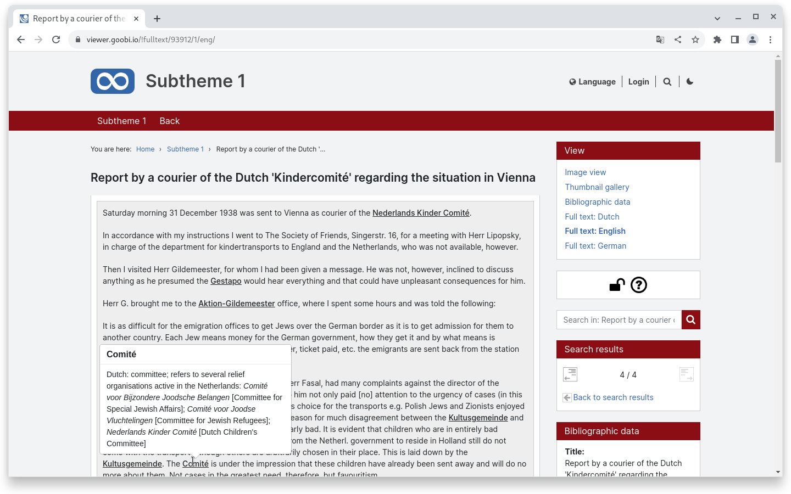
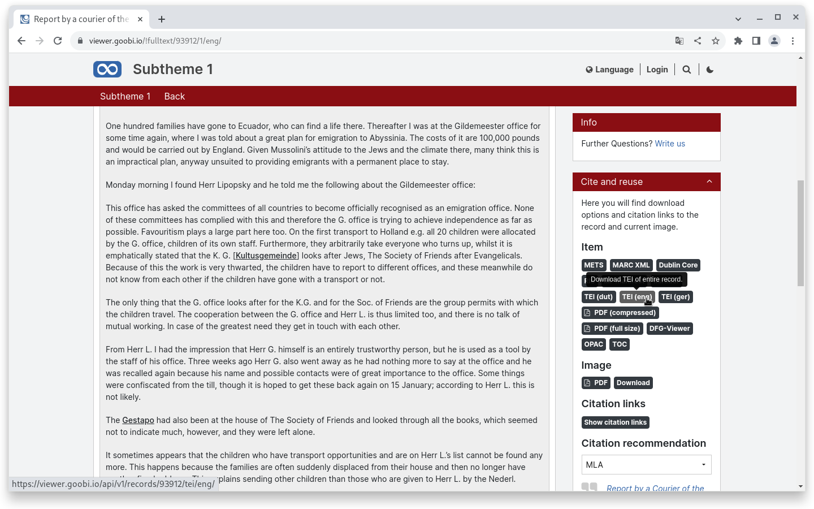
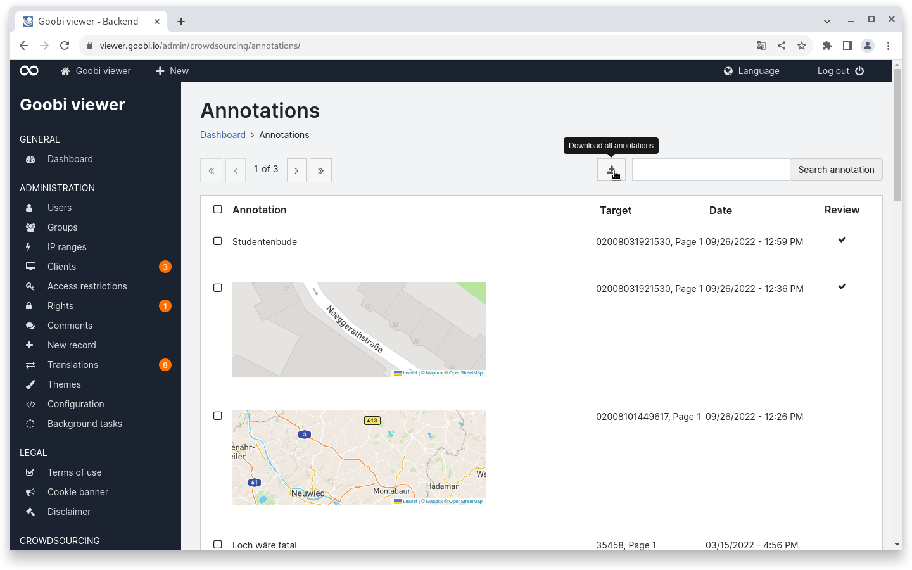

# August

## Coming soon :rocket:&#x20;

* **Text** as main view for records

## Developments

### TEI display

What was previously realised via a custom module is now integrated into the Goobi viewer core: A native TEI display. The use case covered here is that for a digitised work there is a TEI file with a transcription as well as further TEI files with translations. The files refer to the entire record and not just to a single page.

If these TEI files are available, they are included in the indexing process and several full-text links are then available in the front end of the Goobi viewer in the record view. The individual TEI files can be downloaded in the "Cite and reuse" widget.

<figure><figcaption>
Display for an English transcription with annotations in TEI format
</figcaption></figure>

<figure><figcaption>
For each language present, the TEI file can be downloaded in the "Cite and reuse" widget
</figcaption></figure>

### Annotations

Until now, only the selected annotations or all annotations of the current page could be downloaded from the "Annotations" page in the Goobi viewer backend. There was no cross-page download option for all annotations.

This was implemented in August and is now available as an additional download button above the table.

<figure><figcaption>
In the Goobi viewer backend, on the "Annotations" page, all entries can now also be downloaded as an Excel file
</figcaption></figure>

### Client

The print dialogue within the Goobi viewer Desktop Client can now be optionally activated. For this purpose, a new configuration option `allowPrint: true|false` is available in app.config.js. The default value is `false`.

Furthermore, PDF files can now be displayed natively in a separate window in the client.

### Metadata

If a date has been indexed, it can now be configured in the metadata configuration as `type="datefield"` and the date display can then be set to the desired format with the `pattern=""` attribute. attribute to set the date display to the desired format.


There was no dedicated Goobi viewer release in August.

