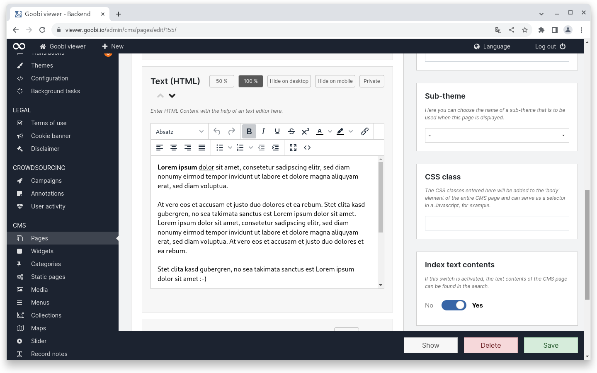
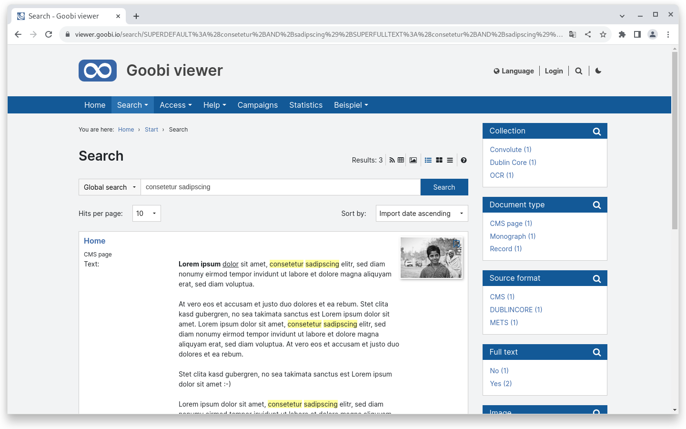
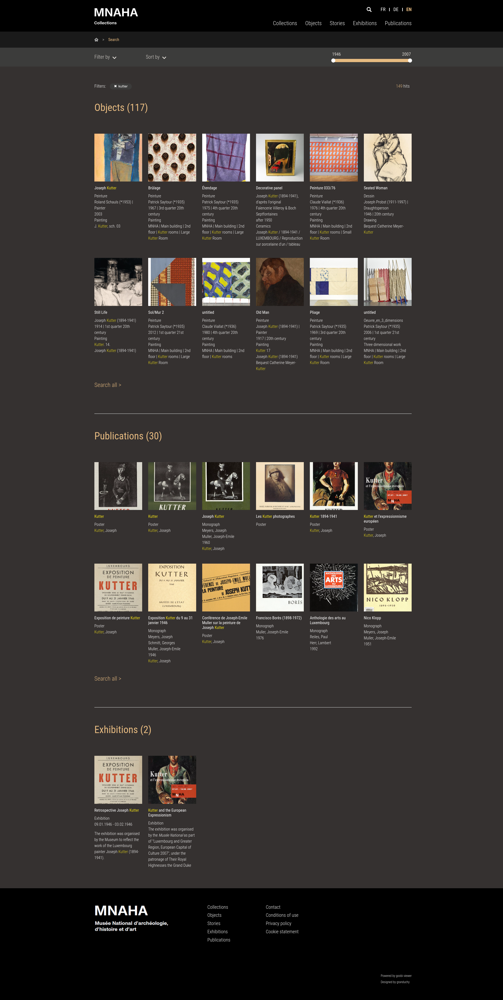

# September

## Coming soon :rocket:&#x20;

* **Maps**
* **Search engine optimisation**
* **Live preparation** of data sets

## Developments

### Search in CMS pages

The text content of CMS pages can optionally be indexed so that they can be found in a search. For this purpose, the Goobi viewer Indexer has been extended accordingly and a new widget is available in the Goobi viewer backend when editing CMS pages, where the indexing of text content can be activated.

If a CMS page is assigned to a category, this is displayed as the publication type. This makes it possible to distinguish between different CMS page types such as FAQ questions and answers or project pages. If a CMS page is not assigned to a category, it is displayed as a "CMS page".

If the CMS page contains a "thumbnail" element, the image is displayed in the search hits when the indexed content is found.

<figure><figcaption><p>New option in the sidebar of CMS pages to index the text content</p></figcaption></figure>

<figure><figcaption><p>Content from CMS pages is displayed in the search results list</p></figcaption></figure>

### Search result groups

The development of search result groups is new. If activated, search results can be divided into individual sections. In the following example, there are four search result groups: LIDO records, monographs, CMS pages in the Stories category and CMS pages in the Exhibitions category.

If search result groups are active, the search entered will only be carried out on the respective configured sub-collections. If hits are also contained in non-configured groups, they are not displayed.

For each search result group, you can define how many results are to be displayed in the group overview until a "Search all" link is rendered.

Configuration:


```xml
<search>
    <resultGroups enabled="true">
        <group name="lido_objects" query="SOURCEDOCFORMAT:LIDO" previewHitCount="12" />
        <group name="monographs" query="+DOCSTRCT:monograph" previewHitCount="12" />
        <group name="stories" query="+DOCSTRCT:cms_page +MD_CATEGORY:Stories" previewHitCount="12" />
        <group name="exhibitions" query="+DOCSTRCT:cms_page +MD_CATEGORY:Exhibitions" previewHitCount="12" />
    </resultGroups>
</search>
```


Here is a sneak preview of what the whole thing looks like in a theme:

<figure><figcaption><p>Search result groups in a search for "kutter" in a sneak preview</p></figcaption></figure>

Search results performance

The Goobi viewer search always finds complete works / objects / data sets. This includes any sub-hits of different types, for example full text. This area has been tidied up and simplified by the technology used. This has increased performance and reduced complexity.


There was no dedicated Goobi viewer release in September.

