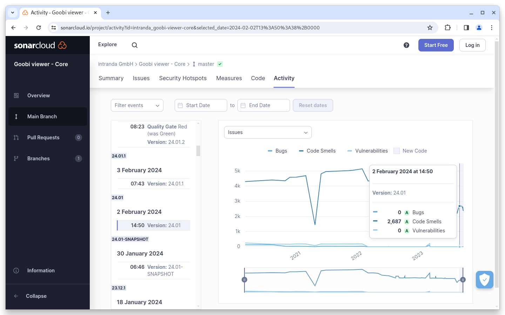
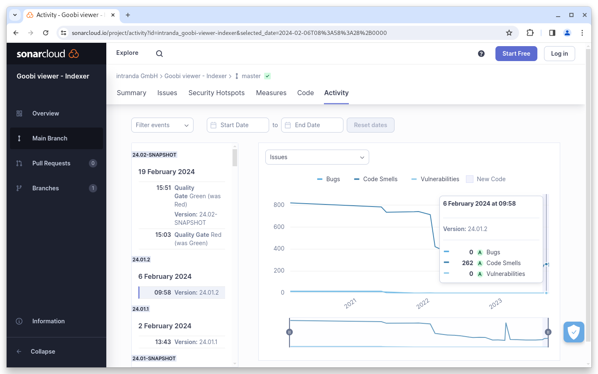

# January

## Coming soon :rocket:&#x20;

* **Solr 9**
* **IIIF manifests** with only one image
* **New widgets** for download, metadata, links and citation
* **Live preparation** of data sets

## Announcements


With the **January release** of the Goobi viewer, the use of **Java 17 is mandatory**.


## Developments

### Core

January was mainly characterized by the installation of updates on customer systems and the work around them. As a result, there were no significant feature developments, but mainly bug fixes.

Nevertheless, there have been many changes in the background recently, which should be mentioned in the January Digest. The most obvious one is that we have switched to Java 17. This means that the Goobi viewer must be compiled and operated with a current Java version. The changeover is necessary, for example, in order to be able to use the latest Java libraries in the future. This is the only way to keep the application up to date and respond quickly to any security vulnerabilities.

In addition, the automatic unit tests were migrated to JUnit 5. This means that the latest technology is being used here too.

Finally, we are working in the background to fulfill certain stylistic code conventions. We use the Checkstyle tool in the CI pipeline for this purpose. Over the past few months, thousands of comments have already been processed and corrected, so that there are now just under 200 left. We will continue to reduce these violations in the coming months in order to ensure a uniform programming style across the entire source code in the future.

## Code analysis

The following screenshots show the SonarCloud analysis of the current release. More information is available directly on the [project page](https://sonarcloud.io/organizations/intranda/projects).


During the release process, we forgot to take the corresponding screenshots. Therefore, this month's screenshots show the status in a different way. The quality gates have all been met.


<figure><figcaption><p>SonarCloud Analysis: Goobi viewer Core - for the Git Tag v24.01</p></figcaption></figure>

<figure><figcaption><p>SonarCloud Analysis: Goobi viewer Indexer - for the Git Tag v24.01.2</p></figcaption></figure>

<figure><figcaption><p>SonarCloud Analysis: Goobi viewer Connector - for the Git Tag v24.01</p></figcaption></figure>

## Version numbers&#x20;

The versions that must be entered in the `pom.xml` of the theme in order to get the functions described in this digest are:

```markup
<dependency>
    <groupId>io.goobi.viewer</groupId>
    <artifactId>viewer-core</artifactId>
    <version>24.01.7</version>
</dependency>
<dependency>
    <groupId>io.goobi.viewer</groupId>
    <artifactId>viewer-core-config</artifactId>
    <version>24.01</version>
</dependency>
<dependency>
    <groupId>io.goobi.viewer</groupId>
    <artifactId>viewer-connector</artifactId>
    <version>24.01</version>
</dependency>
```

The **Goobi viewer Indexer** has the version number **24.01.2**\
The **Goobi viewer Crowdsourcing Module** has the version number **24.01.1**
