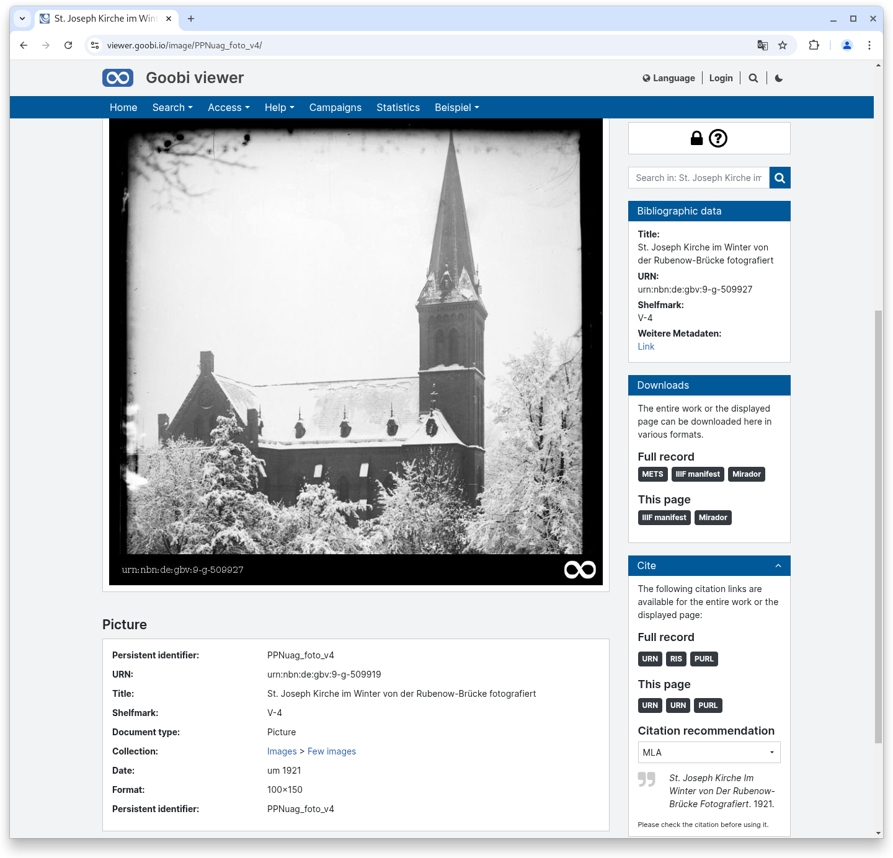
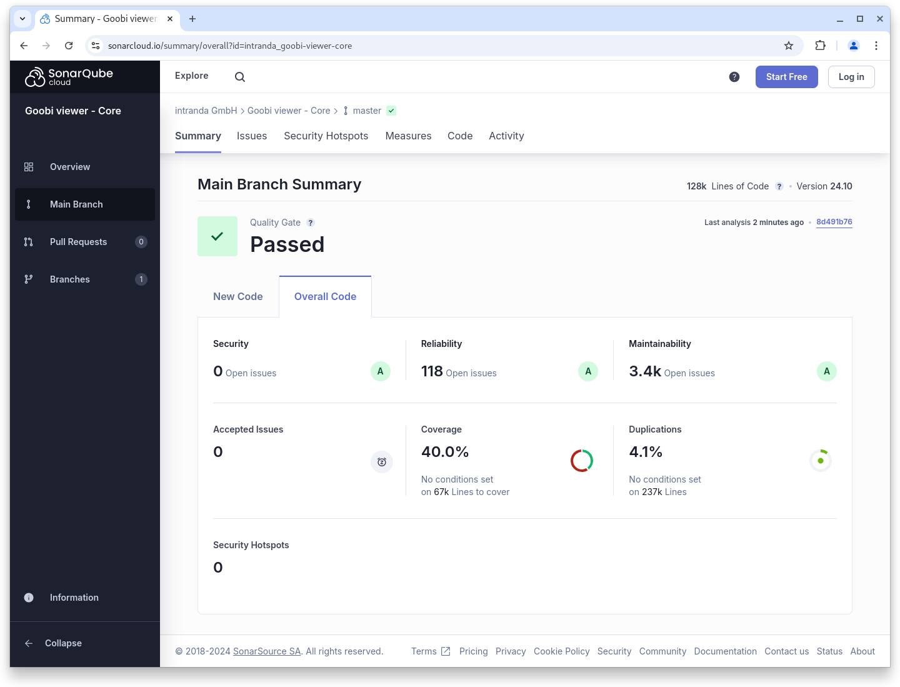
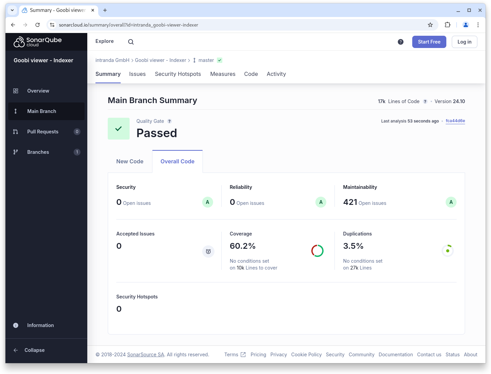
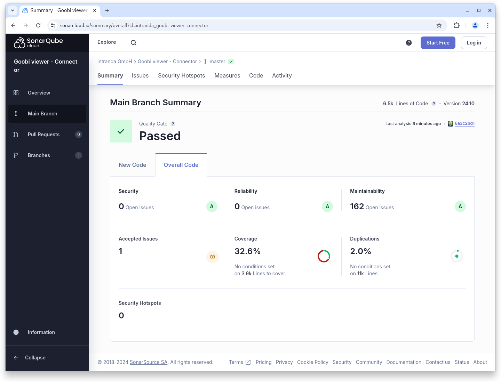

# October

## Coming soon :rocket:&#x20;

* **Access-restricted metadata**
* **Tomcat 10** support

## Announcements


We are planning various **breaking changes** for the **January 2025 release**:

* Support for **Tomcat 10**
* Support for **Java 21**
* **Syntax changes** in the **configuration** of the Goobi viewer **indexer**
* **Changed indexing** of Solr-internal **Iddocs** to an alternative data type


## Developments

### Metadata display

In addition to displaying the metadata on a separate page, it is now also possible to render the metadata below the image display. There is a new location attribute in the metadataView element for this purpose. This setting is particularly useful for data sets that only consist of an image and associated metadata.

<figure><figcaption><p>Optional display of metadata below the image</p></figcaption></figure>

### Metadata configuration

When linking entities, the links themselves have a type. With the new, optional `<filterQuery />` element within a metadata configuration, the links can be displayed grouped by type.

### Snippets

* **OAI**: When calling the OAI interface via /oai, a slash is no longer automatically appended. This fixes some problems with harvesters.
* **Archive**: The performance when loading has been improved.

## Code analysis

The following screenshots show the SonarCloud analysis of the current release. More information is available directly on the [project page](https://sonarcloud.io/organizations/intranda/projects).

<figure><figcaption><p>SonarCloud Analysis: Goobi viewer Core - for the Git Tag v24.10</p></figcaption></figure>

<figure><figcaption><p>SonarCloud Analysis: Goobi viewer Indexer - for the Git Tag v24.10</p></figcaption></figure>

<figure><figcaption><p>SonarCloud Analysis: Goobi viewer Connector - for the Git Tag v24.10</p></figcaption></figure>

## Version numbers&#x20;

The versions that must be entered in the `pom.xml` of the theme in order to get the functions described in this digest are:

```markup
<dependency>
    <groupId>io.goobi.viewer</groupId>
    <artifactId>viewer-core</artifactId>
    <version>24.10.1</version>
</dependency>
<dependency>
    <groupId>io.goobi.viewer</groupId>
    <artifactId>viewer-core-config</artifactId>
    <version>24.10</version>
</dependency>
<dependency>
    <groupId>io.goobi.viewer</groupId>
    <artifactId>viewer-connector</artifactId>
    <version>24.10</version>
</dependency>
```

The **Goobi viewer Indexer** has the version number **24.10**\
The **Goobi viewer Crowdsourcing Module** has the version number **24.10**
