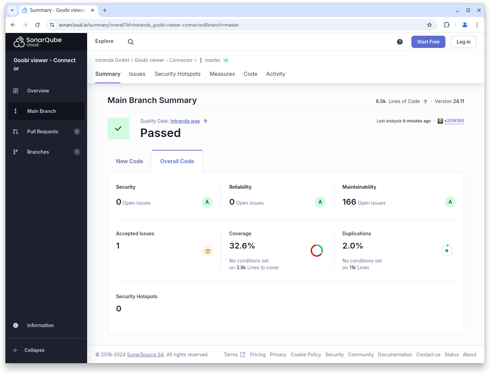

# November

## Coming soon :rocket:&#x20;

* **Access-restricted metadata**
* **Tomcat 10** support
* **Image change** via **scrolling** and **without reloading** the page

## Announcements


We are planning various **breaking changes** for the **January 2025 release**:

* Support for **Tomcat 10**
* Support for **Java 21**
* **Syntax changes** in the **configuration** of the Goobi viewer **indexer**
* **Changed indexing** of Solr-internal **Iddocs** to an alternative data type


## Developments

We worked on a lot of things in November, but most of them happened under the bonnet or in preparation for the breaking changes in January next year. There were also many theme updates on customer systems. Some small things that are included in the November release:

* **Backend**: Rights could be created without all questions being answered. This led to an invalid status in the database.
* **Table of contents**: In the table of contents of anchor works, the selected representative of the volume was not taken into account in the thumbnails.
* **REST-API**: The monitoring endpoint no longer outputs a status `error` if the message queue has been deactivated in the configuration file.

## Code analysis

The following screenshots show the SonarCloud analysis of the current release. More information is available directly on the [project page](https://sonarcloud.io/organizations/intranda/projects).

<figure><figcaption><p>SonarCloud Analysis: Goobi viewer Core - for the Git Tag v24.11</p></figcaption></figure>

<figure><figcaption><p>SonarCloud Analysis: Goobi viewer Indexer - for the Git Tag v24.11</p></figcaption></figure>

<figure><figcaption><p>SonarCloud Analysis: Goobi viewer Connector - for the Git Tag v24.11</p></figcaption></figure>

## Version numbers&#x20;

The versions that must be entered in the `pom.xml` of the theme in order to get the functions described in this digest are:

```markup
<dependency>
    <groupId>io.goobi.viewer</groupId>
    <artifactId>viewer-core</artifactId>
    <version>24.11</version>
</dependency>
<dependency>
    <groupId>io.goobi.viewer</groupId>
    <artifactId>viewer-core-config</artifactId>
    <version>24.11</version>
</dependency>
<dependency>
    <groupId>io.goobi.viewer</groupId>
    <artifactId>viewer-connector</artifactId>
    <version>24.11</version>
</dependency>
```

The **Goobi viewer Indexer** has the version number **24.11**\
The **Goobi viewer Crowdsourcing Module** has the version number **24.11**
