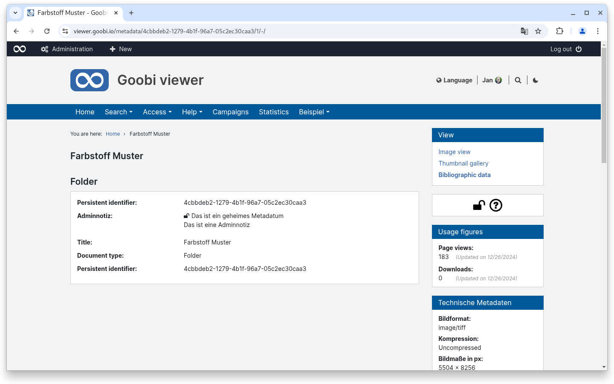
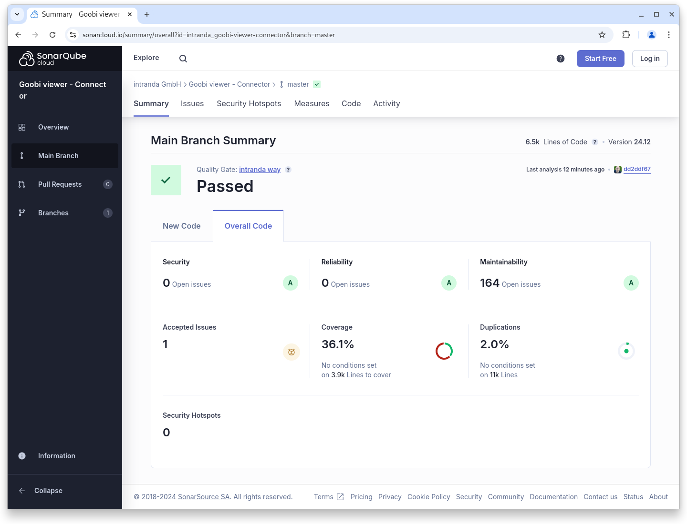

# December

## Coming soon :rocket:&#x20;

* **Tomcat 10** support

## Announcements


We are planning various **breaking changes** for the **January 2025 release**:

* Support for **Tomcat 10**
* Support for **Java 21**
* **Syntax changes** in the **configuration** of the Goobi viewer **indexer**
* **Changed indexing** of Solr-internal **Iddocs** to an alternative data type


## Developments

Access-restricted metadata As of this release, the Goobi viewer supports access restrictions for individual metadata. The standard MODS attribute `shareable=‘no’` is evaluated for this purpose. The Goobi viewer Indexer then automatically writes the access restriction `metadata_access_restricted`, which must then be configured in the backend.

The access-restricted metadata is automatically filtered out during delivery via OAI, SRU, IIIF, source file resolver, etc.

On the bibliographic data page, restricted metadata - if you have the right to see it - is labelled with a lock symbol.

<figure><figcaption><p>Access-restricted metadata is labelled with a lock symbol</p></figcaption></figure>


The current implementation only allows you to have one type of restricted metadata. You can have the right to see it or not. A configuration of different restriction types where, for example, user group ABC can see something and user group XYZ something else is currently not provided.


### Image change via scrolling

In mid-November we received an urgent request to implement a function in the Goobi viewer by the end of the year that would allow you to navigate through a work in the same way as in a PDF reader. To do this, you should not zoom with the mouse wheel in the image container, but scroll up or down in the image stack. In addition to the image container, a thumbnail bar should be available, which - similar to a PDF reader - can be scrolled separately and allows you to quickly jump to an image.

In addition to the actual implementation, there was also the task of ensuring that other information is also updated when the image changes: The URL in the address bar of the browser, the bibliographic data, the table of contents or the URLs for downloading an image. But this has also been successfully implemented.

Sequence mode can be switched on and off globally. In the coming year, we will work on activating it only under certain conditions, such as for certain publication types or collections.



### Snippets

* **Password change**: In an external pen test, it was noticed that users could sometimes change their password if something was entered in the old one. The error has been fixed.
* **Authentication**: When authenticating via HTTP header or attribute there was an error that has been fixed.

## Code analysis

The following screenshots show the SonarCloud analysis of the current release. More information is available directly on the [project page](https://sonarcloud.io/organizations/intranda/projects).

<figure><figcaption><p>SonarCloud Analysis: Goobi viewer Core - for the Git Tag v24.12</p></figcaption></figure>

<figure><figcaption><p>SonarCloud Analysis: Goobi viewer Indexer - for the Git Tag v24.12</p></figcaption></figure>

<figure><figcaption><p>SonarCloud Analysis: Goobi viewer Indexer - for the Git Tag v24.12</p></figcaption></figure>

## Version numbers&#x20;

The versions that must be entered in the `pom.xml` of the theme in order to get the functions described in this digest are:

```markup
<dependency>
    <groupId>io.goobi.viewer</groupId>
    <artifactId>viewer-core</artifactId>
    <version>24.12</version>
</dependency>
<dependency>
    <groupId>io.goobi.viewer</groupId>
    <artifactId>viewer-core-config</artifactId>
    <version>24.12</version>
</dependency>
<dependency>
    <groupId>io.goobi.viewer</groupId>
    <artifactId>viewer-connector</artifactId>
    <version>24.12</version>
</dependency>
```

The **Goobi viewer Indexer** has the version number **24.12**\
The **Goobi viewer Crowdsourcing Module** has the version number **24.12**
