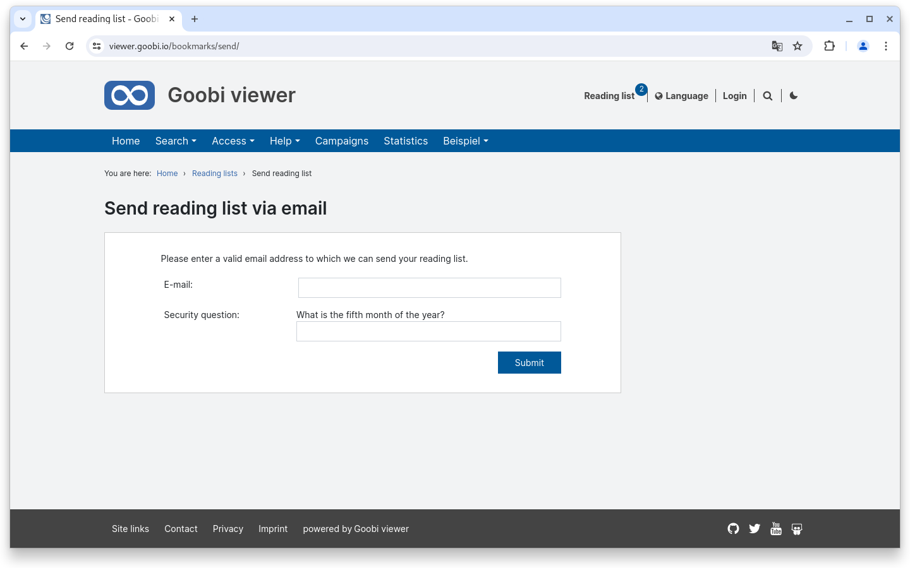
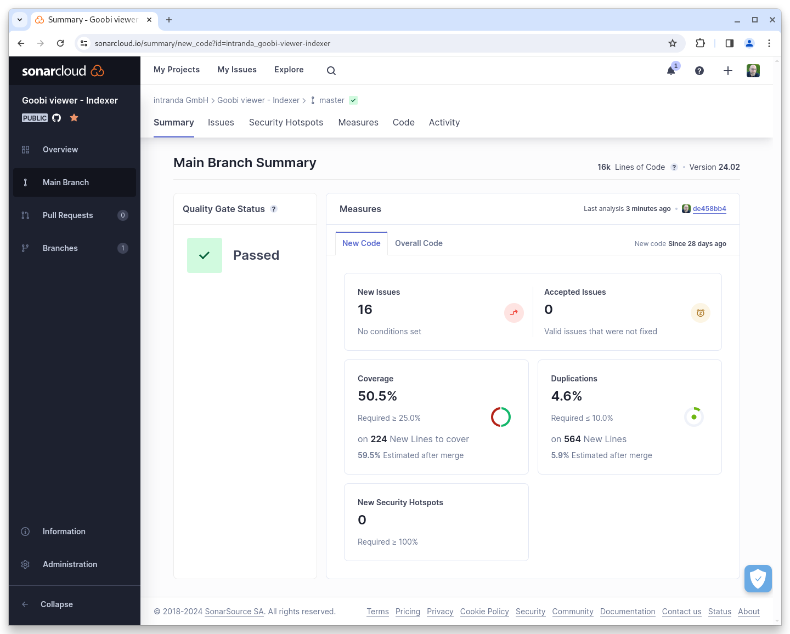
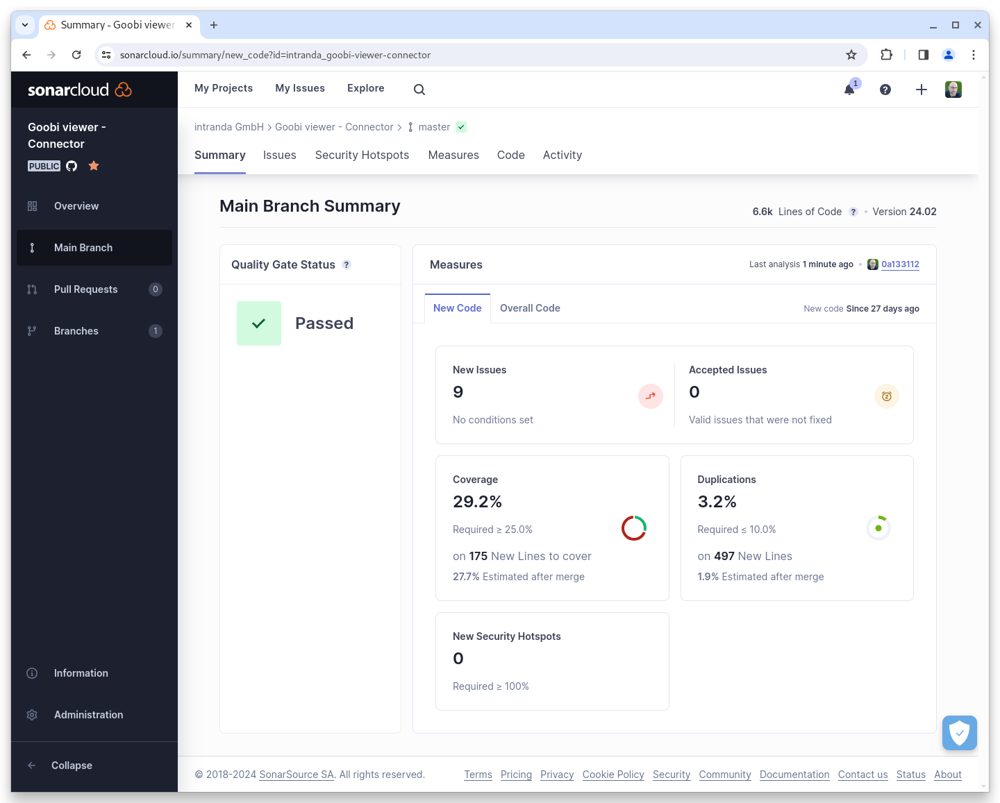

# February

## Coming soon :rocket:&#x20;

* **IIIF manifests** with only one image
* **New widgets** for download, metadata, links and citation
* **Live preparation** of records
* **Revision of EAD** structures

## Developments

### Solr

The biggest change in February took place under the hood. Apache Solr was updated to version 9.5.0. This means that a current version of the software is finally being used.


When updating to the February release of the Goobi viewer, a Solr update with subsequent reindexing is mandatory.


### Reading list

When it came to safeguarding the sending of e-mails, we had missed one point. In February, we were made aware of the possibility of sending reading lists. This area is now also secured with a security question.

<figure><figcaption><p>The form for sending a watchlist now also has SPAM protection</p></figcaption></figure>

### Browse

There is now a new, optional attribute `skipInWidget="true"` for the browse functionality. This means that a field configured for browsing is not displayed in the widget. However, it is still available for the browse element on CMS pages. This means that individual CMS browse pages can be created.

### Goobi viewer Indexer

There have been two notable developments in the Goobi viewer Indexer:

* Names of METS file groups can be configured which - if they exist - are used for indexing image file paths. See also the switch mets/preferredImageFileGroup
* Due to an error in the logic, some works were deleted if a CMS page that was linked to a work was depublished. This error has been fixed.

### Snippets

* The Docker containers now also run completely with Java 17

## Code analysis

The following screenshots show the SonarCloud analysis of the current release. More information is available directly on the [project page](https://sonarcloud.io/organizations/intranda/projects).

<figure><figcaption><p>SonarCloud Analysis: Goobi viewer Core - for the Git Tag v24.02</p></figcaption></figure>

<figure><figcaption><p>SonarCloud Analysis: Goobi viewer Indexer - for the Git Tag v24.02</p></figcaption></figure>

<figure><figcaption><p>SonarCloud Analysis: Goobi viewer Connector - for the Git Tag v24.02</p></figcaption></figure>

## Version numbers&#x20;

The versions that must be entered in the `pom.xml` of the theme in order to get the functions described in this digest are:

```markup
<dependency>
    <groupId>io.goobi.viewer</groupId>
    <artifactId>viewer-core</artifactId>
    <version>24.02.2</version>
</dependency>
<dependency>
    <groupId>io.goobi.viewer</groupId>
    <artifactId>viewer-core-config</artifactId>
    <version>24.02</version>
</dependency>
<dependency>
    <groupId>io.goobi.viewer</groupId>
    <artifactId>viewer-connector</artifactId>
    <version>24.02</version>
</dependency>
```

The **Goobi viewer Indexer** has the version number **24.02**\
The **Goobi viewer Crowdsourcing Module** has the version number **24.02**
